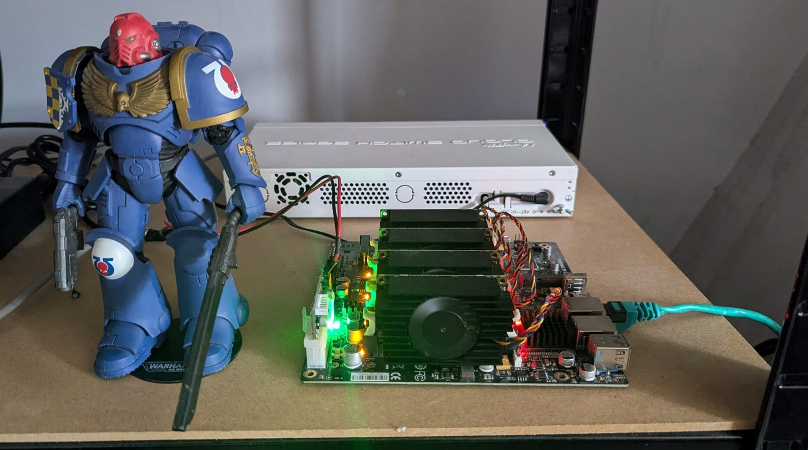

I'm David, a Specialist Adoption Architect at Red Hat based near Cambridge in the UK, specialising in OpenShift, Kubernetes, and the broader cloud-native ecosystem. I have a technical background bridging modern containerised platforms and traditional infrastructure. I focus on helping organisations design scalable, resilient, and automated systems.

Alongside my day-to-day architectural work, I actively document my technical explorations on my blog, where I write deep dives on everything from ArgoCD application sets to eBPF metric streaming and KubeVirt on ARM64.

I am a strong believer in open-source knowledge sharing. Through my GitHub [David-VTUK](https://github.com/David-VTUK), I maintain tools like KubePlumber and comprehensive study resources for the Certified Kubernetes Administrator (CKA) exam, helping other engineers navigate their own cloud-native journeys.

