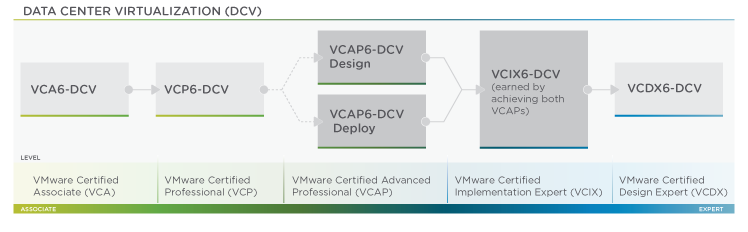

# Motivation

Towards to end of 2015 I decided to make passing the VCAP5-DCD exam a target. I had already refreshed my VCP certification to version 6 and wanted to move further up VMware's certification chain. It may have seen unusual timing giving the impending release of version 6 of the VCAP exams, but as I was in between jobs at the time it seemed like a good idea to not only demonstrate some additional skills, but enhance my CV for potential employers.

For those unfamiliar with VMware certifications the VCAP  requires an existing and valid VCP, and forms part of the VCIX certification, as shown by the image below. It's worth mentioning however that you can achieve the VCIX6-DCV certification with a VCAP5 + the corresponding VCAP6. So for me I can sit the VCAP6-DCV Deploy exam and be awarded the VCIX6-DCV certification.

 

# Preparation

It goes without saying - the VCAP exam is a bit of a beast. Over a relatively short amount of time the format has changed somewhat. When I sat the exam the specification was:

- 22 Questions.
- Mix of Design and Multiple choice questions.
- One deign question designated as the "Master Design".
- 180 Minutes total exam time.

This is taken from the official VMware VCAP5-DCD Blueprint and consequently the first resource I consulted. The blueprint lists exactly the areas you will expect to be tested on in the exam.

You really don't need a lab to study for this exam. It's predominantly theory and process. However you do have to read. A lot.

My bookshelf for this exam mainly consisted of:

- Official Blueprint.
- vBrownbags VCAP-DCD Videos.
- Official VCAP5-DCD study guide from VMWare press.
- vSphere Design Best practices book from Packt Publishing.
- VCAP Study pack from virtualtiers.com.
- Watched the VCAP tool demo video from the VMWare website.
- As many VMware best practice PDF's as google will return. Mainly around Storage and Neworking.
- Mastering vSphere 6.

I also posted and read a lot of content on the [Google Plus VCAP5-DCD study group](https://plus.google.com/u/0/communities/103910393937429082483). Seriously check it out, the guys/gals there are great.

# Before the exam

Like with any exam I've ever taken I've taken a similar approach to each:

- Early night the day before.
- Chill out the night before. Go watch a film/TV show.
- Relax.
- Try and schedule the exam after lunch (I don't like morning exams)
- Have a good breakfast and/or lunch.
- Arrive at the test center early. Allocate an appropriate amount of time for travel, compensating for traffic.
- Try and have some confidence (difficult for me).

# During the exam

During my research for this exam I looked on various blog sites and and social community comments. There was an overwhelming trend in posts relating to the VCAP5-DCD exam - **It's all about time management**. To an extent, this is true, but I think the change to bring it down to 22 questions has made this a lot easier.

I spent a good 30-45mins alone on my "master" design question, about 15-20mins on the other design questions and the remaining time on the multiple choice questions.

I will admit though, after the design questions I was absolutely exhausted. I don't even remember a lot of the multiple choice questions and for quite a few I pretty much clicked random answers. I got the impression that you're heavily marked on the design questions. At the end I had about 20-30mins left to spare.

# After the exam

I was really nervous about finishing the exam. I was so mentally exhausted I convinced myself I failed and was already mentally preparing when to sit my resit. However I was absolutely delighted when I found out I passed. All the hard work and effort paid off.

For those that are thinking of sitting a VCAP exam - good luck!
