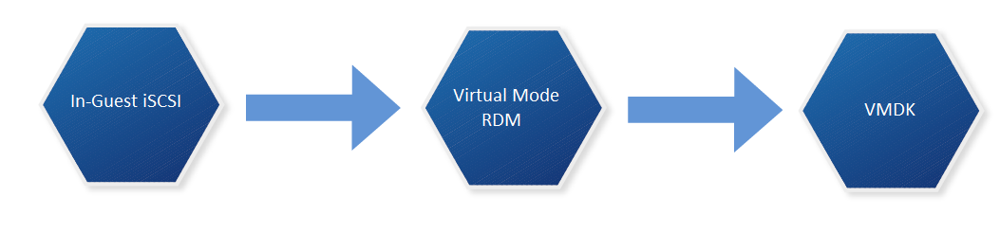
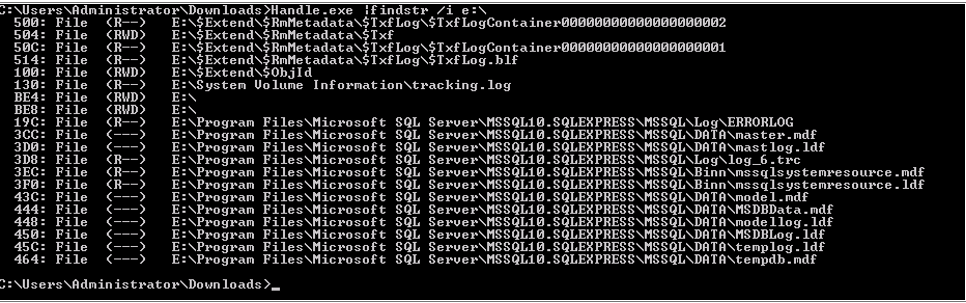

# Do we really need in-guest iSCSI volumes?

Well, yes and no.

I'll admit, the need for VM's with their own iSCSI initiator have decreased over the various improvements made to vSphere and ESXi. However, I would imagine there are a number of implementations that (justifiably)  still need this arrangement, and those that don't. I was recently tasked with eliminating a number of guest-initiated iSCSI disks in favor of using native VMDK's.

I'm sure a lot of VMware admins have either gone through this process, or will find themselves with this task at some point. This post serves as a rough guide to my approach - which doesn't necessarily mean that it's the **only** way to do this, but it worked for me.

# Idea #1 - VMware Converter

VMware Converter is an easy piece of software to use. Pick a source, pick a destination, modify the properties of the associated disks. Et Voila! However, one of the main considerations to make when using this is the maintenance window involved. If you're converting a number of virtual disks, particularly to the same storage array, then you'll need a sizeable disk space overhead, as you may have to essentially mirror all the data before you can delete the source. This also takes time

# Idea #2 - OS Native File Copy to a VMDK

The principle behind this is quite easy. As an example, a file server VM could have a in-guest iSCSI volume to hold all share data. A VMDK could be created and added to the VM, then we can robocopy/rsync the data across and re-configure sharing etc. Again, similar with Idea #1 there are space considerations to factor for, as you're duplicating data for a short period.

# Idea #3 - Convert the disk to a VMDK

This idea differs from the previous two by converting the drive that currently holds the data into a native VMDK. There's no need to mirror/duplicate the data, but there's still a maintenance window involved.

**Idea #3 seemed most suitable for me**. Duplicating data would take up too much space, put extra strain on my SAN, and should anything go a miss I always have decent backups to restore from. So lets go a bit more in depth on how we convert a in-guest iSCSI volume in to a native VMDK.

# Overview - Idea #3 fleshed out

There's no single-step process to convert a in-guest iSCSI volume into a native VMDK. We can do it by following the following conversion process 

We must (at time of writing) convert the in-guest iSCSI volume to a virtual mode RDM, at which point we can then Storage vMotion (sVMotion) it to a native VMDK. Below is my approach at doing so:

 

# Step #1 - Find out what services are touching the drive we want to convert

Some VM's will be easier than others when it comes to finding this out. Some drives are dedicated to specific services such as SQL server. We need to know which because we want to be careful with data consistency. If unsure, we can use tools such as handle.exe from Microsoft Sysinternals which will give us an idea as to which files are currently being used:

 

In this example E:\\ was my mapped iSCSI volume. Executing **handle.exe |findstr /i e:\\** revealed which files on E:\\ had active file handles. This can also be accomplished by Process Explorer too. Next we shut down the services that have handles to this drive. So in this example I shut down SQL server.

 

# Step #2 - Disconnect all iSCSI based volumes, disable iSCSI vNIC's and shutdown the VM

1. Log into the Virtual Machine.
2. Open the “Disk Management” MMC snapin.
3. Right click the drive representing the in-guest iSCSI volume and select “offline”.
4. The disk should no longer be mounted.
5. Launch the iSCSI initiator and select the “Targets” tab.
6. Select the target that’s currently connected and click “Disconnect”.
7. The volume should be listed as Inactive and no longer visible from “Disk Management”.
8. In Network Connections disable the iSCSI NIC.
9. Shut down the VM.

 

# Step #3 - Present previously used in-guest volume to ESXi hosts

We need to do this so we can add the volume as a Virtual Mode RDM to the VM. How we accomplish this depends on your storage vendor. But as a top level overview:

1. Log in to SAN management application
2. Modify the existing volume access policies so volume is visible to all ESXi hosts by authentication methods such as Access Policy / CHAP / initiator name / IP address /etc

 

# Step #4 - Add volume as a Virtual Mode RDM to VM

1. Perform a rescan of the ESXi host HBA’s so the newly presented volume is visible.
2. Right click VM > Edit Settings.
3. Add new Device > Hard Disk > Click Next.
4. Select Raw Device Mapping as the Disk Type.
5. Select the volume from the list.
6. Select a datastore use to map this volume. Click Next.
7. Select “Virtual” as the compatibility mode. Click Next.
8. Leave advanced options as-is, unless required. Click Next.
9. Click finish.
10. Click OK to commit the VM configuration changes

 

# Step #5 - Power on VM and check data integrity

1. Power on the VM.
2. Open “Disk Management”.
3. Right click the added volume and select the “Online” option.
4. Check drive contents (The volume should be mapped with the previous volume label/drive letter).

 

# Step #6 - Re-enable services that require access

Opposite of step 1.

 

# Step #7 - Storage vMotion disk and change disk type

1. Right click the VM in vSphere and select “Migrate”.
2. Select “Change datastore” and click “next”.
3. Click the “Advanced” button.
4. Select the appropriate datastore for the RDM disk and change the disk format from “Same Format as source” to “Thin/Thick Provision”. Other drives remain unchanged (ie OS drive).
5. Click Next.
6. Click Finish
7. Wait until the storage vMotion has completed.
8. Validate the vMotion by viewing the settings of the VM and checking the aforementioned drive is listed as a standard thin/thick provisioned vmdk and not a RDM

# Step #8 - Cleanup

At this point we have finished our conversion process and can clean up by removing any integration tools from the VM, removing the iSCSI vNIC and deleting the volume originally used from the SAN.
