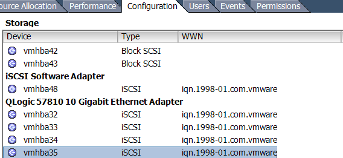

# The what, where and why

At the moment I'm involved in a fair amount of project work involving data (VM) migrations between different storage platforms, sometimes even from the same vendor. What seems to be quite a simple process can get complicated depending on the design considerations for both storage platforms and the migration criteria - particularly if both storage platforms need to co-exist for either the short or long term and migrated VM's must be performed live.

 

# But we have shared nothing vMotion for this, right?

Yes and No. A lot of administrators don't like to work with multiple SAN environments - and with good reason. Conflicting design considerations (which I will touch on later) can cause some incompatibility depending on your host configuration (think iSCSI port bindings as an example). For some migrations it's perfectly acceptable to (for example) logically segment ESXi hosts that belong to different SAN environments and simply vMotion across. Once you've migrated everything across reconfigure all hosts to see the new, shiny storage platform only.

However, requirements I've received recently from various customers stipulate that both SAN environments must co-exist on all hosts in a supported fashion. Some for sort term migrations, others for mid term (maybe to keep the old storage environment for test/dev). These clients have a small number of densely populated hosts, and therefore do not want segmentation of hosts (ie cluster A = SANA, cluster B = SANB).

So how can we facilitate this?

# Assess design considerations for the existing SAN

All storage vendors will (or should) have existing documentation pertaining to best practice for implementing their flavor of storage array. As an example I'll pick the Dell EqualLogic as I'm quite familiar with it.

The EqualLogic is an active/passive storage device, commonly implemented in VMware environments by leveraging the Software iSCSI initiator. We then create either one vSwitch with two VMKernel port groups for iSCSI, each having their own dedicated NIC and the rest being unused, or two vSwitches with 1 VMKernel port group each, with their own dedicated NIC and the rest being unused. IP addresses for all initiators and the target reside on the same VLAN/Subenet Range, so iSCSI port binding is used.

# Assess design considerations for the new SAN

Commonplace at the moment are new 10Gb iSCSI SANs being implemented, including new NICs/HBA's into hosts, switches and obviously the storage device itself. As an example I was asked to co-exist a EqualLogic (1Gb) with another storage device (10Gb) that had different design considerations:

The new storage device is an active/active device, with best practice dictating that each storage controller reside on **its own** VLAN/Subnet range.

# Assessing how to configure hosts to support both SAN environments

In the example previously described we have a particular issue:

- Existing configuration involves iSCSI port binding with all participating initiators and targets in the same VLAN.

This is perfectly common and acceptable with the EqualLogic. But this cannot support the new storage device. Although we technically **\*could\*** modify the existing binding to accommodate the new SAN, this will cause issues and is by in large not supported. [https://kb.vmware.com/selfservice/microsites/search.do?language=en\_US&cmd=displayKC&externalId=2038869](https://kb.vmware.com/selfservice/microsites/search.do?language=en_US&cmd=displayKC&externalId=2038869). Even if we put the new storage device on the same VLAN as the EqualLogic, it still isn't a good idea. Single targets should really be used and including mixed, speed nics in iSCSI port binding is a very bad idea.

Simply put, we can not, and should not modify the existing iSCSI port bindings. We can only have 1 software iSCSI initiator, and when we use port binding it will not leverage other VMKernel port groups.

This leaves us with two options:

# Option #1 iSCSI-Independent HBA's

Independent HBA's do not rely upon ESXi for configuration parameters. They're configured outside of the operating system. This is probably the better way of achieving segmentation between multiple SAN environments. This way we have independent HBA's facilitating traffic to the new storage array, and existing NICs in the existing iSCSI port binding facilitating traffic to the existing storage array.

# Option #2 iSCSI-Dependent HBA's

I'm honestly not sure if it's just a demand thing, or if people are finding acceptable levels of performance from software iSCSI implementations (I know I am) but I don't really come across dedicated iSCSI Independent HBA's anymore. I'd imagine they represent a bit of a false economy with the limited number of PCI-Express slots of small servers these days.

Converged network adapters on the other hand I find very common. For those that are not aware, CNA's are like multi-personality NICs. They're presented in ESXi as both regular NIC's and iSCSI (and/or FCoE) storage adapters with the same MAC. They are usually considered iSCSI-Dependent NIC's though.

What we're able to do here is create our vmkernel ports for the new storage array (one for each uplink for our active/active array) on different VLAN's, IP address ranges etc. Then assign one to each of our iSCSI uplinks and off we go. We still achieve separation of traffic because the software iSCSI initiator remains untouched, and traffic to the new SAN is facilitated by different nics, VMK's, etc.

It's important to identify there that **VMware does support using mixed software AND hardware iSCSI initiators but not to the same target.**

# Option #3 - Swing Host

I've heard people using these before. They're essentially a designated host that's configured with perhaps not a supported or best practice configuration, but is homed to both SAN environments and is just used for migration purposes. You essentially VMotion a VM onto this host, do what you need to do with it, and vMotion it off again to a supported host.

It often works, but is considered a "quick and dirty" solution to this problem, and unlikely to receive any official support from both VMware and your storage vendor.

# Conclusion

Hopefully this might help others who may be tasked with a similar requirement. It's not ideal, and as I mentioned before we try and not implement multi SAN-environments where possible. But sometimes we have to. What's important is to implement something that is supported and stable.
