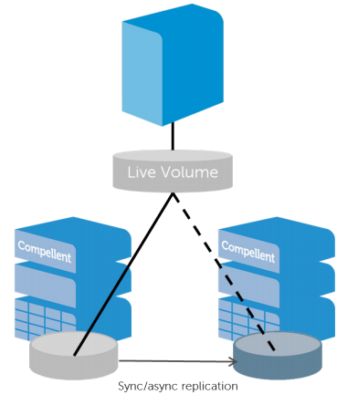
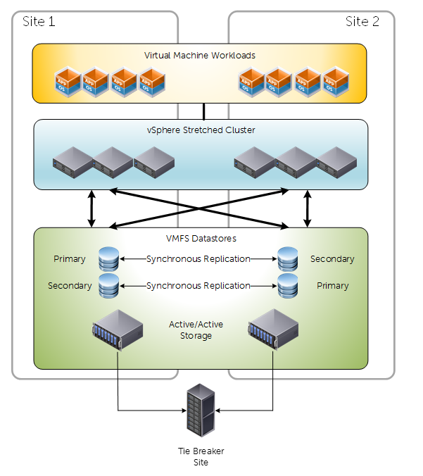
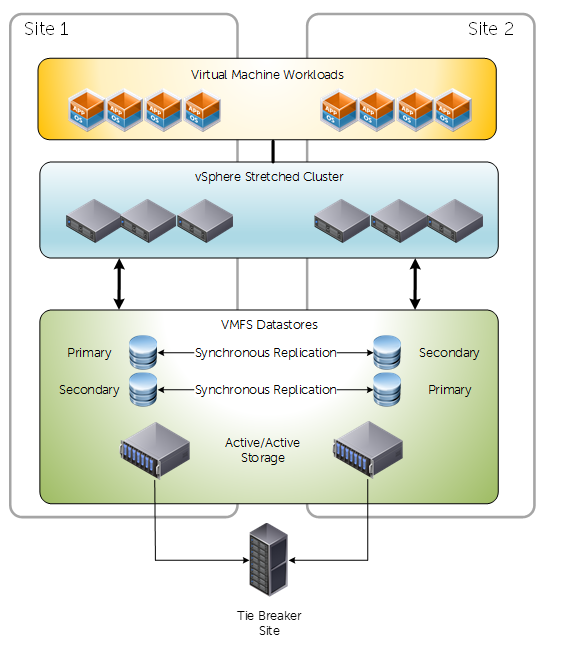
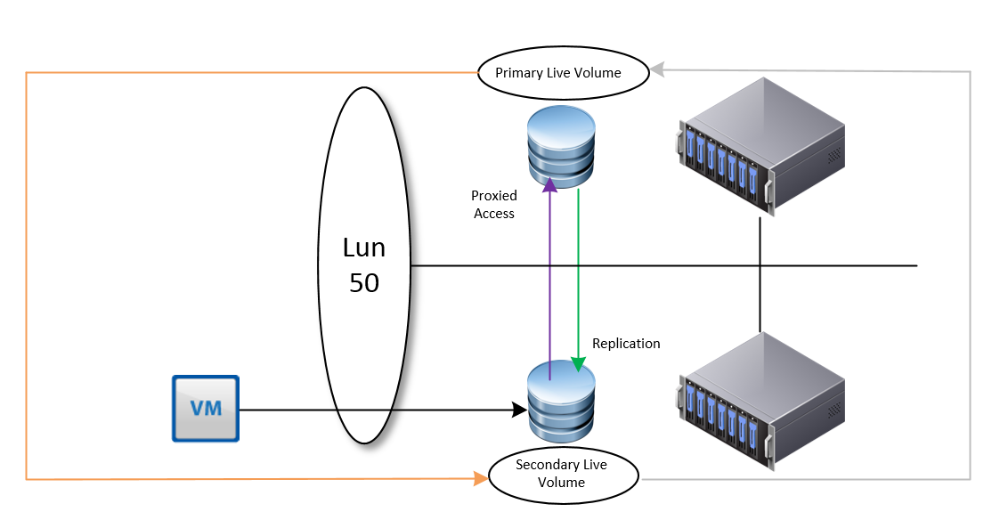

# Intro

VMware vSphere Metro Storage Cluster is a suite of infrastructure configurations that facilitate a stretched cluster setup. It's not a feature like HA/DRS that we can switch on easily; it requires architectural design decisions that specifically contribute to this configuration. The foundation of which are _**stretched clusters**_ and with regards to the Compellent suite of solutions _**Live Volume**_

# Stretched Cluster

Stretched clusters are pretty much self explanatory. In comparison to a lot of configurations where compute clusters reside within the same physical room, stretched clusters spread the compute capacity over more than one physical location. This can still be internally (different server rooms within the same building) or further apart over geographically disperse sites.

Having stretched clusters gives us greater flexibility and potentially better RPO/RTO with mission critical workloads when implemented correctly. Risk and performance are spread across one location. Failover scenarios can be further enhanced with automatic fail over features that come with solutions like Compellent Live Volume.

From a networking perspective. Ideally we have a stretched & trunked layer 2 network across both sites facilitated by redundant connections. I will touch on requirements later on in this post.

# What is Live Volume?

Live volume is a specific feature with Dell Compellent storage centers. Broadly speaking  Live Volume virtualizes the volume presentation separating it from disk and RAID groups within each storage system. This virtualization enables decoupling of the volume presentation to the host from its physical location on a particular storage array. As a result, promoting the secondary storage array to primary status is transparent to the hosts, and can be done automatically with auto-failover. Why is this important for vMSC? Because in certain failure scenarios we can fail over between both sites automatically and gracefully.

 

 

# Requirements

Specifically regarding the Dell Compellent solution:

- SCOS 6.7 or newer
- High Bandwidth, low latency link between two sites
    - Latency must be no greater than 10ms. 5ms or less is recommended
    - Bandwidth is dependent on load, it is not uncommon to see redundant 10Gb/40Gb links between sites
- Uniform or non-uniform presentation
- Fixed or round Robin path selection
- No support for Physical Mode RDM's
    - Very important when considering traditional MSCS
- For auto failover a third site is required with the Enterprise Manager software installed to act as a a tiebreaker
    - Maximum latency to both storage center networks must not exceed 200ms RTT
- Redundant vMotion network supporting minimum throughput of 250Mbps

 

# Presentation Modes - Uniform

For vMSC we have two options for presenting our storage. Uniform and Non uniform. Below is a diagram depicting a traditional uniform configuration. Uniform configurations are commonly reffered to as "mesh" typologies, because of how the compute layer has access to primary and secondary storage both locally and via the inter-site link.

 

 

**Key considerations about uniform presentation:**

- Both Primary and Secondary Live Volumes presented on active paths to all ESXi hosts.
- Typically used in environments where both sites are in close proximity.
- Greater pressure/dependency on inter-site link compared to non-uniform.
- Different reactions to failure scenarios compared to non-uniform - Because of storage paths and how Live volume works
- Attention needs to be taken to IO paths. For example, write requests received by a storage center that holds the **secondary** volume will simply act as a proxy and redirect the I/O request to the Storage Center that has the primary volume over the replication network. This causes additional delay. Under some conditions, Live volume will be intelligent enough to swap the roles for a volume when it experiences all I/O requests from a specific site.

 

# Presentation Modes - Non Uniform

Non-Uniform presentation restricts primary volume access to the confines of the local site. Key differences and observations are around how vCenter/ESXi will react to certain failure scenarios. It could be argued that non-uniform presentation isn't as resilient as uniform, but this depends on the implementation.

**Key considerations about Non-uniform presentation:**

- Primary and Secondary Live Volumes presented via active paths to ESXi hosts within their local site only
- Typically used in environments where both sites are not in close proximity
- Less pressure/dependency on inter-site connectivity
- Path/Storage failure would invoke a "All Paths Down" condition. Consequently affected VM's will be rebooted on secondary site. Whereas compared to uniform presentation they would not - because paths would still be active.

 

# Synchronous Replication Types

With Dell Compellent storage centers we have two methods of achieving synchronous replication:

- High Consistency
    - Rigidly follows storage industry specifications pertaining to synchronous replication.
    - Guarantees data consistency between replication source and target.
    - Sensitive to Latency
    - If writes cannot be committed to destination target, it will not be committed at the source. Consequently the IO will appear as failed to the OS.
- High Availability
    - Adopts a level of flexibility when adhering to industry specifications.
    - Under normal conditions behaves the same as High Consistency.
    - If the replication link or the destination storage either becomes unavailable or exceeds a latency threshold, Storage Center will automatically remove the dual write committal requirement at the estination volume.
    - IO is then Journaled at the source
    - When destination volume has returned healthy, IO is flushed at the destination

**Most** people tend to opt for High Availability mode for flexibility, unless they have some specific internal or external regulatory requirements.

 

# Are there HA/DRS considerations?

Short answer, yes. Long answer, it depends on the storage vendor, but as this is a Compellent-Centric post I wanted to discuss a (really cool) feature that can potentially alleviate some headaches. It doesn't absolve all HA/DRS considerations, because these are still valid design factors.

 

In this example we have a Live Volume configured on two SAN's leveraging Synchronous replication in a uniform presentation.

If, for any reason a VM is migrated to the second site where the secondary volume resides, we will observe IO requests proxied over to the storage center that currently has the primary live volume.

However, Live volume is intelligent enough to identify this, and under these conditions will perform a automatic role swap, in an attempt to make all IO as efficient as possible.

I really like this feature, but it will only be efficient if a VM has its own volume, or VM's that reside on one volume are grouped together. If Live Volume sees IO from both sites to the same Live Volume, then it will not perform a role swap. Prior to this feature, and under different design considerations we would need to leverage DRS affinity rules (should, not must) for optimal placement of VM's for the shortest path of IO.

Other considerations include, but not limited to:

- **Admission Control**
    - Set to 50% to allow enough resource for complete failover
- **Isolation Addresses**
    - Specify two, one for each physical site
- **Datastore Heartbeating**
    - Increase the number of datastore heartbeats from two to four in a stretched cluster. Two DS's for each site

 

# Why we need a third site

Live volume can work without a third site, but you won't get **automatic** failover. It's integral for establishing quorum during unplanned outages and for preventing split brain conditions during networking partitioning. With Compellent, we just need to install the Enterprise Manager on a third site that has connectivity to both storage centers, <200ms latency and it can be a physical or virtual Windows machine.

 

# Conclusion

As you can imagine a lot of care and attention is required when designing and implementing a vMSC solution. Compellent has some very useful features to facilitate it, and with advancements in network technology there is a growing trend for stretched clusters for many reasons.
