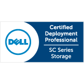

I've only recently started focusing more on developing my storage skills which I personally believe to be a good complement to my existing VMware knowledge. I've been working with Compellent systems for a few months now and thought it was a good time to get officially certified.

The exam itself put me a little out of my comfort zone, as in the past my storage level knowledge was limited to administrator level on EqualLogic setups. This exam was tough but rewarding.

Now I get to enjoy week long holiday and relaxing.

My return will start my VCAP6-Deploy exam prep...

