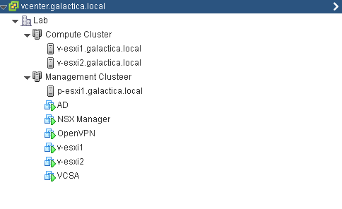
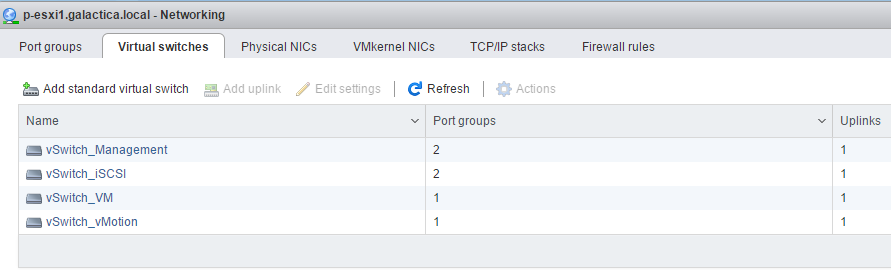

With the ever growing popularity of SDDC solutions I've decided to invest some time in learning VMware NSX and sit the VCP6-NV Exam. For this I've re-purposed my existing homelab and configured it for NSX. I have a fairly simple setup consisting of a single whitebox "server" that will accommodate nested ESXi hypervisors and a HP Microserver acting as a iSCSI target.

Whitebox specs:

**Motherboard:** MSI B85M-E45 Socket 1150

**CPU:** Intel Core i7 4785T 35W TDP

**RAM:** 32GB Corsair DDR3 Vengeance

**PSU:** 300W be quiet! 80plus bronze

**Case:** Thermaltake Core v21 Micro ATX

**Switch:** 8 Port Netgear GS 108-T Smart Switch

**Cooler:** Akasa AK-CC7108EP01

**NAS/SAN:** HP Microserver N54L , 12GB Ram, 480GB SSD, 500GB mechanical.

 

ESXi is installed on the physical host with additional ESXi VM's being created so I can play around with DRS/HA features too. The end result looks like this:

From a networking perspective I have separate port groups on my physical host for Management, VM, iSCSI, vMotion etc. My nested ESXi hosts have vNIC's in these port groups. Due to the nature of nesting ESXi hosts for this to work promiscuous mode has to be enabled on the port groups on the phyiscal host for this to work (management doubles as VXLAN Transport)

 

The actual installation of NSX is already well covered but this  covers the basics for what I needed to do.
