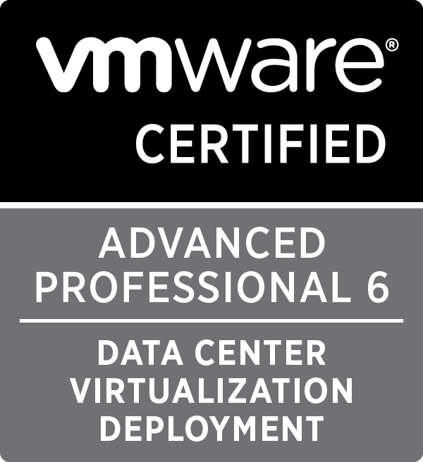

# Now I can rest...

I decided at around mid December to make passing the VCAP6 DCV Deploy exam a target. Today I can tick that objective off. As I have previously passed the VCAP5-DCD exam this should entitle me to the VCIX-DCV certification, but I may need to wait a bit for that.

# My Experience

Precisely this time last year I passed the VCAP5-DCD exam. By cheer coincidence I picked exactly 365 days later to do the deploy exam on v6. I was quite nervous as I've never done a deploy VMware lab exam before. The lab itself was reasonably well laid out but the response times and general feel of the environment was a bit sluggish, but then again my home lab resides on SSD storage so perhaps I'm used to a snappy interface.

# Tips based on my own prep

- The study guide from vJenner is an absolute goldmine : http://www.vjenner.com/vcap6-dcv-deployment-study-guide/.
- As with all VMware exams the blueprint is your main reference. If you're comfortable with most of the objectives you should be good to go.
    - Additionally, there is a **lot** to cover. Naturally like myself you're most likely going to have weak and strong areas. Don't get too hung of up on (for example) nailing to commit the entire esxcli CLI namespace to memory.
- If you're finding it difficult to fully remember esxcli commands in their entirety remember there's --help and --example flags.
- use a VMware HOL (Hands on Lab) to get acquainted with the UI

Good Luck!

