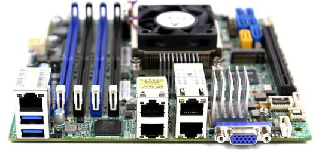

# Out with the old

My previous homelab, although functional was starting to hit the limits of 32GB of RAM, particularly when running vCenter, vSAN, NSX, etc concurrently.

A family member had use for my old lab so I decided to sell it and get a replacement whitebox.

 

# Requirements

- **Quiet** \- As this would live in my office and powered on pretty much 24/7 it need a silent running machine
- **Power efficient** - I'd rather not rack up the electric bill.
- **64GB Ram Support**

 

# Nice to have

- 10GbE
- IPMI / Remote Access
- Mini-ITX

# Order List

I've had a interest in the Xeon-D boards for quite some time, the low power footprint, SRV-IO support, integrated 10GbE, IPMI and 128GB RAM support make it an attractive offering. I spotted a good deal and decided to take the plunge on a [Supermicro X10SDV-4C+-TLN4F](http://www.supermicro.com/products/motherboard/Xeon/D/X10SDV-4C_-TLN4F.cfm)

 

As for a complete list:

**Motherboard -** Supermicro X10SDV-4C+-TLN4F

**RAM -** 64GB (4x16GB) ADATA DDR4

**Case -** TBC, undecided between a supermicro 1U case or a standard desktop ITX case

**Network -** Existing gigabit switch. 10GbE Switches are still quite expensive, but it's nice to have future compatibility on the motherboard for it.

I've yet to take delivery of all the components, part 2 will include assembly.
