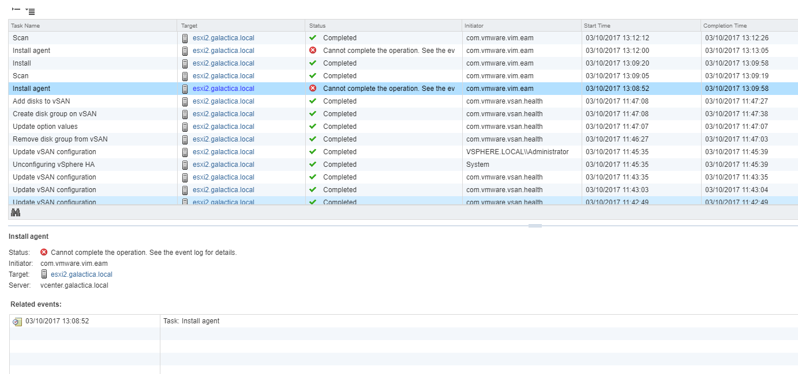

# The Rebuild

I decided to trash and rebuild my nested homelab to include both NSX and vSAN. When I attempted to prepare the hosts for NSX I received the following message:

 

 

I've not had this issue before so I conducted some research. I found a lot of blog posts / comments / KB articles linking this issue to VUM. For example : [https://kb.vmware.com/selfservice/microsites/search.do?language=en\_US&cmd=displayKC&externalId=2053782](https://kb.vmware.com/selfservice/microsites/search.do?language=en_US&cmd=displayKC&externalId=2053782)

However, after following the instructions I couldn't set the "bypassVumEnabled" setting. Nor could I manually install the NSX vibs and was presented with the following:

 

\[root@ESXi4:~\] esxcli software vib install -v /vmfs/volumes/vsanDatastore/VIB/vib20/esx-nsxv/VMware\_bootbank\_esx-nsxv\_6.5.0-0.0.6244264.vib --force \[LiveInstallationError\] Error in running \['/etc/init.d/vShield-Stateful-Firewall', 'start', 'install'\]: Return code: 1 Output: vShield-Stateful-Firewall is not running watchdog-dfwpktlogs: PID file /var/run/vmware/watchdog-dfwpktlogs.PID does not exist watchdog-dfwpktlogs: Unable to terminate watchdog: No running watchdog process for dfwpktlogs ERROR: ld.so: object '/lib/libMallocArenaFix.so' from LD\_PRELOAD cannot be preloaded: ignored. Failed to release memory reservation for vsfwd Resource pool 'host/vim/vmvisor/vsfwd' release failed. retrying.. Resource pool 'host/vim/vmvisor/vsfwd' release failed. retrying.. Resource pool 'host/vim/vmvisor/vsfwd' release failed. retrying.. Resource pool 'host/vim/vmvisor/vsfwd' release failed. retrying.. Resource pool 'host/vim/vmvisor/vsfwd' release failed. retrying.. Set memory minlimit for vsfwd to 256MB ERROR: ld.so: object '/lib/libMallocArenaFix.so' from LD\_PRELOAD cannot be preloaded: ignored. Failed to set memory reservation for vsfwd to 256MB ERROR: ld.so: object '/lib/libMallocArenaFix.so' from LD\_PRELOAD cannot be preloaded: ignored. Failed to release memory reservation for vsfwd Resource pool 'host/vim/vmvisor/vsfwd' released. Resource pool creation failed. Not starting vShield-Stateful-Firewall

It is not safe to continue. Please reboot the host immediately to discard the unfinished update. Please refer to the log file for more details. \[root@ESXi4:~\]

In particular I was intrigued by the "Failed to release memory reservation for vsfwd" message. I decided to increase the memory configuration of my ESXi VM's from 6GB to 8GB and I was then able to prepare the hosts from the UI.

### TLDR; If you're running  ESXi 6.5, NSX 6.3.3 and vSAN 6.6.1 and experiencing issues preparing hosts for NSX, increase the ESXi memory configuration to at least 8GB.
