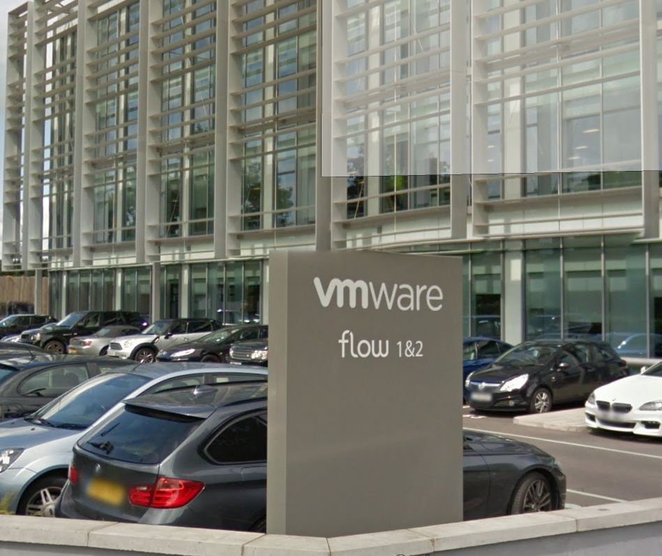

 

Recently I was lucky enough to attend a NSX livefire course hosted at the VMware EMEA HQ in Staines, It's designed to facilitate a intensive knowledge transfer of NSX related subject matter. All participants are bound by NDA, however most of the information is GA with the exception of roadmap information.

 

# Day One

Day one was focused on introducing all the participants, laying a foundation for the course objectives as well as some background info on NSX. In addition the following topics were covered:

- Lab intro
- Dynamic routing and operations
- Integrating NSX with phyiscal infrastructure

# Day Two

We covered:

- Security
- Multi site implementations
- Business continuity and disaster recovery

# Day Three

We covered:

- Operations and Troubleshooting
- Cloud management integration

# Day Four

We covered:

- VDI
- Best practice

Overall, it was a very packed few days but an extremely valuable and positive experience. I would strongly recommend  attending if given the chance.
