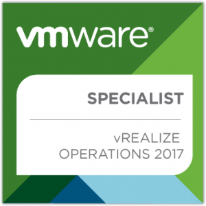

# "Specialist Exams"....Wait, what?

I have a requirement to essentially get more up to speed with vRealize Operations Manager. As I was digging through some of the reading material I came across the specialist exam. The details for which can be found [here](https://mylearn.vmware.com/mgrReg/plan.cfm?plan=103167&ui=www_cert).

I wasn't actually aware up until this point VMware actually offer specialist exams. At time of writing vRealize Operations and vSAN are the only two specialist certifications you can take.

I can understand the logic behind it - vRealize is becoming a very comprehensive suite of applications and with the VCP7-CMA certification primarily focused on vRealize Automation, it makes sense to separate out certain technologies into their own curriculum.

# 2VB-602 (vRealize Operations)

For a couple of weeks or so I've been messing around with / reading up on / watching videos of vRealize Operations primarily focused on 6.6 without even knowing about the certification. The exam, however, is based on 6.0 - 6.5 and 6.6 brings some rather substantial changes. Therefore don't expect to see 6.6 related questions in the exam.

# Resources

Although I wasn't actually focused on passing this specific test, Here's what I've used so far in an attempt to get up to speed:

 

Pluralsight's training course on vRealize Operations (created March 2017) - [https://www.pluralsight.com/courses/vmware-vrealize-operations-manager](https://www.pluralsight.com/courses/vmware-vrealize-operations-manager)

VMware's documentation center - [https://docs.vmware.com/en/vRealize-Operations-Manager/index.html](https://docs.vmware.com/en/vRealize-Operations-Manager/index.html)

vApp Deployment and Configuration Guide - [https://docs.vmware.com/en/vRealize-Operations-Manager/6.6/vrealize-operations-manager-66-vapp-deploy-guide.pdf](https://docs.vmware.com/en/vRealize-Operations-Manager/6.6/vrealize-operations-manager-66-vapp-deploy-guide.pdf)

VMware training videos - [http://players.brightcove.net/1534342432001/S1xUFpuYwx\_default/index.html?playlistId=5446534362001](http://players.brightcove.net/1534342432001/S1xUFpuYwx_default/index.html?playlistId=5446534362001)

# Exam Experience

The exam can be taken anywhere unlike the VCP or VCAP exams which require you to attend a training center. The questions were pretty tough, but that may have come down to my lack of experience with the product.

Overall, it was a interesting experience. I probably would have preferred vRealize Operations to have it's own VCP level exam being proctored etc. It's a nice-to-have, but I still have a lot to learn about vRealize Operations but it's given me some confidence that I've probably understood the fundamentals.

 

