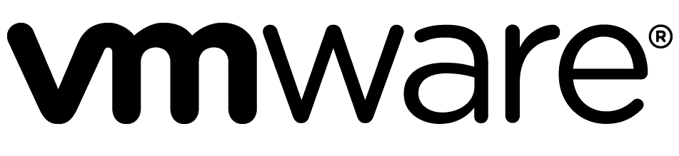
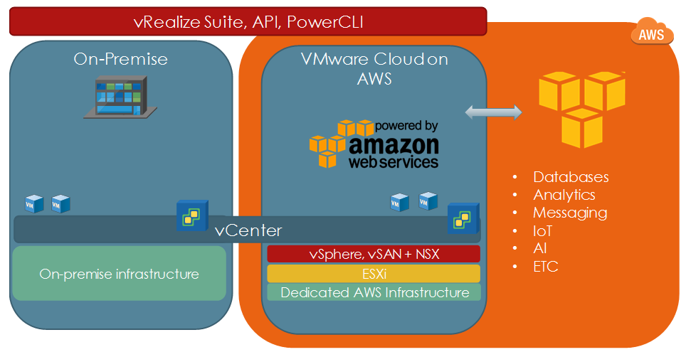
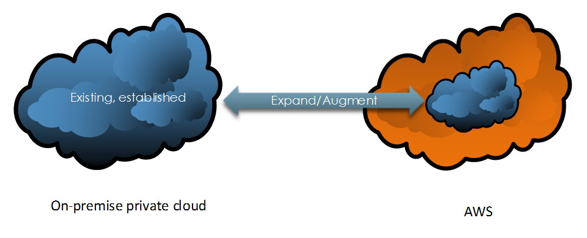
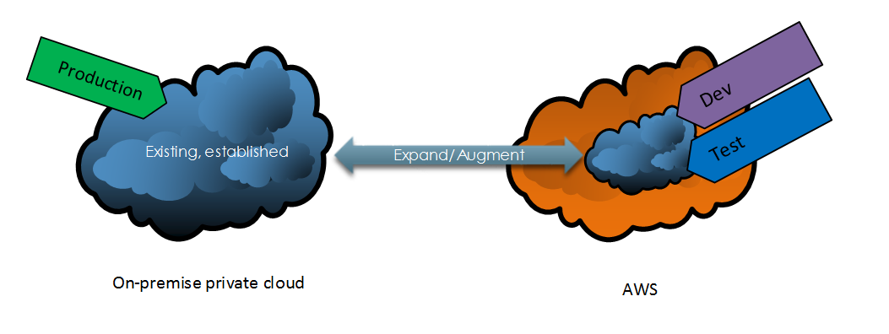
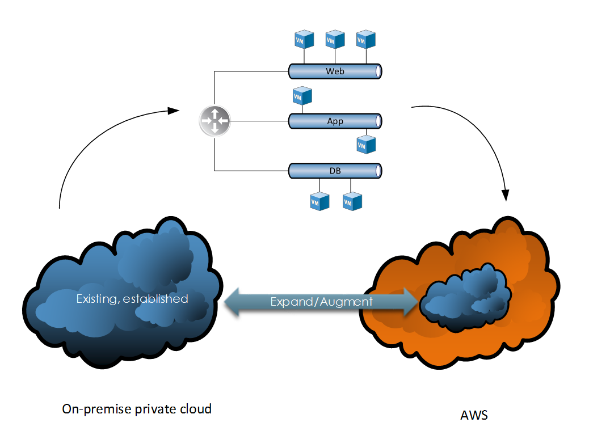

Perhaps one of VMware’s most significant announcements made in recent times is the partnership with Amazon Web Services (AWS), including the ability to leverage AWS’s infrastructure to provision vSphere managed resources. What exactly does this mean and what benefits could this bring to the enterprise?

 

# **Collaboration of Two Giants**

To understand and appreciate the significance of this partnership we must acknowledge the position and perspective of each.

 

 

 

- Market leader in private cloud offerings
- Deep roots and history in virtualisation
- Expanding portfolio

 

 

 

 

- Market leader in public cloud offerings
- Broad and expanding range of services
- Global scale

 

VMware has a significant presence in the on-premise datacentre, in contrast to AWS which focuses entirely on the public cloud space. VMware cloud on AWS sits in the middle as a true hybrid cloud solution leveraging the established, industry-leading technologies and software developed by VMware, together with the infrastructure capabilities provided by AWS.

 

# **How it Works**

In a typical setup, an established vSphere private cloud already exists. Customers can then provision an AWS-backed vSphere environment using a modern HTML5 based client. The environment created by AWS leverages the following technologies:

- ESXi on bare metal servers
- vSphere management
- vSAN
- NSX

 

The connection between the on-premise and AWS hosted vSphere environments is facilitated by Hybrid Linked Mode. This allows customers to manage both on-premise and AWS hosted environments through a single management interface. This also allows us to, for example, migrate and manage workloads between the two.

# **Advantages**

Existing vSphere customers may already be leveraging AWS resources in a different way, however, there are significant advantages associated with implementing VMware cloud on AWS, such as:

**Delivered as a service from VMware** – The entire ecosystem of this hybrid cloud solution is sold, delivered and supported by VMware. This simplifies support, management, billing amongst other activities such as patching and updates.

**Consistent operational model** – Existing private cloud users use the same tools, processes and technologies to manage the solution. This includes integration with other VMware products included in the vRealize product suite.

**Enterprise-grade** **capabilities** – This solution leverages the extensive AWS hardware capabilities which include the latest in low latency IO storage technology based on Solid State Drive technology and high-performance networking.

**Access to native AWS resources** – This solution can be further expanded to access and consume native AWS technologies pertaining to databases, AI, analytics and more.

# **Use Cases**

VMware Cloud on AWS has several applications, including (but not limited to) the following:

 

## **Datacenter Extension**

 

Because of how rapidly an AWS-backed software-defined datacenter can be provisioned, expanding an on-premise environment becomes a trivial task. Once completed, these additional resources can be consumed to meet various business and technical demands.

 

 

 

## Dev / Test

 

Adding additional capabilities to an existing private cloud environment enables the division of duties/responsibilities. This enables organisations to separate out specific environments for the purposes of security, delegation and management.

 

 

 

 

 

## Application Migration

 

 

VMware cloud on AWS enables us to migrate N-tier applications to an AWS backed vSphere environment **without** the need to re-architect or convert our virtual machine/compute and storage constructs. This is because we’re using the same software-defined data centre technologies across our entire estate (vSphere, NSX and vSAN).

 

 

 

 

 

 

# **Conclusion**

There are a number of viable applications for VMware Cloud on AWS and it’s a very strong offering considering the pedigree of both VMware and AWS. Combining the strengths from each creates a very compelling option for anyone considering a hybrid cloud adoption strategy.

To learn more about VMware Cloud on AWS please review the following:

[https://aws.amazon.com/vmware/](https://aws.amazon.com/vmware/)

[https://cloud.vmware.com/vmc-aws](https://cloud.vmware.com/vmc-aws)
