The Software Defined Data Center (SDDC for short) has become a widely adopted and embraced model for modern datacentre implementations. Conveying the benefits of the SDDC, particularly the non-technical aspects can be a challenge. In this blog post we take a practical example of a single activity we can automate in NSX and the benefits that come from it, both technical and non-technical.

# **The NSX API**

An API (**A**pplication **P**rogramming **I**nterface), in simple terms is an intermediary that allows two applications to communicate with each other via a common syntax. Although we may not be aware of it, it’s likely we use API’s every day when we use applications such as Facebook, LinkedIn, vSphere and countless others. For example, when you create a logical switch in the vSphere web client, behind the scenes an API call is made to the NSX manager to facilitate that request.

The NSX API is based on REST which leverages HTTPS requests to GET, PUT, POST and DELETE data from the NSX ecosystem:

- **GET –** Retrieve an entity
- **PUT –** Create an entity
- **POST –** Update an entity
- **DELETE –** Remove an entity

An entity can be a variety of NSX objects such as Logical Switches, Distributed Routers, Edge Gateways, Firewall rules, etc.

 

# **Options for** **working with the NSX API**

Several avenues exist for working with the rest API, each having their own advantages and disadvantages:

- **Direct API calls via REST client** – These can be made via clients such as Postman. These calls are static and are therefore suitable for one-off requests.

 

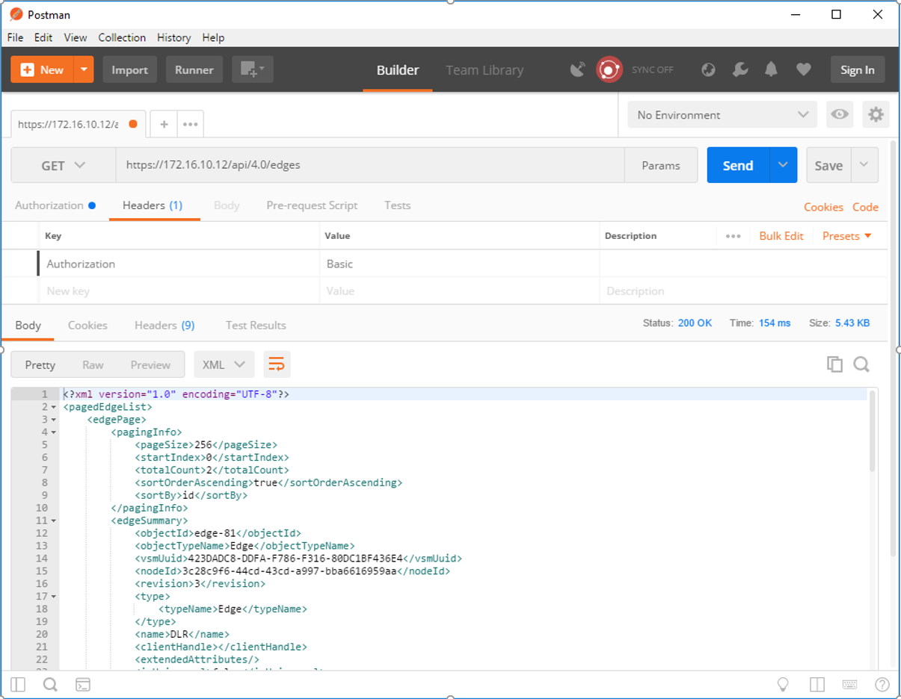

 

- **PowerNSX** – PowerNSX is a PowerShell module that enables the consumption of API calls via Powershell cmdlets. It’s an open source community project but is **not** supported by VMware. Also, not all API calls are currently exposed as cmdlets.
- **API calls via code** – API calls can be made from a variety of programming libraries (Powershell, C#, Java, etc) which add functionality by adding an element of dynamic input. We use this as an example in this blog.

 

# **Practical example – Creating new networks in a legacy virtualised compute environment**

To illustrate the power of automating NSX via automation let’s take an example activity and break it down into respective tasks. In this example, we want to create an N-tier network (IE a network comprising of Web, App and DB tiers which are routable and sit behind a perimeter firewall).

 

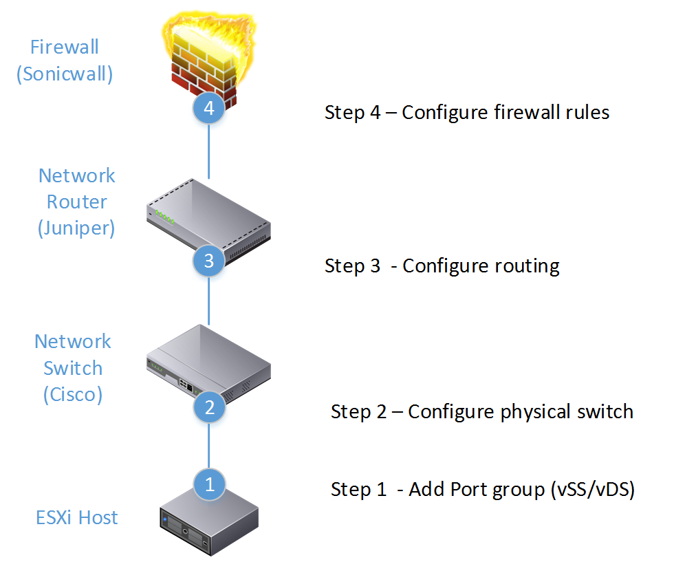

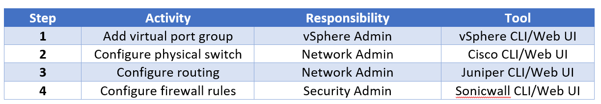

Depending on factors such as the number of vendors used and the structure of the IT team, we can see that executing a relatively simple task of creating an N-Tier routable, secure network for the purposes of consumption could:

- **Involve multiple network teams** (vSphere admin/network admin/security admin)
- **Involve multiple tools** (in this example tools from vSphere, Cisco, Juniper and Sonicwall)

This operational complexity can hinder the speed and agility of a business due to factors such as:

- **Multiple teams need to collaborate**. Collaboration between vSphere / Network / Security teams can be time-consuming
- **Multiple tools/skillsets required**. In the example above skills pertaining to Sonicwall, Juniper, Cisco and vSphere are required to create a secure network topology

 

# **Practical example – Automating in NSX**

To demonstrate the automation capabilities designed to address the example a Powershell script was created to facilitate API calls directly to NSX. The advantage of doing this is:

- API calls are supported by VMware.
- The entire API ecosystem is exposed for consumption.
- Powershell can prompt the user for information, which is then used to dynamically populate API requests.
- All tiers of the network are created and managed by a single management plane.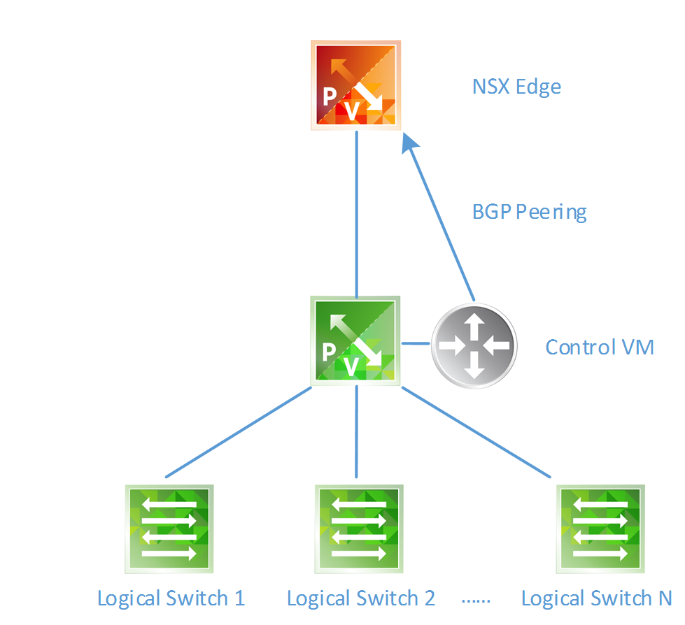

 

This script starts with the layer 2 logical switches and then moves up the networking stack configuring the layer 3 and perimeter elements of this network:

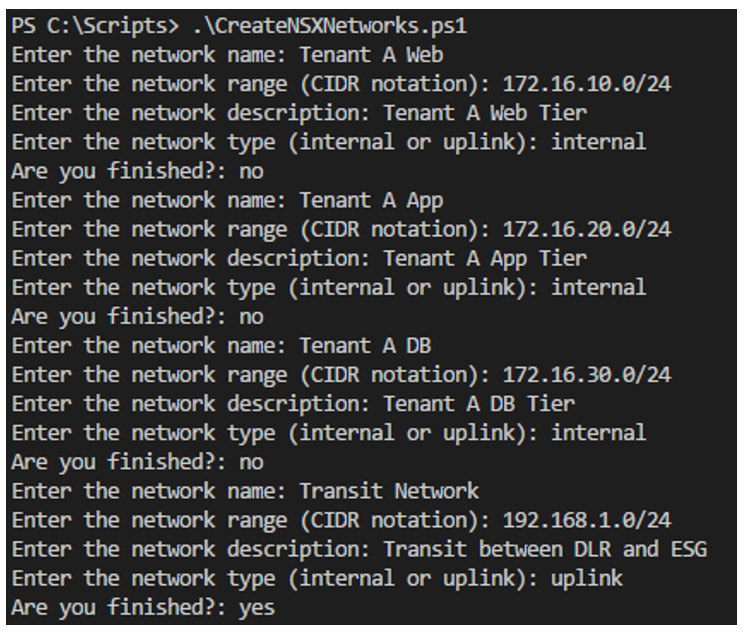

 

For each logical network we prompt the user for the following:

- **Name** – What we want to call the logical network
- **Network Range** – The intended network range for this network. This is used to determine the DLR’s interface on it
- **Network Description** – What we provide as the description
- **Network Type** – Simply put, Uplinks are used for peering (North/South) traffic. We need one uplink network to facilitate the peering between the DLR and ESG

 

Once the user has put in the required networks, API calls are executed from the Powershell script to create the networks:

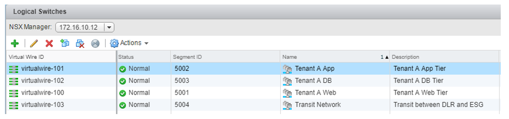

Next is to prompt the user for the DLR and ESG names: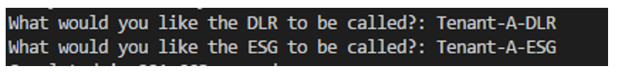

 

This information is used to construct the Distributed Logical Router (DLR) and Edge Services Gateway (ESG) devices via API calls:

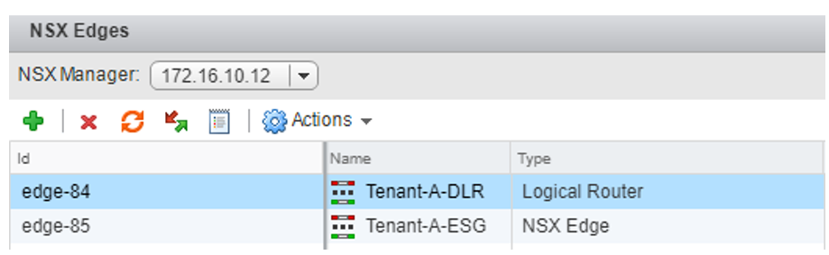

At this stage, the following has been created:

 

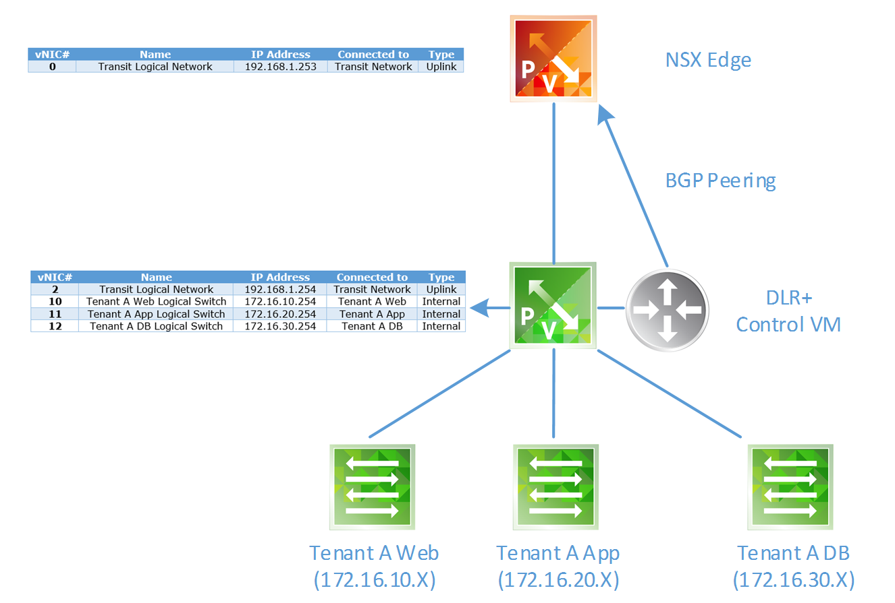

 

At which point the script outputs the total amount of time elapsed to construct this topology in NSX (including the time taken for the user to input the data for).

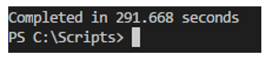

In this example it took 291.7 seconds (4.9 minutes) to construct the following:

- Create 3 internal logical switches (for VM traffic)
- Create 1 uplink logical switch (for BGP peering)
- Create 1 DLR and configure interfaces on each internal logical switch (default gateway)
- Create 1 ESG and configure interface for BGP peering
- Configure BGP dynamic routing

Not bad at all.

To validate the routing, we can simply log on to the ESG and check its routing table:

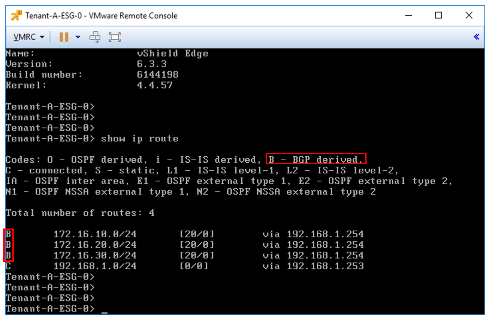

We can see the ESG has learnt (by BGP) the networks that reside on our DLR.

This is one of the almost endless examples of exposing and leveraging the NSX API.

**For anyone interested in the Powershell** **script - I intend to upload the code once I've added some decent input validation.**
