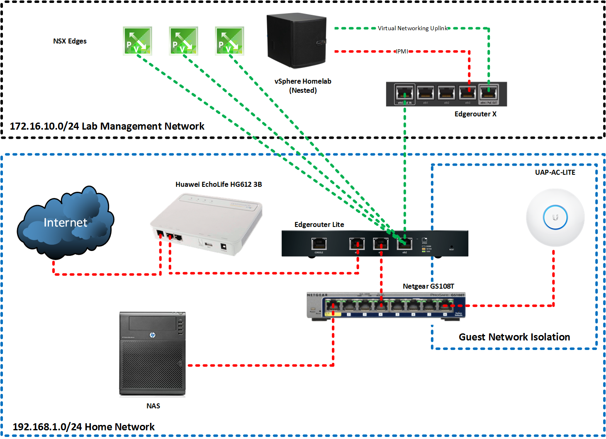

# Adios, Netgear router

In hindsight, I shouldn't have bought a Netgear D7000 router. The reviews were good but after about 6 months of ownership, it decided to exhibit some pretty awful symptoms. One of which was completely and indiscriminately drop all wireless clients regardless of device type, range, band or frequency it resided on. A reconnect to the wireless network would prompt the passphrase again, weirdly. Even after putting in the passphrase (again) it wouldn't connect. The **only** way to rectify this was to physically reboot the router.

Netgear support was pretty poor too. The support representative wanted me to downgrade firmware versions just to "see if it helps" despite confirming that this issue is not known in any of the published firmware versions.

Netgear support also suggested I changed the 2.4ghz network band. Simply put. They weren't listening or couldn't comprehend what I was saying.

Anyway, rant over. Amazon refunded me the £130 for the Netgear router after me explaining the situation about Netgear's poor support. Amazing service really.

# Hola, Ubiquiti

I've been eyeing up Ubiquiti for a while now but never had a reason to get any of their kit until now.  With me predominantly working from home when I'm not on the road and my other half running a business from home, stable connectivity is pretty important to both of us.

The EdgeMAX range from Ubiquiti looked like it fit the bill. I'd say it sits above the consumer-level stuff from the likes of Netgear, Asus, TP-Link etc and just below enterprise level kit from the likes of Juniper, Cisco, etc. Apart from the usual array of features found on devices of this type I particularly wanted to mess around with BGP/OSPF from my homelab when creating networks in VMware NSX.

With that in mind, I cracked open Visio and started diagramming, eventually ending up with the following:

 

I noted the following observations:

- Ubiquti Edgerouters do not have a build in VDSL modem, therefore for connections such as mine, I required a separate modem.
- The Edgerouter Lite has no hardware switching module, therefore it should be purely used as a router (makes sense)
- The Edgerouter X has a hardware switching module with routing capabilities (but lower total pps (Packets Per Second))

# Verdict

I managed to set up the pictured environment over the weekend fairly easily. The Ubiquiti software is very modern, slick, easy to use and responsive. Leaps and bounds from what I've found on consumer-grade equipment.

I have but one criticism with the Ubiquiti routers, and that is not everything is easily configurable through the UI (yet). From what I've read Ubiquiti are making good progress with this, but for me I had to resort to the CLI to finish my OSPF peering configuration.

The wireless access point is decent. good coverage and the ability to provision an isolated guest network with custom portal is a very nice touch.

Considering the Edgerouter Lite costs about £80 I personally think it represents good value for money considering the feature set it provides. I wouldn't recommend it for every day casual network users, but then again, that isn't Ubiquiti's market.

The Ubiquiti community is active and very helpful as well.
