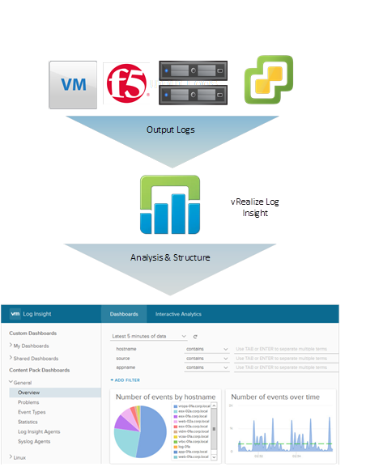

Log analysis has always been a standardised practice for activities such as root cause analysis or advanced troubleshooting. However, ingesting and analysing these logs from different devices, types, locations and formats can be a challenge. In this post, we have a look at vRealize Log Insight and what it can deliver.

 

## **What is it?**

vRealize Log Insight is a product in the vRealize suite specifically designed for heterogeneous and scalable log management across physical, virtual and cloud-based environments. It is designed to be agnostic across what it can ingest logs from and is therefore valid candidate in a lot of deployments.

Additionally, any customer with a vCenter Server Standard or above license is entitled to a **free 25 OSI pack**. OSI is known as “Operating System Instance” and is broadly defined as a managed entity which is capable of generating logs. For example, a 25 OSI pack license can be used to cover a vCenter server, a number of ESXi hosts and other devices covered either natively or via VMware Content Packs (with the exception of Custom and 3rd party content packs – standalone vRealize Log Insight is required for this feature).

 

## **Current Challenges**

Modern datacenters and cloud environments are rarely consumed by homogeneous solutions. Customers use a number of different technologies from different vendors and operating systems. With this comes a number of challenges:

 

- **The inconsistent format** **of log types** – vCenter/ESXi uses syslog for logging, Windows has a bespoke method, applications may simply write data to a file in a specific format. This can require a number of tools/skills to read, interpret and action from this data.
- **Silos of information** – The decentralised nature of dispersed logging causes this information to be siloed in different areas. This can have an impact on resolution times for incidents and accuracy of root cause analysis.
- **Manual analysis** – Simply logging information can be helpful, but the reason why this is required is to perform the analysis. In some environments, this is a manual process performed by a systems administrator.
- **Not scalable** – As environments grow larger and more complex having silos of differentiating logging types and formats becomes unwieldy to manage.
- **Cost** – Man hours used to perform manual analysis can be costly.
- **No Correlation** – Siloed logs doesn’t cater for any correlation of events/activities across an environment. This can greatly impede efforts in performing activities such as root cause analysis.

 

## **Addressing Challenges With vRealize Log Insight**

Below are examples of how vRealize Log Insight can address the aforementioned challenges.

 

- **Create structure from unstructured data** – Collected data is automatically analysed and structured for ease of reporting.
- **Centralised logging** – vRealize Log Insight centrally collates logs from a number of sources which can then be accessed through a single management interface.
- **Automatic analysis** – Logs are collected in near real-time and alerts can be configured to inform users of potential issues and unexpected events.
- **Scalable** – Advanced licenses of vRealize Log insight include additional features such as Clustering, High Availability, Event Forwarding and Archiving to facilitate a highly scalable, centralised log management solution. vRealize Log Insight is also designed to analyse massive amounts of log data.
- **Cost** – Automatic analysis of logs and alerting can assist with reducing man-hours spent manually analysing logs, freeing up IT staff to perform other tasks.
- **Log Correlation** – Because logs are centralised and structured events across multiple devices/services can be correlated to identify trends and patterns.

 

## **Extensibility**

vRealize Log Insight’s capabilities can be extended by the use of content packs. Content packs are available from the VMware marketplace ([https://marketplace.vmware.com/vsx/?contentType=2](https://marketplace.vmware.com/vsx/?contentType=2))

Content packs are published either by VMware directly or from vendors to support their own devices/solutions. Examples include:

- Apache Web Service
- Brocade Devices
- Cisco Devices
- Dell | EMC Devices
- F5 Devices
- Juniper Devices
- Microsoft Active Directory
- Nimble Devices
- VMware SRM

 

## **Closing Thoughts**

It’s surprising how underused vRealize Log Insight is considering it comes bundled in as part of any valid vSphere Standard or above license. The modular design of the solution allowing third-party content packs adds a massive degree of flexibility which is not common amongst other centralised logging tools.
