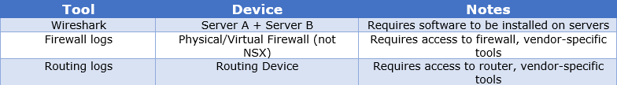
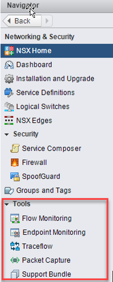
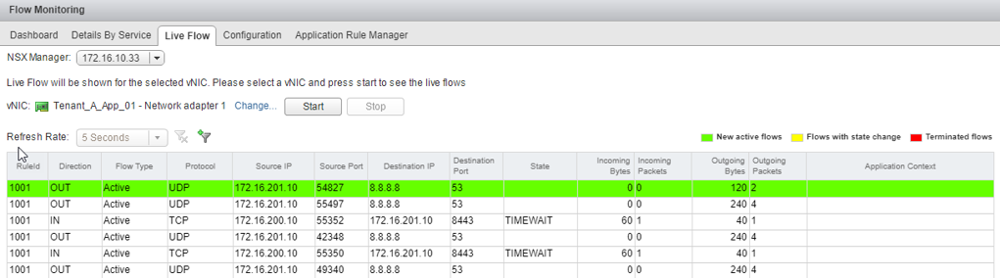
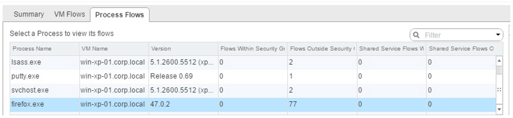
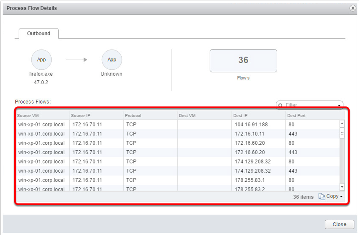
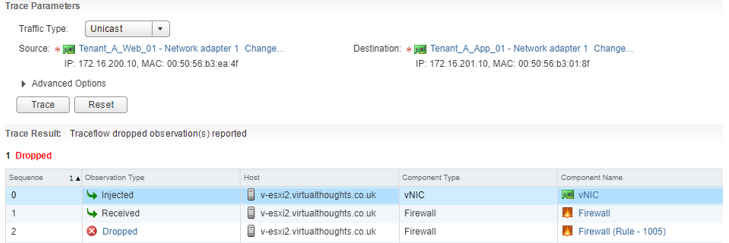
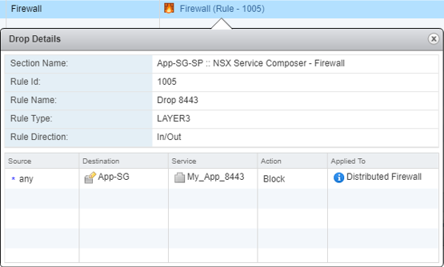
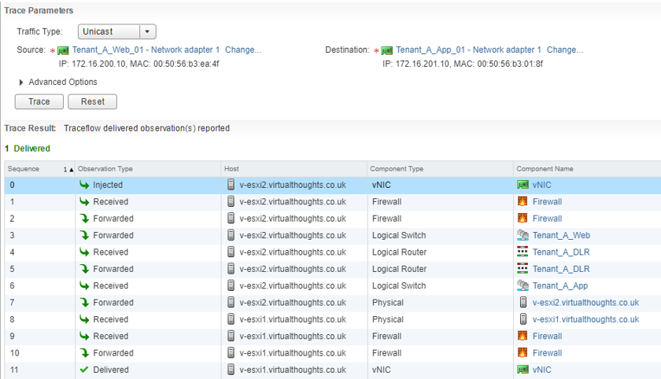
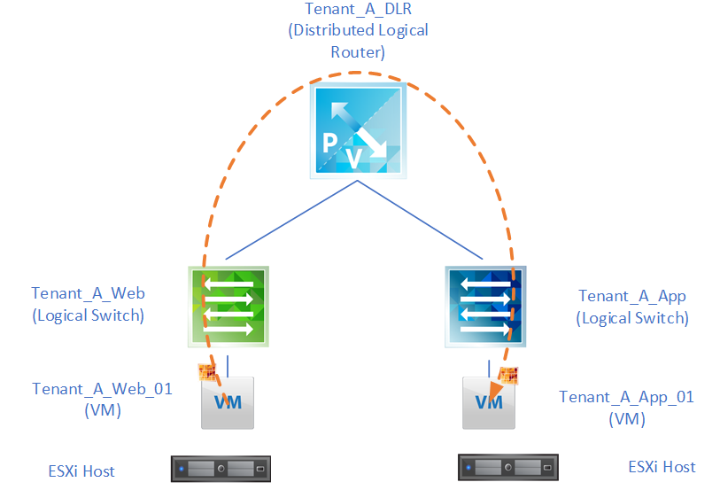
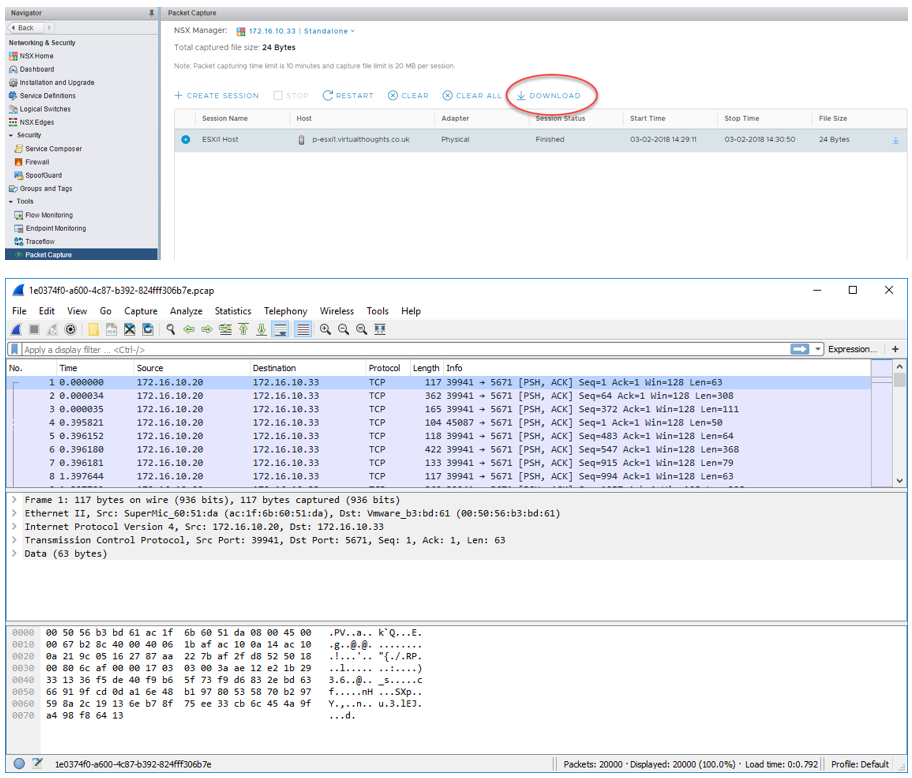

The defining characteristic of the Software Defined Data Center (SDDC), as the name implies, is to bring the intelligence and operations of various datacenter functions into software. This type of integration provides us with the ability to gain insights and analytics in a much more controlled, tightly integrated fashion.

VMware NSX is the market leader in network virtualisation. In this post, we have a look at a selection of tools which come with NSX, enabling a greater understanding of exactly what is transpiring in our NSX environment.

 

# What we do now

Before diving into NSX-V traffic flow capabilities, let’s take a step back into how some organisations may approach identifying traffic flows currently by taking a simple example issue:

**_“Server A can’t talk to Server B on port 8443”_**

In this example, we assume that Server B is listening on port 8443.

Here are a few tools/methods that can be used to help identify the root cause

 

What these tools/methods have in common are:

 

- **Disjointed** – Treated as separate, discrete exercises.
- **Isolated** – Requires specific tools/skillsets.
- **Decentralised** – Analysis requires output to be crossed referenced and analysed manually.

 

# How NSX-V native tools can help

NSX-V provides us with a number tools to help us gain a deeper understanding of our network environment as well as provide accelerated troubleshooting and root cause analysis. These can be found via the vCenter client:

 

# Flow Monitoring

Flow Monitoring is one of the traffic analysis tools that provide a detailed view of the traffic originating and terminating at virtual machines. One example use case of this is to determine in real time the traffic flows originating from a virtual machine – the below example demonstrating this. No agent or VM configuration is needed, unlike with Wireshark – NSX does this all natively without any modifications to the VM:

 

The VM in the example above has an IP of 172.16.201.10. We can see that itself is making DNS calls out to 8.8.8.8 as well as communicating with another machine with an IP of 172.16.200.10 over port 8443.

# Endpoint Monitoring

 

Endpoint Monitoring enables us to map specific processes inside a guest operating system to network connections that are facilitating this traffic. This is helpful for gaining insight into application-layer details. The examples shown below demonstrate NSX’s ability to identify:

- The source of the flow (process or application)
- The source VM
- The destination (can be any destination)
- Traffic Type

 

 

 

# Traceflow

Traceflow acts as a very useful diagnostic tool. Compared to flow monitoring, which takes a real-time view of network traffic, traceflow allows us to simulate traffic by synthetically “injecting” this traffic into our environment and monitoring the data path. In this example a test was executed for connectivity from a web server to an App server over port 8443:

 

NSX has informed us that this packet was dropped due a firewall rule – it also gives us the Rule ID in question. We can click on this link to get more information about this rule:

 

Once this rule was modified we can re-run the test, which shows this traffic has been successfully delivered to the target VM.

Traceflow also gives us an idea as to the journey our packet has travelled. From the above output we can see that this packet has traversed two logical switches, two ESXi hosts, one distributed logical router, and has forwarded through the distributed firewall running on the vNIC’s of two VM’s:

 

 

# Packet Capture

The Packet Capture feature in NSX-V enables us to generate packet traces from physical ESXi hosts should we wish to perform any troubleshooting at that level.

These captures are done on a per-host level and we can specify to gather packet captures from one of the following interface types:

- Physical NIC
- VMKernel Interface
- vNIC
- vDR Port

Or from one of the respective filter types. Once started NSX will start gathering packet logs. Once the session has stopped these can be downloaded as .PCAP files which can be opened with a tool such as Wireshark

 

# Conclusion

As organisations are adopting software-defined technologies, the tools and processes we use must also change. Thankfully, NSX-V has a plethora of native capabilities to observe, identify and troubleshoot software-defined networks.
