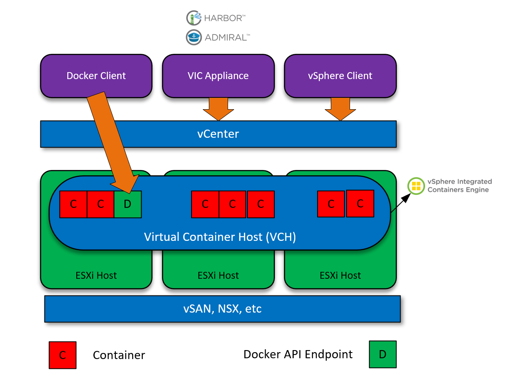
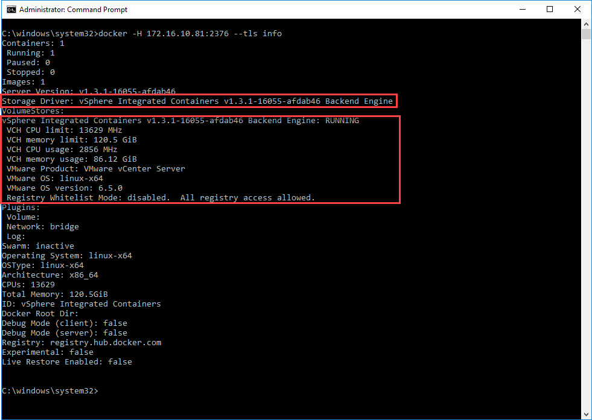

In this multi-part series, we evaluate the options available to vSphere users/customers wishing to deploy a native container service into an existing vSphere environment.

Part 1 - VIC (VMware Integrated Containers).

Part 2 - PKS (Pivotal Container Service).

# Why should we care about containers?

Containers change the way we fundamentally look at application deployment and development. There was a huge shift in the way we managed platforms when server virtualisation came around - all of a sudden we had greater levels of flexibility, elasticity and redundancy compared to physical implementations. Consequently, the way in which applications were developed and deployed changed. And here we are again, with the next step of innovation using technology that is making rifts in the industry, changing the way consume resources.

 

# What is VIC?

VIC (or vSphere Integrated Containers) is a native extension to the vSphere platform that facilitates container technology, because of this tight integration we're able to perform actions and activities using the vSphere client and integrate it with auxiliary services. VIC is developed in such a way so it presents a Docker Compatible API endpoint. Therefore Ops/Dev staff already familiar with Docker can leverage VIC using the same tools/commands that they're already familiar with.

VIC is a culmination of three technologies:

 

The containers engine is the core runtime technology that facilitates containerised applications in a vSphere environment. As previously mentioned, this engine presents a Docker-compatible API for consumption. Tight integration between this and vSphere enables vSphere admins to manage container and VM workloads in a consistent way.

 

 

Harbour is an enterprise-level facilitator of Docker-based image retrieval and distribution. It's considered an extension of the open source Docker Distribution by adding features and constructs that are beneficial to the enterprise including but not limited to : LDAP support, Role-based access control, GUI control and much more.

 

 

Admiral is a scalable and lightweight container management platform for managing containers and associated applications. Primary responsibilities are mainly around automated deployment and lifecycle management of containers.

# How VIC works

The management plane of VIC is facilitated by a OVA appliance, rather than going through the installation steps here, I will simply point to the direction of the (excellent) documentation located at https://vmware.github.io/vic-product/#documentation. At the core though, we have the following constructs:

- **VIC Appliance** - Management plane.
- **Virtual Container Hosts** **-** Infrastructure resource with a docker endpoint.
- **Registry** - Location for Docker-compatible images.

 

Which, from a logical view looks like this:

 

Key observations are:

- The VCH (Virtual Container Host) **isn't** a Virtual machine, it's actually a **resource pool**. Therefore, I think the best way to describe a VCH is a logical representation of a pool of resources, including clustering, scheduling, vMotion, HA, and other features.
- When a VCH is created, a VM is created that facilitates the Docker-compatible API endpoint.

 

# Advantages of VIC

So why would any of us consider VIC instead of, for example, standard Docker hosts? Here are a few points I've come across:

1. Native integration into vSphere.
2. Administrators can secure  and manage VM and Container resources in the same way.
3. Easy integration into other VMware products.
    1. NSX.
    2. VSAN.
    3. vRealize Network Insight.
    4. vRealize Orchestrator.
    5. vRealize Automation.
4. Eases adoption.
5. Eases security.
6. Eases management.

# Conclusion

VIC helps bridge the gap between Developers and Administrators when it comes to the world of containers. I would say VIC is still in its infancy in terms of development, but it's being backed by a great team and I think it's going to make a compelling option for vSphere customers/users looking to embrace the container world, whilst maintaining a predictable, consistent security and management model.
