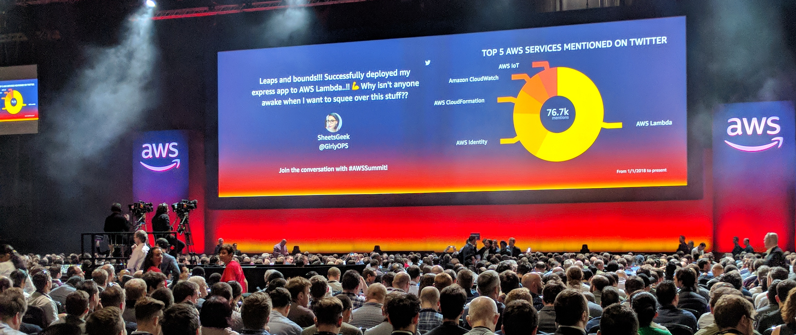

# Post-AWS Summit 2018 Thoughts on Serverless and Containers

I was lucky enough to attend the AWS summit in London in May 2018. It was a first for me,  and the experience was pretty awesome. With a veritable smorgasbord of chalk talks, instructor-led demos and vendor presence there was something for everyone. I gravitated towards the docker/lambda sessions as I had recently picked up learning container technology, which got me thinking - from my perspective (previous ops-centric), how does container technology compare to the likes of serverless? When would you use one over the other? Whilst on the train home from London I decided to jot down my notes into this post.

# Primer

I'm not a dev, but I have some development background. I got acquainted with C# in the past and wrote a number of applications - probably the most complicated one I wrote was a remote data collector for Windows-based machines to extract data from the WMI (Windows Management Instrumentation)  database, and then present this is an ASP.net page. But I'm fully aware things have moved on a lot since then. My career history has predominantly been based on the design, implementation and monitoring of infrastructure.

 

# What I like about containers

- **Flexibility** - You can pretty much take any existing application and package it into a container image. At this point, it's portable, lightweight and may not require any change to the app itself.
- **Control** - You have extensive control over the platform in which your containers are running, as well as the runtime itself.
- **Scale** - Container environment can scale tremendously well and cater for the complete n-tier architecture.
- **Self-Contained** - Excuse the pun, but you can encapsulate an application, its microservices, and it's dependencies within a single ecosystem.
- **No Vendor Lock-in** - Don't like a particular way a cloud provider is hosting your containers? Simply move them elsewhere.

# What I don't like about containers

- **Can be complex** - Orchestration tools such as Kubernetes can generate a bit of a learning curve, especially for non-devs.
- **Requires a change in mindset** - Containers should be short-lived and ephemeral - treat them like cattle, not pets. Those who are used to nurturing, patching and tweaking individual VM's will experience a bit of a mindset change.
- **Microsoft** **has some catching up to do** - The smallest Linux container image is a few MB, whereas the smallest Windows image is a cool 1GB or more.

# What I like about serverless

- **Abstraction** - Zero touch on the infrastructure or runtime.
- **Cost** - Can be significantly cheaper than running applications/services within VM's.
- **Auto Scale** - Increase resources with demand, scale back when not required.
- **Quicker time to deployment** - Implement services quickly and efficiently.

# What I don't like about serverless

- **At the mercy of the provider** - For example, with Lambda you're at their mercy when it comes to changes or outages with the service.
- **Runtime Limits** - A Lambda function can have a maximum lifetime of 5 minutes,  Minimum = 128 MB / Maximum = 3008 MB memory and 512MB of ephemeral disk space. This means that particular functions that are CPU intensive may not be well suited.
- **Language Limits** - You are limited to writing code for specific runtimes supported by Lambda. For example, The latest version of Node.js that's supported is 8.10, whereas newer versions have been released. To take advantage of additional features or bug fixes, you have to wait for the provider (AWS in this case) to update accordingly.
- **Latency** - Expect invocation latency for functions that have not been executed for a while. This can yield unpredictable time to execute. Therefore, if you have services that are latency-sensitive, serverless may not be the best option.
- **The name** - "Serverless" is not server-less. It runs on servers, including containers (!). Personally, I find the naming a misnomer.

 

# So, which one is "better"?

I've read a lot of blog posts that compare the two - **personally, I don't think they can be compared**. There are workloads you can do in containers but not in serverless and vice-versa - they solve different issues and have their own advantages and disadvantages. The deciding factor between them has to be influenced by exactly _**what**_ you need to do/run. Ultimately though, from my perspective it boils down to whether or not you need to have absolute control and access over the runtime environment - If you don't, serverless technologies from the likes of Lambda are great. If you need greater control and visibility of how & where and in what language/compiler you want your code to run in/from, containers may be better.

Container ecosystems can be pretty self-encapsulated. Lambda, however, works best by acting as a "glue" to bring together other features and resources from the AWS ecosystem into the bigger picture.

It's probably worth mentioning that when you invoke a Lambda function, behind the scenes a container is spun up to execute your code, adding further weight to the reasoning behind not doing a direct comparison. Lambda actually needs containers to run.
