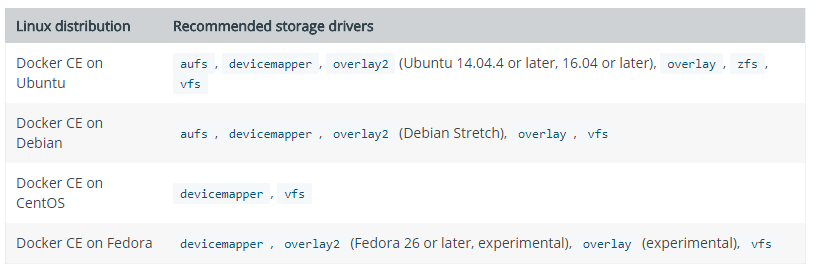
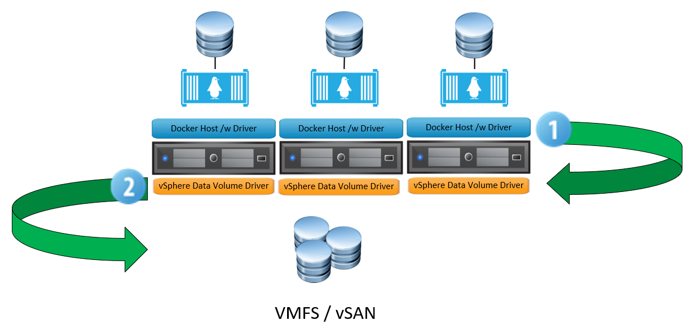

# The persistent storage requirement for the container ecosystem

When we talk about containers we generally think about microservices and all things ephemeral. But does this mean that we can't facilitate stateful workloads leverage persistent storage? Absolutely not.

In the docker world, we choose a storage "driver" to back our persistent storage onto. The driver we choose is based on a number of requirements and which operating system our Docker hosts run. The table below lists the recommended out-of-the-box drivers for Docker Community Edition.

Most of the above are battle-hardened, well-documented drivers. But what if we're running a vSphere based environment and want to integrate with some vSphere resources?

# vSan Storage Driver

Docker introduced the Docker Volume Plugin framework. This extended the integration options between Docker and other storage platforms including (but not limited to):

- Amazon EBS
- EMC Scaleio
- NFS
- Azure File Services
- iSCSI
- VMware based storage
    - vSAN, VMFS

 

The vSAN Storage Driver for Docker has two components:

# vSphere Data Volume Driver

This is installed on the ESXi host and primarily handles the VMDK creation that is requested by the underlying container ecosystem. It also keeps track of the mapping between these entities.

 

# vSphere Docker Volume Plugin

This is installed on the Docker host and primarily acts as the northbound interface that facilitates requests from users / API / CLI to create persistent storage volumes to be used by containers.

From an architectural perspective it looks like this:

 

**Step 1** - The user instantiates a new docker volume, specifying the appropriate driver (ie VMDK).

**Step** **2** - The vSphere Data Volume Driver accepts the request and communicates via the ESXi host to the underlying storage, which can be vSAN, VMFS or a mounted NFS share.

# Why use this?

A distinct advantage of leveraging vSphere-backed storage for containers is how we can utilise native capabilities of the underlying storage infrastructure. For example, if we use vSAN as the backend storage for containers we can leverage:

- Deduplication
- Compression
- Encryption
- Erasure Coding.
