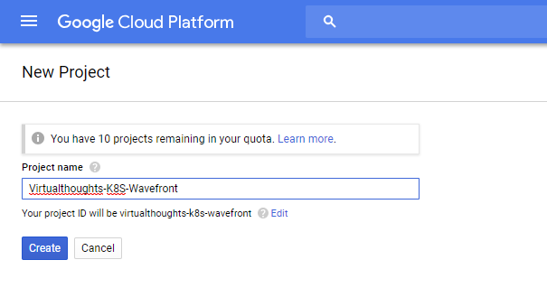
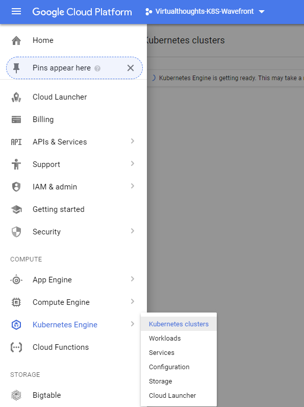
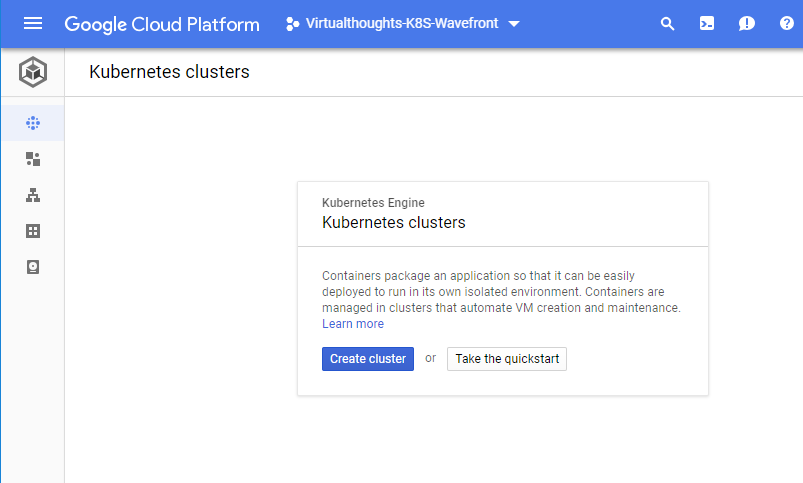
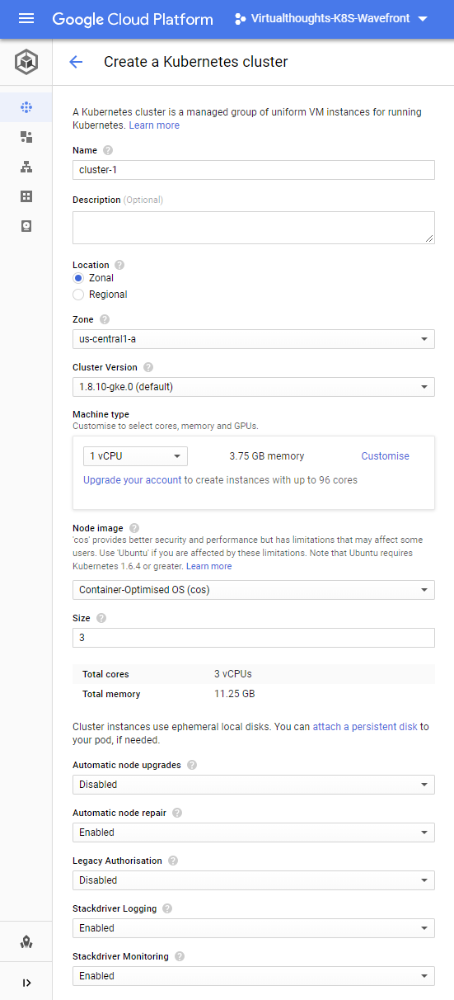
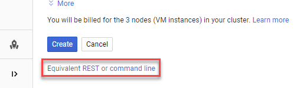
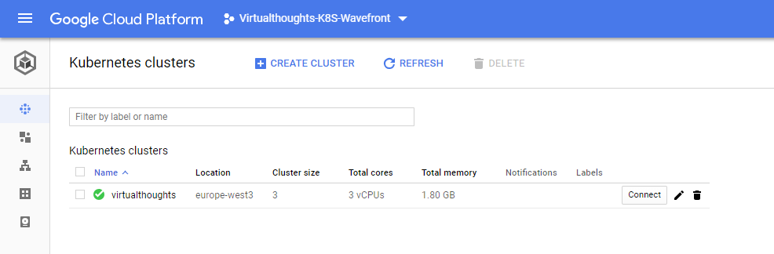
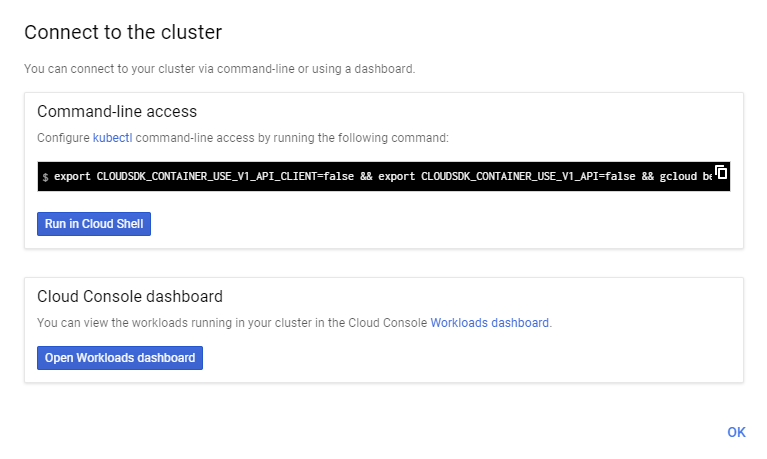
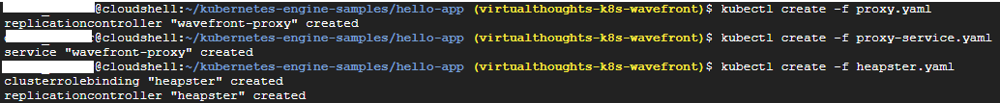
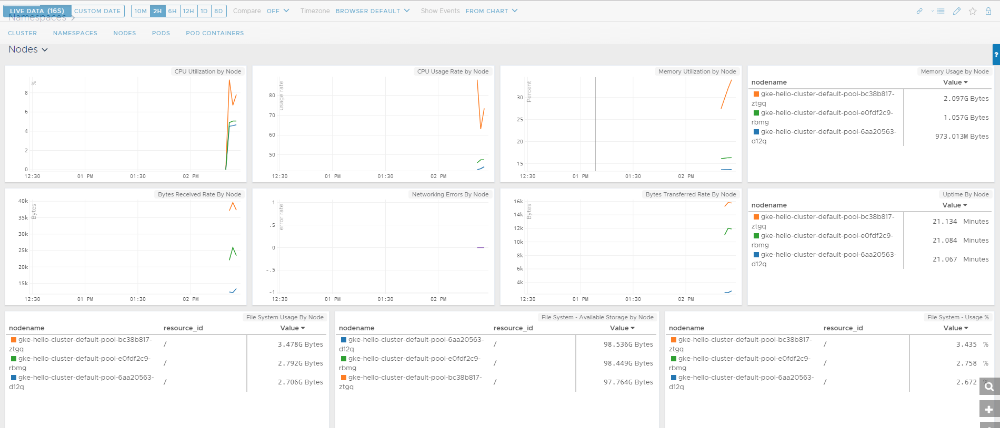

# Wavefront

Back in 2017, VMware acquired Wavefront - a company based in the US which focuses predominantly on real-time metrics and monitoring of a really...really vast array of platforms and technologies. We have technologies that aid in adopting and promoting cloud-native implementations, but monitoring, in some peoples eyes, can be a bit of an afterthought. Wavefront to the rescue. Having developed some Kubernetes and Docker knowledge myself, it seemed rather fitting to get an example going.

# GCP - Creating our Kubernetes cluster

To begin with, we need a Google Cloud project. Log into your GCP account and create one:

Access the Kubernetes Engine:

You may have to wait a few minutes for the Kubernetees engine to initialise. Once initialised, create a new Kubernetes cluster:

 

We have a number of options to define when we create a new Kubernetes cluster:

Note: You are not charged for, or responsible for deploying and maintaining the master nodes. As this is a hosted solution, Google takes care of this for us. As for the cluster options, we have the following base options to get us up and running, all of which should be pretty self-explanatory.

**Name** - The name for the cluster. **Description** - Optional value. **Location** - Determines whether our cluster's master VMs are localised within a single zone or spread across multiple zones in one region. **Zone/Region** - Determines where our clusters worker VM's are localised. **Cluster Version** - The version of Kubernetes to be deployed in this cluster. **Node Image** - We have two choices, either Container-Optimised OS (cos) or Ubuntu. **Size** - Number of nodes in our cluster

One aspect of this wizard I _**really**_ like is the ability to extract the corresponding REST or CLI command to create the Kubernetes cluster based on the options selected:

 

Click "Create" to initialise the Kuberntes cluster.

 

# GCP - Deploying a simple application

After waiting a few minutes our Kuberntes cluster has been created:

To connect to it, we can click the "Connect" button which will give us two options:

At this stage, you can deploy your own application, but for me, I deployed a simple application following the instructions located at [https://cloud.google.com/kubernetes-engine/docs/tutorials/hello-app](https://cloud.google.com/kubernetes-engine/docs/tutorials/hello-app)

 

# Wavefront and Kubernetes integration

To get started, we need to deploy the following:

- Wavefront Proxy
- Wavefront Proxy Service
- Heapster (Collector Agent)

The YAML files are located at the following URL : [https://longboard.wavefront.com/integration/kubernetes/setup](https://longboard.wavefront.com/integration/kubernetes/setup)

Note that you'll need a logon to access the above URL. Also, and very cleverly, the generated YAML files contain tokens specific to your account. Therefore, after deploying the YAML files Wavefront will automagically start collecting stats:

 

 

# Thoughts on wavefront

Once I got everything up and running I was pretty much in awe of the sheer depth of what Wavefront has visibility of.  From my tiny, insignificant environment I'm able to get _**extremely**_ detailed metrics and content pertaining to:

- **Clusters**
- **Namespaces**
- **Nodes**
- **Pods**
- **Pod Containers**

In particular, I was very impressed as to how **easy** it is to get wavefront to ingest data from the likes of GCP hosted K8s.
