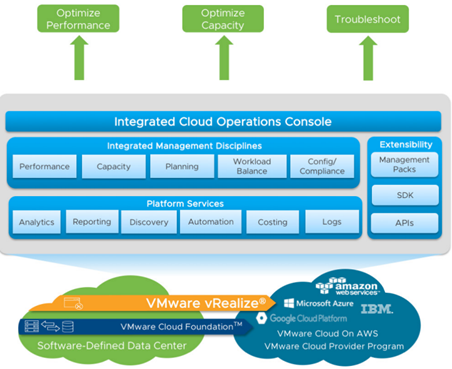
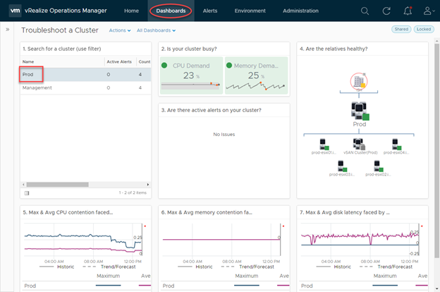
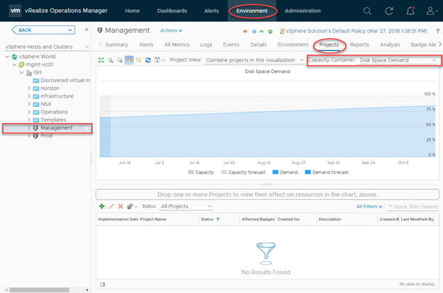
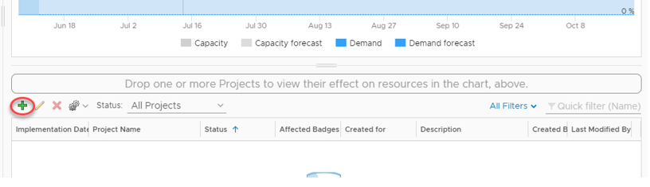
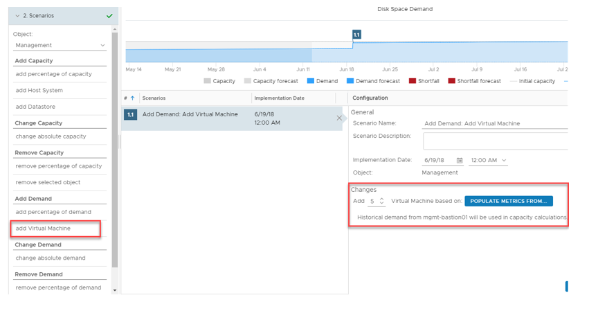
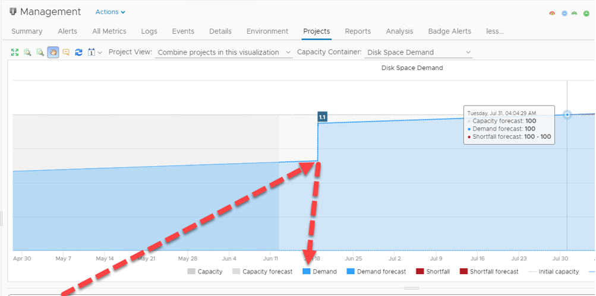
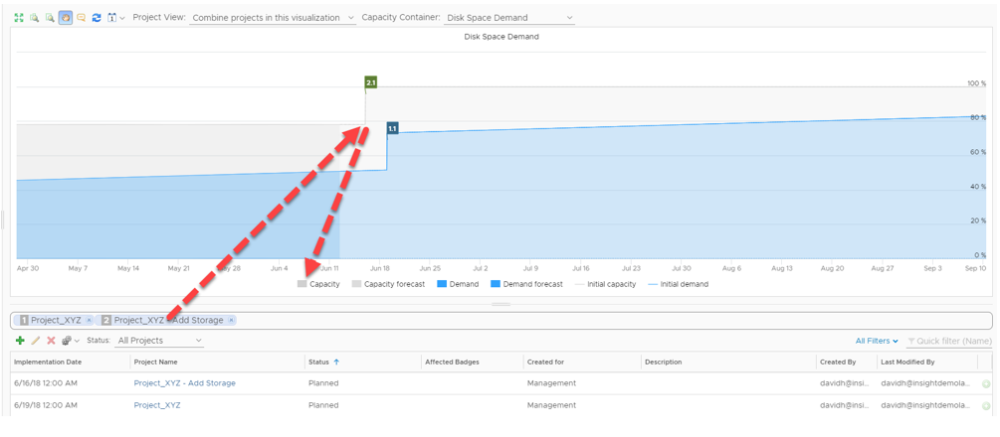

Applications and the underlying infrastructure, be it public, private or hybrid cloud are becoming increasingly sophisticated. Because of this, the way in which we monitor and observe these environments requires more sophisticated tools. In this blog post, we look at vRealize Operations and how it can be a facilitator of true hybrid cloud monitoring.

# **What is vRealize Operations?**

vRealize Operations forms part of the overall vRealize suite from VMware – a collection of products targeted to accommodate cloud management and automation. In particular, vRealize Operations, as the name implies, primarily caters to operations management with full visibility across physical, virtual and cloud-based environments. The anatomy of vRealize Operations is depicted below

 

**Integrated Cloud Operations Console** – A single, unified frontend to access, modify and view all related vRealize Operations components.

**Integrated Management Disciplines** – vRealize Operations has built-in intelligence to assimilate, dissect and report back on a number of key operational metrics pertaining to performance, capacity, planning and more. Essentially, vRealize Operations “learns” about your environment and is able to make recommendations, predictions and much more based on your specific workloads.

**Platform Services** – vRealize Operations is able to perform a number of platform management disciplines based on your specific environment. As an example, vRealize Operations can automate the addition of virtual machine memory based on monitored load, therefore proactively addressing potential issues before they surface.

**Extensibility** – Available from the VMware Marketplace, Management Packs extend the functionality of vRealize Operations. Examples include:

- Microsoft Azure Management Pack from Blue Medora
- AWS Management Pack from VMware
- Docker Management Pack from Blue Medora
- Dell | EMC Management Pack from Blue Medora
- vRealize Operations Compliance Pack for PCI from VMware

The examples above demonstrate vRealize Operation’s capability to monitor AWS and Azure environments in addition to on-premises workloads, making vRealize Operations a true platform for Hybrid Cloud monitoring and operations management

# **Practical Example – Cluster Monitoring / Troubleshooting**

In this example, we leverage one of the vRealize Operation’s built-in dashboards to check the performance of a specific cluster. A dashboard in vRealize operations terminology is a collection of objects and their state, represented in a visual fashion.

 

One of the ways vRealize understands the underlying environment is to establish and map dependencies in a logical manner. In this example, we have a top-level datacentre object (ISH), which child objects are decedents of (Cluster and hosts) this dashboard identifies key aspects of this cluster in a single page:

- Cluster activity / utilisation
- Health state of associated objects
- CPU contention information
- Memory contention information
- Disk latency information

Without vRealize Operations it would be common for an administrator to try and collate these metrics manually, looking at individual performance charts, DRS scheduling information, and vCenter health alarms. However, with vRealize operations, this data is collected and centralised for easy and effortless exposure.

 

# **Practical Example – Workload Planning**

In this example, we have an upcoming project that we want to forecast into our environment, particularly around disk space demand. We facilitate this by creating a “Project” in vRealize Operations, but before that, let's look at the project UI in a bit more detail:

 

We can access this section by navigating to Environment > vSphere Object. At which point we can select the resource we're interested in forecasting into. The chart in the middle projects the disk space demand for this specific vSphere object (a cluster, in this example). Note how we have an incline in disk space demand, which is typical of a production environment, however, we are within capacity for the time period specified (90 days).

To add a project, we click the green “plus” icon below the chart:

 

Next, we fill in details pertaining to the demand. In this case, I’m adding demand in the form of 5 virtual machines and I’m populating the specification of these VM’s based on an existing VM in my environment with an implementation date of June 19th.

 

 

If we add this project to the forecast chart, the chart changes to accommodate this change in our environment:

 

 

By adding this project we have obviously created more demand, consequently, the date in which our disk space resources will exhaust has been expedited.

By having this knowledge we can plan our capacity requirements ahead of time. In this example, I decide to add another project to add resources prior to the commissioning of the aforementioned VM’s:

Because we can combine projects into a single chart, we can see based on observed metrics what effect adding demand and capacity to our environment has.

This is one of a vast number of features in vRealize Operations.  vRealize Operations Manager can be an incredibly useful tool to have for a number of reasons. Its intelligent analytics, a breath of extensibility options and unified experience make it a compelling experience for modern cloud-based operations
