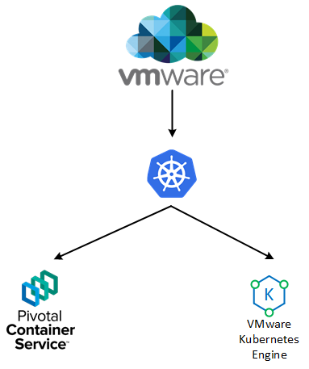

On the 26th of June 2018, VMware publically announced VKE - VMware Kubernetes Engine in Beta (with GA planned for later on this year). For me, the development of this solution flew under the radar, and its subsequent release came as quite a surprise - albeit quite a good one. So, where exactly does this solution fit with other Kubernetes based solutions that currently exist?

# VKE Overview

VKE sits within VMware's portfolio of cloud-native solutions as is pitched as a fully managed, Kubernetes-as-a-service offering. Therefore we have multiple ways we can consume Kubernetes resources from the VMware ecosystem, depicted in the diagram below.

 

Which prompts some customers to ask - Why should I pick VKS over PKS or vice-versa? From a high level, some of the differences are listed below:

|  | PKS | VKS |
| --- | --- | --- |
| Management Responsibility | Customer/Enterprise | Fully Managed |
| Consumption Model | Install, Configure, Manage, Consume | Consume |
| Residence | Public and Private Cloud | Public Cloud only |

 

What we can ascertain here is that VKE is designed to abstract away all the infrastructure components that are required for an operational Kubernetes deployment. As a reminder, PKS is composed of:

- **PKS Control Plane**
- **Kubernetes core**
- **BOSH**
- **Harbor**
- **GCP Service Broker**
- **NSX-T**

Which is quite a lot to manage and maintain. VKS however, takes away the requirement for us, the customers to manage such entities, and simply provides a Kubernetes endpoint for us to consume. Networking, storage and other aspects are abstracted. Of course, there are use cases for both VKE and PKS. VKE is not looking to be a replacement for PKS.

 

# How does it work?

Under the hood, VKS is deployed on top of AWS (who recently announced EKS, Amazon's own managed Kubernetes-as-a-service platform) but in fitting with VMware's ethos of "Any app, any cloud", this is likely to extend to other cloud platforms - notably Azure. In addition to simply leveraging the AWS backend, VKS adds a few new features:

- **VMware Smart Cluster** **-** Essentially, this is a layer of resource management, designed to automate the allocation of compute resources for maximum efficiency and cost saving, as well as automatic remediation of nodes.
- **Full end-to-end encryption** - Designed so that all data, be it in transit or at rest is encrypted by default.
- **Role based access control** - Map enterprise users to clusters.
- **Integration with Amazon Services -** EC2, Lambda, S3, ES, Machine learning, the list is extensive.
- **Integration with VMware cloud services** - Log insight, Wavefront, Cost insight, etc.

 

# Why shouldn't I just use EKS if I wanted an AWS-backed Kubernetes instance?

To be honest, this is a good question. If you aren't using any VMware services currently, then it makes sense to go with EKS. However, existing VMware customers can potentially gain a consistent operational experience with both on-premises and cloud-based resources using familiar tools. Plus, when VKS opens up to other cloud providers, this will add tremendous agility to the placement of Kubernetes workloads, facilitating a true multi-cloud experience.

This service is obviously very new, and no doubt will change a bit up to GA, but it's definitely worth keeping an eye on, considering the growing adoption of Kubernetes in general.
