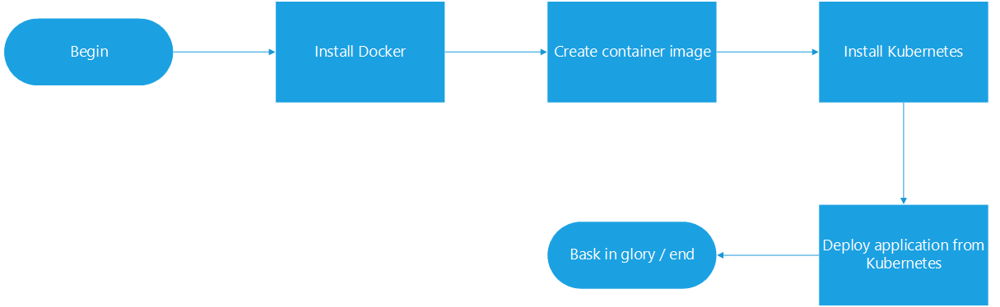
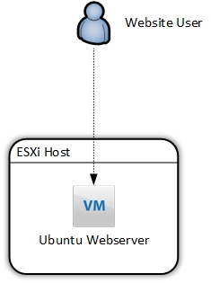
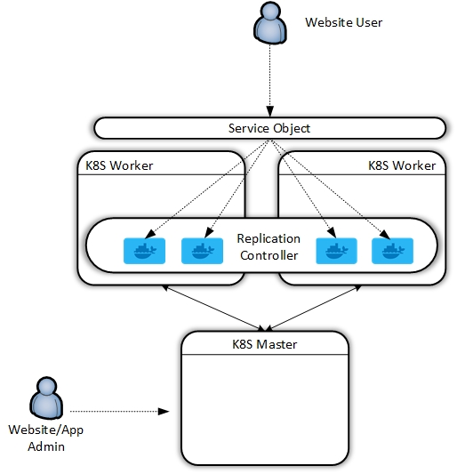
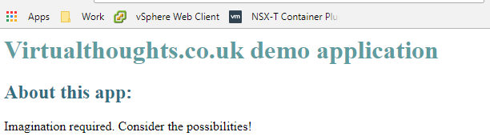
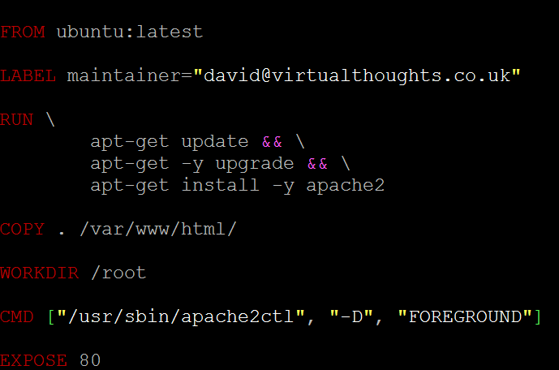
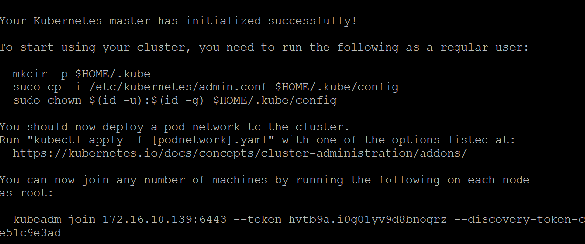
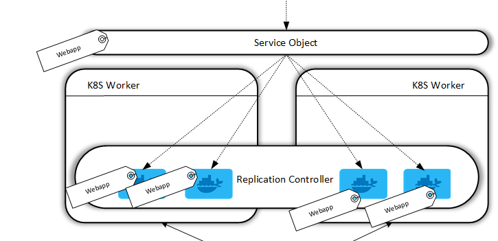
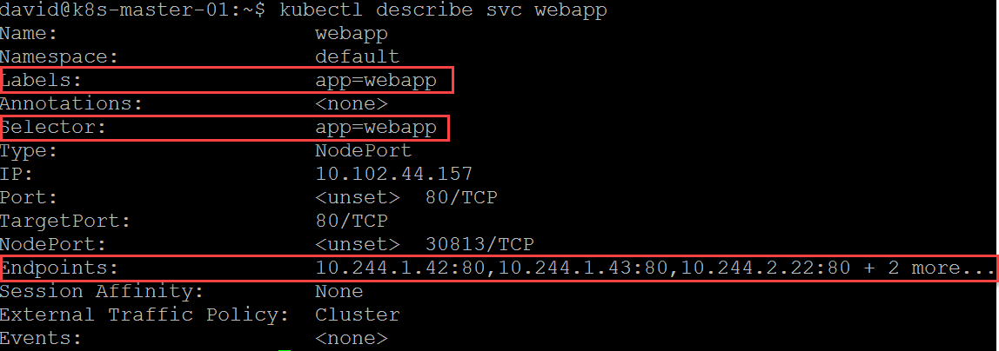
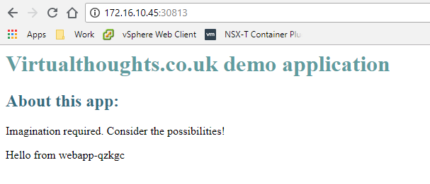

# Preamble

Having spent a number of months familiarising myself with container technology I inevitably got "stuck in" with Kubernetes. Containers are brilliant, but I personally don't see the value of managing individual containers - it's still the pets vs cattle mentality. Orchestrating containers with the likes of Kubernetes, however, makes a **ton** of sense and reinforces the microservices approach to building and deploying applications.

To test myself, I decided to document end-to-end the entire journey from taking a web server residing on a standalone virtual machine, containerise it, and deploying it via Kubernetes.

 

**Disclaimer** - I'm not a developer so the application example I'll be using is relatively simple - but the fundamentals would be similar for other applications of increasing complexity.

# Current and Intended State

I currently have a simple HTTP web server running on an Ubuntu VM on an ESXi host. For many reasons, this is a suboptimal design. The web server is facilitated by Apache2. As far as configurations go, it's almost as basic as you can get, but surprisingly (shockingly) is widespread, even with front-facing, live websites.

 

At the end of this exercise, we will have redeployed this application in the following fashion:

 

 

So, to quote Khan from Star Trek Into Darkness:

 

# Install Docker

You can install Docker on a number of operating systems, however, I had a spare Ubuntu server box idling so I used this as a kind of "staging" box where I could tinker with creating the Docker components prior to installing Kubernetes, but you could do this on a Kubernetes worker node if desired.

Curl and pipe the get docker url to your shell

\[code language="bash"\] david@ubuntu\_1804:~$ curl -sSL https://get.docker.com/ | sh \[/code\]

Which should result in the following:

 

\[code language="bash"\] david@ubuntu\_1804:~$ curl -sSL https://get.docker.com/ | sh # Executing docker install script, commit: 36b78b2 + sudo -E sh -c apt-get update -qq &gt; /dev/null + sudo -E sh -c apt-get install -y -qq apt-transport-https ca-certificates curl &gt; /dev/null + sudo -E sh -c curl -fsSL "https://download.docker.com/linux/ubuntu/gpg" | apt-key add -qq - &gt; /dev/null Warning: apt-key output should not be parsed (stdout is not a terminal) + sudo -E sh -c echo "deb \[arch=amd64\] https://download.docker.com/linux/ubuntu bionic edge" &gt; /etc/apt/sources.list.d/docker.list + \[ ubuntu = debian \] + sudo -E sh -c apt-get update -qq &gt; /dev/null + sudo -E sh -c apt-get install -y -qq --no-install-recommends docker-ce &gt; /dev/null + sudo -E sh -c docker version Client: Version: 18.05.0-ce API version: 1.37 Go version: go1.9.5 Git commit: f150324 Built: Wed May 9 22:16:13 2018 OS/Arch: linux/amd64 Experimental: false Orchestrator: swarm

Server: Engine: Version: 18.05.0-ce API version: 1.37 (minimum version 1.12) Go version: go1.9.5 Git commit: f150324 Built: Wed May 9 22:14:23 2018 OS/Arch: linux/amd64 Experimental: false If you would like to use Docker as a non-root user, you should now consider adding your user to the "docker" group with something like:

sudo usermod -aG docker david

Remember that you will have to log out and back in for this to take effect!

WARNING: Adding a user to the "docker" group will grant the ability to run containers which can be used to obtain root privileges on the docker host. Refer to https://docs.docker.com/engine/security/security/#docker-daemon-attack-surface for more information. \[/code\]

I want the ability to issue Docker commands without having to switch to root, so I added my user to the "docker" group

\[code language="bash"\] sudo usermod -aG docker david \[/code\]

Well, that was easy.

# Create container image

The first thing we need to do is copy over our application code to our host. For this example, I have a simple .html file acting as a landing page:

To keep things tidy, I suggest creating a directory on your Docker machine.

\[code language="bash"\] david@ubuntu\_1804:~$ mkdir WebApp david@ubuntu\_1804:~$ cd WebApp/

..Copy over code (ie via SCP).. david@ubuntu\_1804:~/WebApp$ ls index.html \[/code\]

To create a docker image (and consequently a container) we must create what's known as a Dockerfile. In short, a Dockerfile is a human-readable document that acts as a guide on how to create your image. Think of it like an instruction manual you get with flat-pack furniture, it provides the steps required to get to the final, constructed model. Hopefully without any spare screws.

So, with your text editor of choice, create "Dockerfile" within the application directory containing your code. Below is one for my application, which we will break down:

**FROM** - All "Dockerfile" files must begin with a "FROM" statement. This defines the **base image** for our application, which is pulled from Dockerhub ([https://hub.docker.com/explore/](https://hub.docker.com/explore/)).  Official releases are available from a number of companies, including Ubuntu, MySQL, Microsoft, NGINX, etc. These differ from your bog-standard OS install. Much more lightweight, hardneded and specifically engineered to cater for containerise workloads.

**LABEL** - This is metadata denoting the maintainer for this image.

**RUN** - When the docker image is instantiated, the following commands will be executed to compile this image. As you can see for this image I specify to update and upgrade the base OS as well as install Apache2.

**COPY** - This command copies over my application data (in this case, index.html) into /var/www/html, which is the root directory for the Apache2 service.

**WORKDIR** - Sets the working directory.

**CMD** - Runs a command within the container after creation. In this example, I'm specifying the Apache2 service to run in the foreground.

**EXPOSE** - Defines which port you want to open on containers from this image. As this is a webserver, I want TCP 80 open (TCP is the default). You can also add TCP 433, or whichever port your application requires.

The next step is to **build** our image using "Dockerfile" to do this, we can issue the following command. The "." dictates we will use "Dockerfile" from the current directory.

\[code language="bash"\] docker build -t webapp:0.1 . \[/code\]

This command names the constructed image as "webapp". The value after the colon determines the **version** of this image, in this case, I'm tagging this image as version 0.1. Should I make a change, I can recompile the image and increment the version number.

After issuing this command the terminal window will output the build process, similar to below. This includes Docker dragging down the base image and making modifications as per our Dockerfile:

\[code language="bash"\] david@ubuntu\_1804:~/WebApp$ docker build -t webapp:v0.1 . Sending build context to Docker daemon 3.072kB Step 1/6 : FROM ubuntu:latest latest: Pulling from library/ubuntu 6b98dfc16071: Pull complete 4001a1209541: Pull complete 6319fc68c576: Pull complete b24603670dc3: Pull complete 97f170c87c6f: Pull complete Digest: sha256:5f4bdc3467537cbbe563e80db2c3ec95d548a9145d64453b06939c4592d67b6d Status: Downloaded newer image for ubuntu:latest ---&amp;amp;amp;amp;amp;amp;amp;amp;amp;amp;amp;amp;amp;gt; 113a43faa138 Step 2/6 : LABEL maintainer="david@virtualthoughts.co.uk" ---&amp;amp;amp;amp;amp;amp;amp;amp;amp;amp;amp;amp;amp;gt; Running in bdcf972318b5 Removing intermediate container bdcf972318b5 ---&amp;amp;amp;amp;amp;amp;amp;amp;amp;amp;amp;amp;amp;gt; 3e6f9671a0af Step 3/6 : RUN apt-get update &amp;amp;amp;amp;amp;amp;amp;amp;amp;amp;amp;amp;amp;amp;&amp;amp;amp;amp;amp;amp;amp;amp;amp;amp;amp;amp;amp;amp; apt-get -y upgrade &amp;amp;amp;amp;amp;amp;amp;amp;amp;amp;amp;amp;amp;amp;&amp;amp;amp;amp;amp;amp;amp;amp;amp;amp;amp;amp;amp;amp; apt-get install -y apache2 ---&amp;amp;amp;amp;amp;amp;amp;amp;amp;amp;amp;amp;amp;gt; Running in c26d1729a269

.... \[/code\]

To validate the Image has been created, we can issue a "Docker image ls" command:

\[code language="bash"\] david@ubuntu\_1804:~/WebApp$ docker image ls REPOSITORY TAG IMAGE ID CREATED SIZE webapp v0.1 5f42fa00f1f3 3 minutes ago 232MB ubuntu latest 113a43faa138 5 weeks ago 81.2MB \[/code\]

It's a good idea at this stage to test our image, so let's create a container from it:

\[code language="bash"\] david@ubuntu\_1804:~/WebApp$ docker run -d -p 80:80 -t webapp:v0.1 \[/code\]

This command runs a container in **detached** mode (ie we don't shell into it) and maps port 80 from the host to the container, using the webapp:v0.1 image.

Therefore, curl'ing the localhost address should yield a HTTP response from our container:

\[code language="bash"\] david@ubuntu\_1804:~/WebApp$ curl localhost <h1 style="color: #5e9ca0;">Virtualthoughts.co.uk demo application</h1> <h2 style="color: #2e6c80;">About this app:</h2> 
Imagination required. Consider the possibilities!
 \[/code\]

Perfect. Our application is now containerised.

# Install Kubernetes

As shown in the diagram at the beginning of this post, Kubernetes is composed of _master_ and _worker_ nodes in a production deployment. For my own learning and development I wanted to recreate this, however, there are ways you can deploy single-server solutions.  For my test environment I created the following:

- 3x VM's
    - Ubuntu 18.04
    - 2vCPU
    - 2GB RAM
    - 20GB Local Disk
    - Single IP - Attached to the management network

In an ideal world, you would flesh out the networking and storage requirements, but for internal testing, this was sufficient for me.

Once the VM's are installed, create the master node by installing Kubernetes:

Add the GPG key as Root

\[code language="bash"\] root@ubuntu\_1804:~# curl -s https://packages.cloud.google.com/apt/doc/apt-key.gpg | apt-key add OK \[/code\]

Add repo for K8s

\[code language="bash"\] root@ubuntu\_1804:~# echo "deb http://apt.kubernetes.io/ kubernetes-xenial main" &amp;amp;amp;amp;amp;amp;gt; /etc/apt/sources.list.d/kubernetes.list \[/code\]

Install Kubelet, Kubeadm, Kubectl and the Kubernetes CNI

\[code language="bash"\] apt-get update apt-get install -y kubelet kubeadm kubectl kubernetes-cni \[/code\]

Next, we can initialise our master, but before we do so, consideration needs to be made with regards to the networking model we'll be using. For my example, I used flannel, which states that we need to define the CIDR address range for our containers during the initialisation process.

\[code language="bash"\] sudo kubeadm init --pod-network-cidr=10.244.0.0/16 \[/code\]

Which results in the following: 

Follow the instructions to run the mkdir, cp and chown commands as a non-root user. At the bottom is a command to add worker nodes - keep this safe.

Deploy the Flannel supporting constructs by executing the following:

\[code language="bash"\]

kubectl apply -f https://raw.githubusercontent.com/coreos/flannel/master/Documentation/kube-flannel.yml

\[/code\]

The process for creating worker nodes is similar - Install Docker (previously covered) and install the Kubernetes packages minus running the kubeadmin init command - replace it with the Kubeadm join command. Nodes can then be validated on the master node.

\[code language="bash"\] david@k8s-master-01:~$ kubectl get nodes NAME STATUS ROLES AGE VERSION k8s-master-01 Ready master 22h v1.11.0 k8s-worker01 Ready none 22h v1.11.0 k8s-worker02 Ready none 19h v1.11.0 \[/code\]

 

# Deploy an application to the Kubernetes cluster

At this stage, we have a functioning, albeit empty K8s Cluster, but it's ready to start hosting applications. For my application, I took a two-step process:

- Configure the replication controller (how many containers should run for this app)
- Configure the service object (how to access this cluster from the outside)

A Replication Controller in Docker ensures that a specified number of container replicas are running at any one time. In this example, I have created an account on Dockerhub and uploaded my image to it, so my worker nodes can pull it. We define a replication controller in a YAML file:

\[code language="bash"\] david@k8s-master-01:~$ cat webapp-rc.yml apiVersion: v1 kind: ReplicationController metadata: name: webapp spec: replicas: 5 selector: app: webapp template: metadata: labels: app: webapp spec: containers: - name: webapp image: virtualthoughts/webapp:latest ports: - containerPort: 80 \[/code\]

**Kind:** The type of object this is

**Spec:** How this application should be deployed, including the image to be used.

**Replicas:** How many containers for this app should be running at any given time. Kubernetes constantly monitors the environment and if there's a deviation between how many replicas should be running, and how many are currently running, it will reconcile automatically.

**Label:** Labels are very important. We label the containers in this replication controller so we can later tie them into a service object. This means as containers are created and destroyed, they are automatically included in the service object based on **tags** - After all, we don't care much about containers as individual entities.

Next is to create the service object:

\[code language="bash"\] david@k8s-master-01:~$ cat webapp-svc.yml kind: Service apiVersion: v1 metadata: name: webapp labels: app: webapp spec: type: NodePort selector: app: webapp ports: - protocol: TCP port: 80 targetPort: 80 \[/code\]

**Kind:** The type of object this is.

**Selector**: Which containers should be included in this service?

**Type:** Type of service object. In a cloud environment, for example, we can change this to "Loadbalancer" to leverage cloud platform-specific load balancers from the likes of GCP and AWS. But for this example, I don't have an external load balancer so it's not applicable.

What we're accomplishing here are two fundamental operational aspects of our application:

- We declare a _minimum_ number of containers (pods) to be available at all times to facilitate our workload.
- We're establishing a relationship between containers (pods) with a service object via the use of tags. Therefore, any new containers that are created with the same tag will automatically be included in this service object. Think of the service object as a central point to access the application. We do not access the application by directly sending HTTP requests to containers.

To deploy these YAML files we issue a command via Kubectl:

\[code language="bash"\] david@k8s-master-01:~$ sudo kubectl create -f webapp-svc.yml david@k8s-master-01:~$ sudo kubectl create -f webapp-rc.yml \[/code\]

We can also check the service:

We have labels to define the service and which containers to include, and we also have the current list of endpoints. Think of endpoints as loadbalancer members. Because of how nodeport works we can hit any of our K8S worker nodes on port 30813 and reach our service which will load balance across all endpoints.

I tested this on my two worker nodes (and I also added a bit of code to my index.html to return the hostname of the container servicing the HTTP request):

# Conclusion

I had a lot of fun doing this, and the more I learn about containers and orchestration the more I believe it's the next facilitator change in the way we manage applications, as significant as the change between physical and virtual machines.
