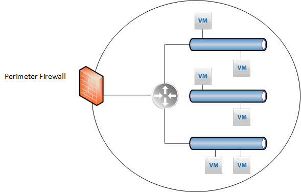
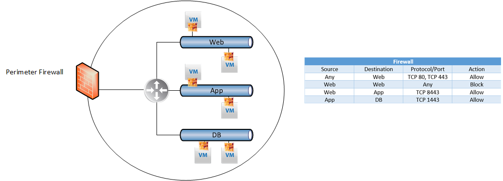
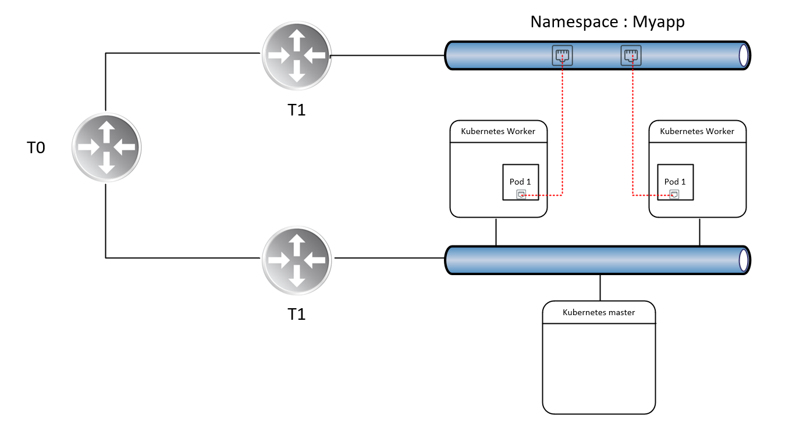
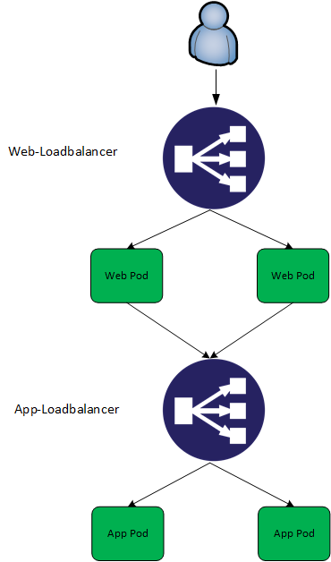
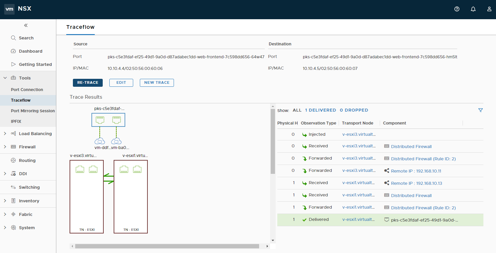
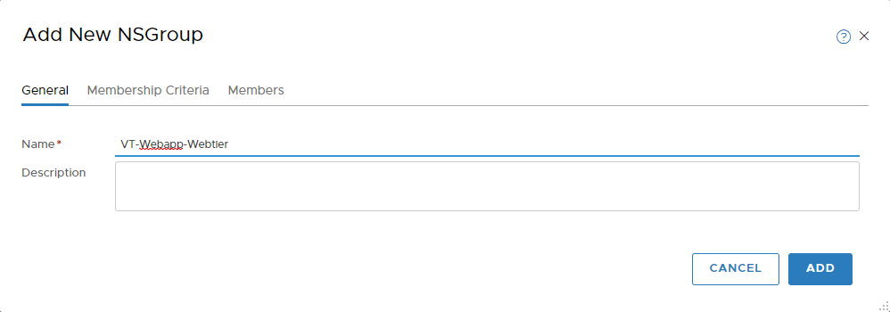
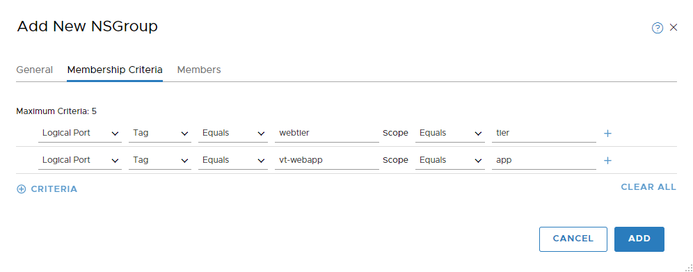
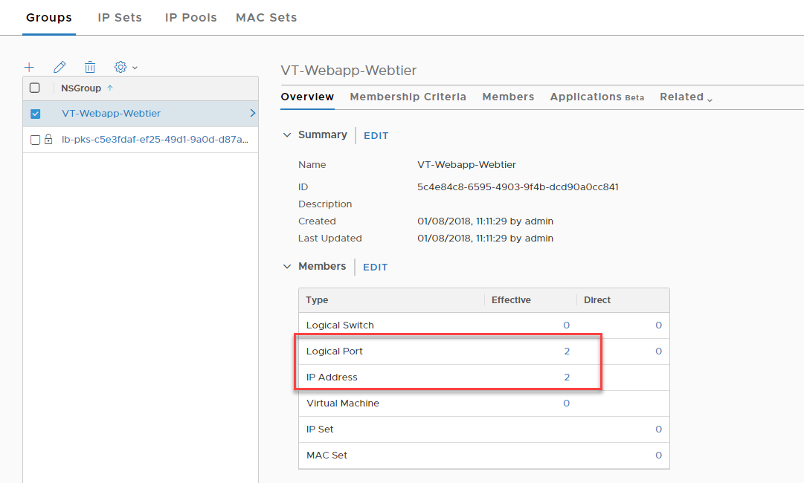
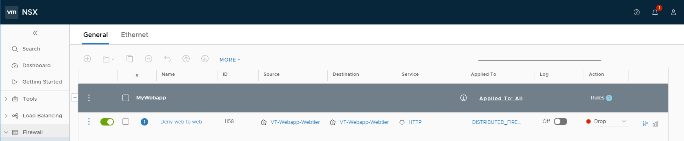
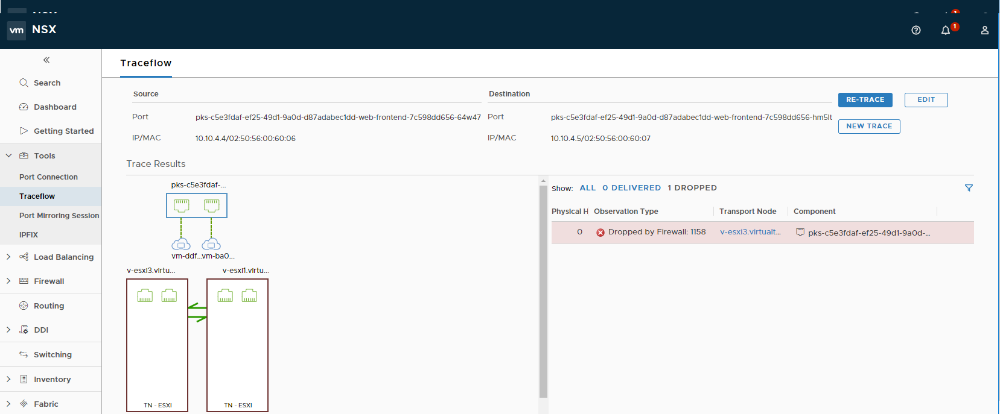

For the uninitiated, VMware NSX comes in two "flavours", NSX-V which is heavily integrated with vSphere, and NSX-T which is more IaaS agnostic. NSX-T also has more emphasis on facilitating container-based applications, providing a  number of features into our container ecosystem. In this blog post, we discuss the microsegmentation capabilities provided by NSX-T in combination with container technology.

# What is Microsegmentation?

Prior to Software-defined networking, firewall functions were largely centralised, typically manifested as edge devices which were and still are, good for controlling traffic to and from the datacenter, otherwise known as north-south traffic:

The problem with this model, however, is the lack of control for resources that reside within the datacenter, aka east-west traffic. Thankfully, VMware NSX (-V or -T) can facilitate this, manifested by the distributed firewall.

Because of the distributed firewall, we have complete control over lateral movement within our datacenter. In the example above we can define firewall rules between logical tiers of our application which enforce permitted traffic.

 

# But what about containers?

Containers are fundamentally different from Virtual machines in both how they're instantiated and how they're managed. Containers run on hosts that are usually VM's themselves, so how can we achieve the same level of lateral network security we have with Virtual Machines, but with containers?

 

# Introducing the NSX-T Container Plugin

The NSX-T container plugin facilitates the exposure of container "Pods" as NSX-T logical switch ports and because of this, we can implement microsegmentation rules as well as expose Pod's to the wider NSX ecosystem, using the same approach we have with Virtual Machines.

Additionally, we can leverage other NSX-T constructs with our YAML files. For example, we can request load balancers from NSX-T to facilitate our application, which I will demonstrate further on. For this example, I've leveraged PKS to facilitate the Kubernetes infrastructure.

# Microsegmentation in action

Talk is cheap, so here's a demonstration of the concepts previously discussed. First, we need a multitier app. For my example, I'm simply using a bunch of nginx images, but with some imagination you can think of more relevant use cases:

## Declaring Load balancers

To begin with, I declare two load balancers, one for each tier of my application. Inclusion into these load balancers is determined by tags.

\[code language="bash"\]

apiVersion: v1 kind: Service metadata: name: web-loadbalancer labels: namespace: vt-web spec: type: LoadBalancer ports: - port: 80 protocol: TCP targetPort: 80 selector: app: web-frontend tier: frontend --- apiVersion: v1 kind: Service metadata: name: app-loadbalancer labels: namespace: vt-web spec: type: LoadBalancer ports: - port: 8080 protocol: TCP targetPort: 80 selector: app: web-midtier tier: midtier ---

\[/code\]

## Declaring Containers

Next, I define the containers I want to run for this application.

\[code language="bash"\] &lt;pre&gt;--- apiVersion: extensions/v1beta1 kind: Deployment metadata: name: web-frontend namespace: vt-web spec: replicas: 2 template: metadata: labels: app: vt-webapp tier: webtier spec: containers: - name: web-frontend image: nginx:latest ports: - containerPort: 80 --- apiVersion: extensions/v1beta1 kind: Deployment metadata: name: web-midtier namespace: vt-web spec: replicas: 2 template: metadata: labels: app: web-midtier tier: apptier spec: containers: - name: web-midtier image: nginx:latest ports: - containerPort: 80&lt;/pre&gt; \[/code\]

Logically, this app looks like this:

 

 

# Deploying app

\[code language="bash"\] david@ubuntu\_1804:~/vt-webapp$ kubectl create namespace vt-web namespace "vt-web" created david@ubuntu\_1804:~/vt-webapp$ kubectl apply -f webappv2.yaml service "web-loadbalancer" created service "app-loadbalancer" created deployment "web-frontend" created deployment "web-midtier" created \[/code\]

 

# Testing Microsegmentation

At this stage, we're not leveraging the Microsegmentation capabilities of NSX-T.  To validate this we can simply do a traceflow between two web-frontend containers over port 80:

 

As expected, traffic between these two containers is permitted. So, lets change that. In the NSX-T web interface go to inventory -> Groups and click on "Add". Give it a meaningful name.

As for membership Criteria, we can select the tags we've previously designed, namely _tier_ and _app_.

Click "add". After which we can validate:

We can then create a firewall rule to block TCP 80 between members of this group:

Consequently, if we run the same traceflow exercise:

# Conclusion

NSX-T provides an extremely comprehensive framework for containerised applications. Given the nature of containers in general, I think container + microsegmentation are a winning combination to secure these workloads. Dynamic inclusion adheres to the automated mentality of containers, and with very little effort we can implement microsegmentation using a framework that is agnostic - the principles are the same between VM's and containers.
