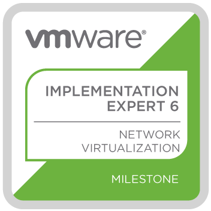

# Preamble (pun intended)

I've been eyeing up the VCAP6-NV exam for quite some time now, but due to work and personal projects I've not been able to focus on this exam. Having some time between jobs I decided to start revising and push myself into taking the exam. At time of writing, there is still no NV-Design exam, therefore, anyone who sits and passes the VCAP6-NV Deploy exam is automatically given the VCIX6-NV certification.

I'm not a full on networking person. Back in the day (~10 years ago) I **wanted** to be, but the opportunities didn't exist for me and I consequently went down a generic sysadmin path until ending up where I am today, primarily focusing on SDDC and cloud technologies. There are a lot of people who dive into NSX that **do** come from traditional networking backgrounds. For me, I found this quite intimidating, however the point is you do not have to be some kind of Cisco God to appreciate NSX, or pass this exam.

# Preparation

Read any blog post, forum or reddit post about any VMware-based exam and it won't take long until someone says something like:

_**"Read, study, understand and master the contents of the blueprint."**_

And it's absolutely correct. The version of the blueprint for the exam I sat can be found at [https://www.vmware.com/content/dam/digitalmarketing/vmware/en/pdf/certification/vmw-vcap6-nv-deploy-3v0-643-guide.pdf](https://www.vmware.com/content/dam/digitalmarketing/vmware/en/pdf/certification/vmw-vcap6-nv-deploy-3v0-643-guide.pdf)

This, as well as [vZealand.com's excellent guide](https://vzealand.com/category/vcap6-nv-study-guide/) were my primary study resources and I would prepare by doing the following:

1. Go over each section  of the blueprint via vZealand's guide in my own lab, following the instructions on the site.
2. Go over each section of the blueprint without any initial external assistance, assess accuracy after each objective by checking the guide.
3. Go over each section of the blueprint in a way where I was confident in going over the objectives from practice.

Also, bear in mind the exam is based on 6.2 of NSX, therefore it's a good idea to have a lab running on this version as there have been a number of significant changes since then.

After I accomplished all three, I felt confident to sit the exam

# The exam itself

You're looking at 205 minutes in total covering 23 questions that cover the blueprint in its entirety. Without breaking NDA my observations are:

- **Time management** - This is the third VCAP exam I've taken and with each the time has flown by. It really doesn't feel like a long time when you've finished. I personally found the NSX VCAP exam much more demanding on time compared to the VCAP-DCV Deploy exam. I didn't complete all my questions in the NV exam whereas I had about 30-40mins left when I took the DCV exam.
- **Content** - I feel like the exam was a pretty good reflection of the blueprint and was fairly well represented.
- **HOL Interface** \- The Exam simulation feels very similar to the VMware HOL, including (unfortunately) the latency. The performance for my exam wasn't great, but wasn't terrible.
- **Skip questions you're not sure on** - Time is an expensive commodity in this exam, if you're struggling with some questions skip and move on. You may have time to come back to it later. I skipped a couple of questions.

 

# Result

I passed, but not by much. But a pass is a pass and I was pretty chuffed. It's definitely the hardest VCAP exam I've taken to date.
