# 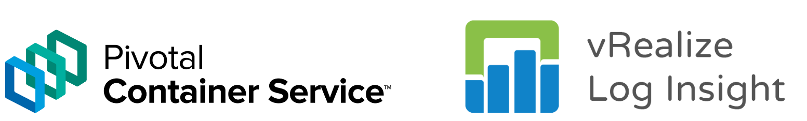

# Introduction

In this blog post, we take a look into the integration between PKS and vRealize Log Insight and how this integration benefits the enterprise. As a bit of a recap:

**PKS** - PKS is a purpose-built enterprise level container solution leveraging the capabilities of Kubernetes, BOSH, VMware NSX-T, Harbour and more to deliver a highly available, highly flexible container runtime that operates on a number of cloud platforms, both private and public, including vSphere, AWS, Azure and GCP.

VMware also released VMware Cloud PKS, a fully managed service that combines the technical capabilities of AWS, PKS and Kuberntes which can be consumed in a similar fashion to other cloud services.

**vRealize Log Insight** - vRealize Log Insight is a log management system that's designed to operate within heterogeneous environments, however, it's much more than a simple aggregator of logging information. vRealize Log Insight has analytical and trend-identification capabilities which allow operators to gain invaluable insight into the state, health, and events which are transpiring in the environment. vRealize Log Insight works across physical, virtual and cloud environments.

# Containers and Coexistence with VM's

VM's have existed for a _long_ time now. Consequently, there are very mature, battle-hardened tools and software which can be used to monitor a plethora of operating systems, software, components and more. Containers, on the other hand, are _relatively_ new in the enterprise. Although there is an overlap, there are significant differences in the way we monitor and collect logs from VM's and  containers. How can this be addressed?

There are a number of ways to monitor a container based environment. Prometheus and Wavefront come to mind, but for environments that already leverage vRealize Log Insight, we can integrate PKS with it to facilitate a single plane of glass view of logging information from VM's, their underlying infrastructure as well as containers and their underlying infrastructure.

 

# What can we expect PKS to send to Log Insight

At a high level, the Integration between PKS and vRLI will facilitate the propagation of the following logs:

- BOSH jobs
- Core Kubernetes processes & nodes
- Core BOSH processes
- Kubernetes event logs
- **Individual Pod stdout and stderr**

I've highlighted the last one as I can see real value in this. Imagine centralising all stdout and stderr from pods in combination with the analytics and trend identification capabilities from vRLI? Pretty interesting. Of course, we're not **_that_** interested in what individual pods are logging, but if we have an example where some new code has been pushed out and 10's / 100's or 1000's of pods start logging errors, we can identify, categorise and analyse these pretty easily with vRLI.

 

# PKS and vRealize Log Insight in action

Talk is cheap, so let's crack on.

Log into Ops Manager and select the PKS tile

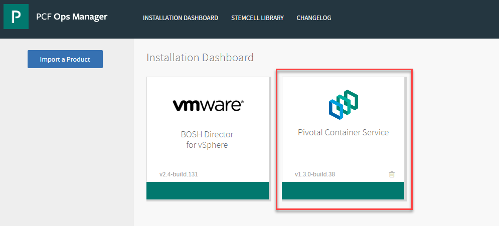

 

Select "Logging" from the left and select "yes" under vRLI integration:

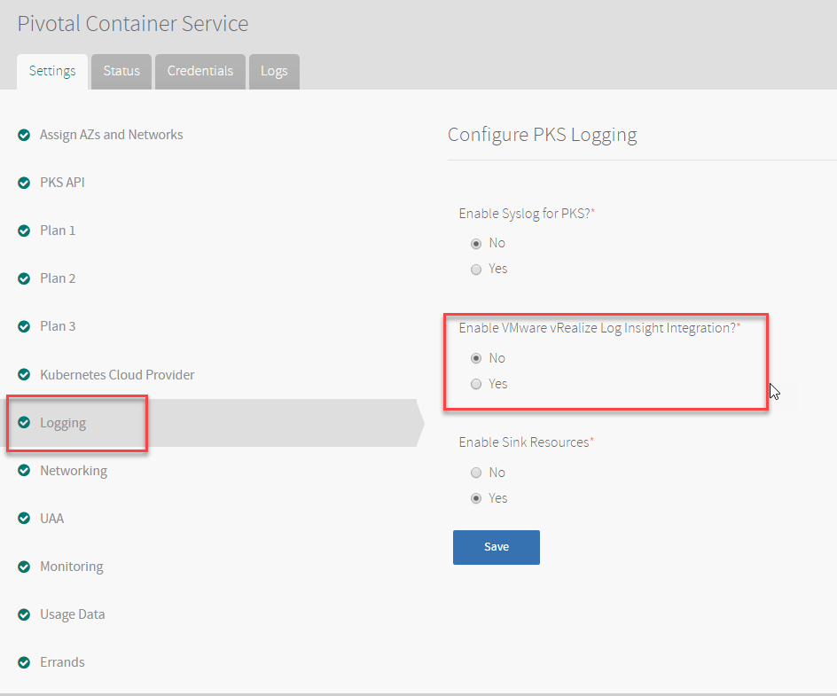

Enter the host and SSL settings where applicable in your environment:

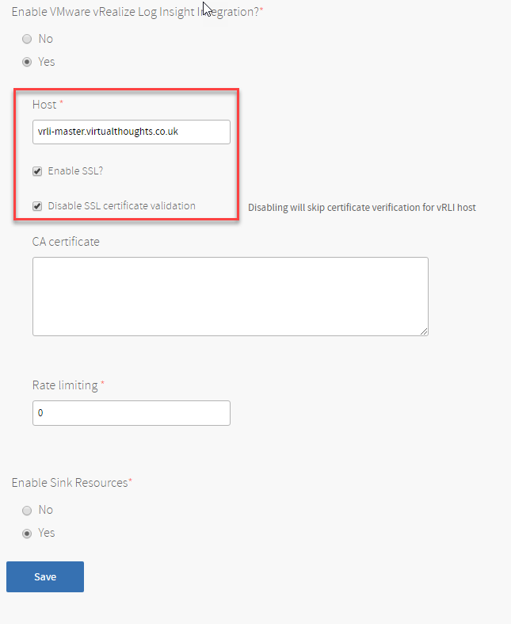

Apply the changes:

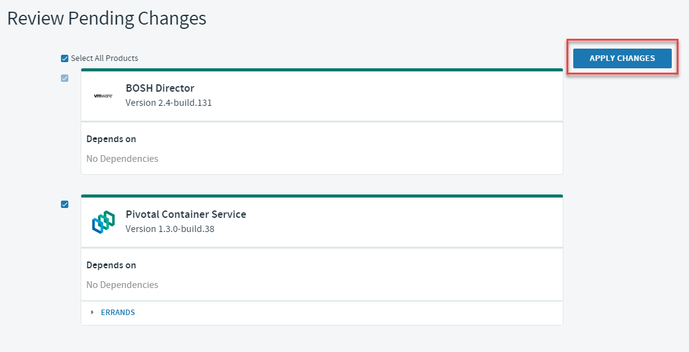

if you keep an eye on the logs, references for the vRLI configuration will be shown:

\- fluentd\_vrli\_ca\_cert: "<redacted>" - fluentd\_vrli\_host: "<redacted>" + fluentd\_vrli\_host: "<redacted>" - fluentd\_vrli\_rate\_limit\_msec: "<redacted>" + fluentd\_vrli\_rate\_limit\_msec: "<redacted>" - fluentd\_vrli\_skip\_cert\_verify: "<redacted>" + fluentd\_vrli\_skip\_cert\_verify: "<redacted>" - fluentd\_vrli\_use\_ssl: "<redacted>" + fluentd\_vrli\_use\_ssl: "<redacted>"

Next, deploy a cluster in PKS:

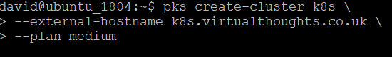

After which, the following "hosts" can be observed, which in essence, is a reflection of the services within our Kubernetes cluster:

 

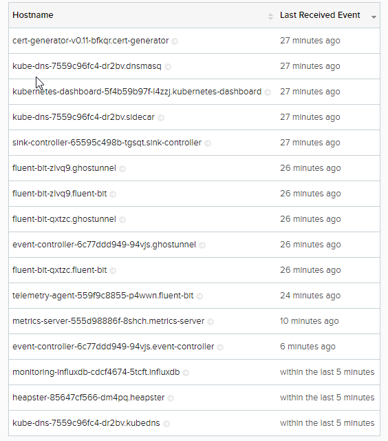

I also create a individual pod, named nginx-sleep. Below are the logs that were ingested for this event:

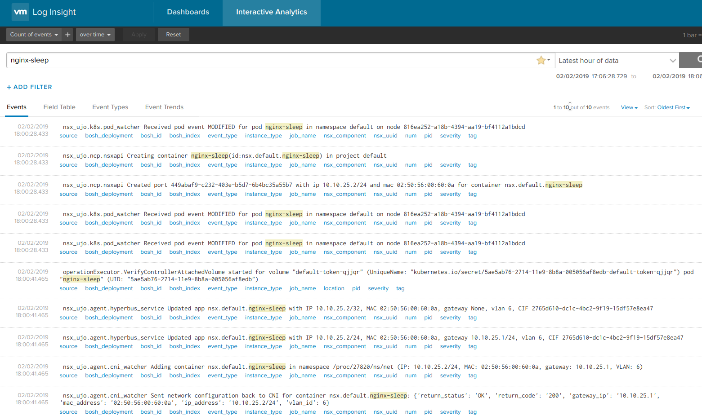

To validate the stdout capturing, create a cluster that writes to stdout:

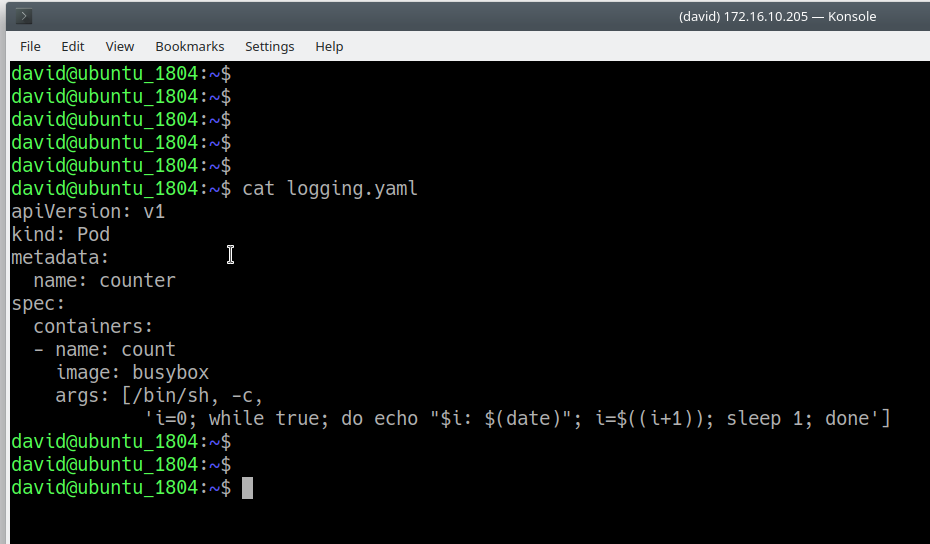

 

And check the logs from the pod:

 

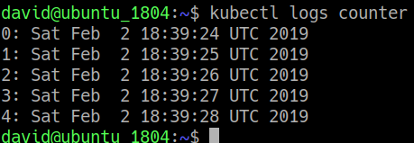

And also from Log Insight:

 

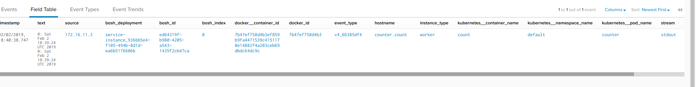

# Conclusion

vRealize Log Insight provides a compelling platform for log ingestion, and it's flexibility to ingest, analyse and interpret logs from physical, virtual and container based solutions makes it an extremely versatile tool in any admins repertoire.
