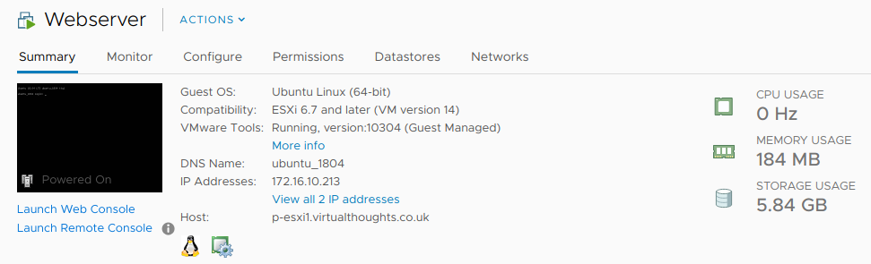
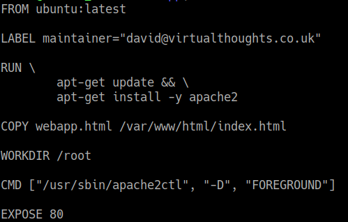
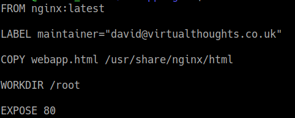
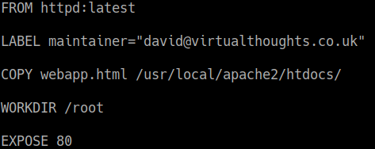
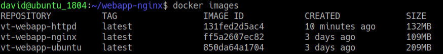
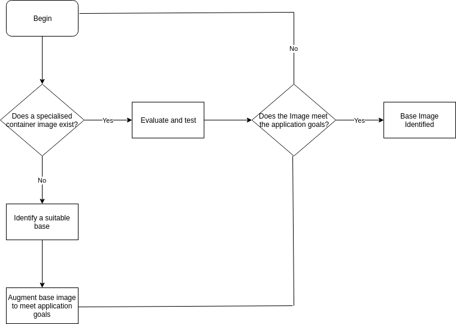

# Preamble

A lot of organisations are looking towards containerising their applications and embracing the world of microservices. There are a number of ways to reach this goal, through a variety of tools and methodologies,  this blog post goes through one way of approaching this task.

[In a previous blog post](https://www.virtualthoughts.co.uk/2018/07/13/kubernetes-zero-to-hero-from-single-vm-webserver-to-a-scalable-microservices-infrastructure/) I went through the process of taking a web application and putting it into a container, and whilst it got the job done, there wasn't a lot of attention given to the image used for the container. So let's address that.

Container images come in all shapes and sizes and choosing the right base for your application can be a difficult decision.

# VM vs Ubuntu Container vs NGINX Container

In the aforementioned blog post, I took a simple web application and placed it into a Ubuntu-based container. It worked fine, but is there any way we can further optimise it?

I've got a generic 18.04 Ubuntu Server VM I spun up, installed Apache2 and added in my web application. According to the hypervisor (ESXi in this case), the VM consumed 5.84GB of storage

 

Next, I'll do the same in a Ubuntu container, using the Ubuntu image as my base:

But what about different base images?

NGINX is is an open source reverse proxy server for HTTP, HTTPS, SMTP, POP3, and IMAP, as well as a load balancer, HTTP cache, and a web server. As such. it's more specialised than the standard Ubuntu image. So let's create another image based on NGINX.

 

Apache also has a image, so lets throw that in for good measure.

Comparing all three images yield different results with regards to image size:

Unsurprisingly, the Ubuntu base image comes in as the largest, followed by the Apache image, and NGINX being the smallest.

Is this such a big deal, though? If we consider:

- The potential number of pods
- The time taken for new nodes to download the image
- The lifecycle of a pod

Then shaving off even 100MB or so from an image can have a _**significant**_ impact on operations.

# Thought process

From this exercise, we can determine one approach to choosing the right base image could be a result of the following:

 

