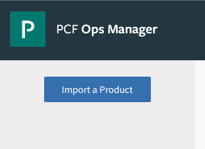
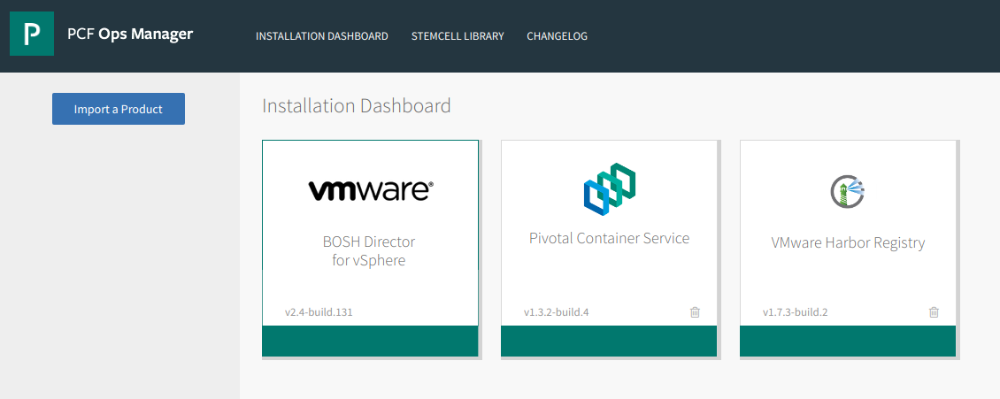
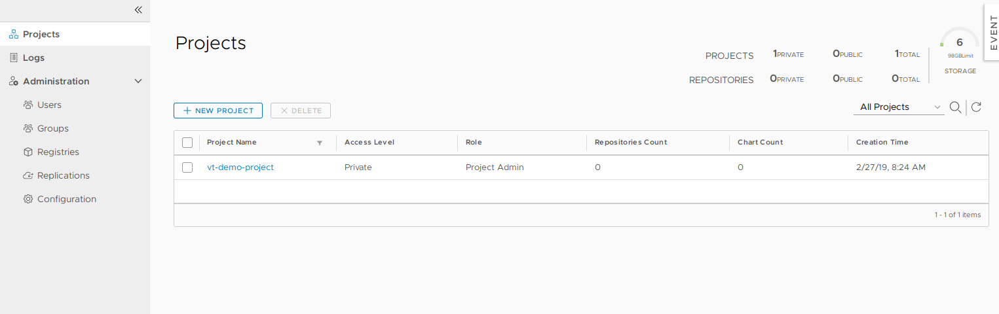
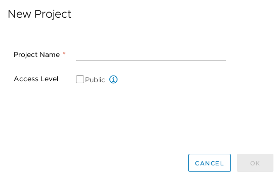
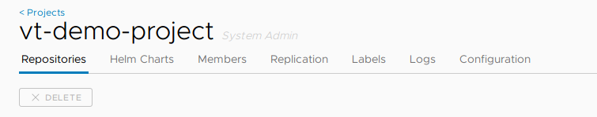
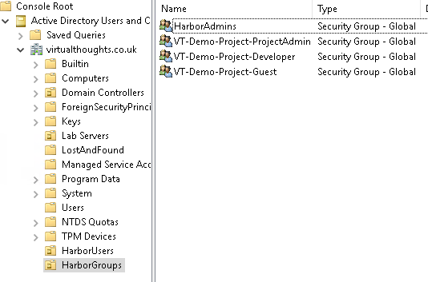
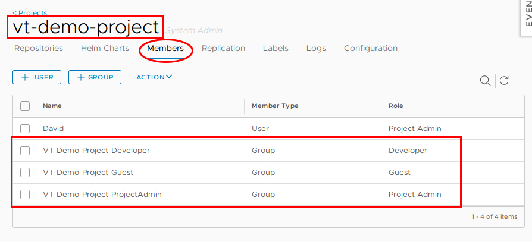
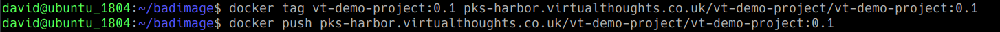
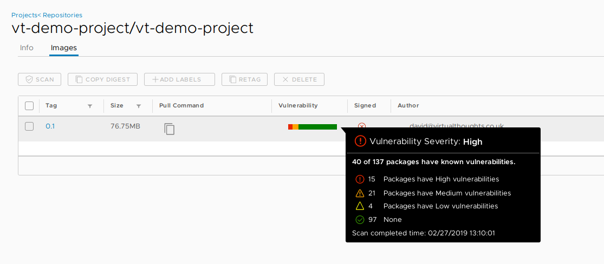
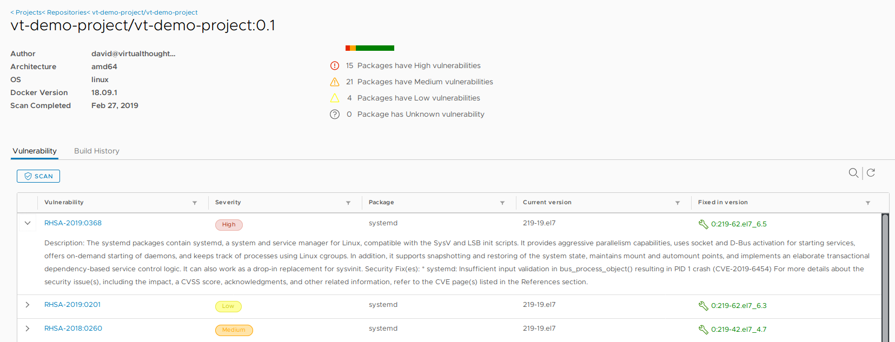

# What are container registries and why do we need them?

A lot of the time, particularly when individuals and organisations are evaluating, testing and experimenting with containers they will use _public_ container registries such as Docker Hub.  These public registries provide an easy-to-use, simple way to access images. As developers, application owners, system admins etc gain familiarity and experience additional operational considerations need to be explored, such as:

- **Organisation** - How can we organise container images in a meaningful way? Such as by environment state (Prod/Dev/Test) and application type?
- **RBAC** - How can we implement role-based access control to a container registry?
- **Vulnerability Scanning** - How can we scan container images for known vulnerabilities?
- **Efficiency** - How can we centrally manage all our container images and deploy an application from them?
- **Security** - Some images need to kept under lock and key, rather than using an external service like Docker Hub.

# Introducing VMware Harbor Registry

VMware Harbor Registry has been designed to address these considerations as enterprise-class container registry solution with integration into PKS. In this post, We'll have a quick primer on getting up and running with Harbor in PKS and explore some of its features. To begin, we need to download PKS Harbor from the Pivotal site and import it into ops manager.

After which the tile will be added (When doing this for the first time it will have an orange bar at the bottom. Press the tile to configure).

The following need to be defined with applicable parameters to suit your environment.

- **Availability Zone and Networks** - This is where the Harbor VM will reside, and the respective configuration will be dependent on your setup.
- **General** - Hostname and IP address settings
- **Certificate** - Generate a self-signed certificate, or BYOC (bring your own certificate)
- **Credentials** - Define the local admin password
- **Authentication** - Choose between
    - Internal
    - LDAP
    - UAA in PKS
    - UAA in PAS
- **Container Registry store** \- Choose where to store container images pushed to Harbor
    - Local file system
    - NFS Server
    - S3 Bucket
    - Google Cloud Storage
- **Clair Proxy Settings**
- **Notary settings**
- **Resource Config**

# VMware Harbor Registry - Organisation

Harbor employs the concept of "projects". Projects are a way of collecting images for a specific application or service. When images are pushed to Harbor, they reside within a project:

 

Projects can either be private or public and can be configured during, or after, project creation:

A project is comprised of a number of components:

 

# VMware Harbor Registry - RBAC

In Harbor, we have three role types we can assign to projects:

 

_Image source: https://github.com/goharbor/harbor/blob/master/docs/user\_guide.md#managing-projects_

- **Guest** - Read-only access, can pull images
- **Developer** - Read/write access, can pull and push images
- **Admin** - Read/Write access, as well as project-level activities, such as modifying parameters and permissions.

As a practical example, AD groups can be created to facilitate these roles:

And these AD groups can be mapped to respective permissions within the project

 

Therefore, facilitating RBAC within our Harbor environment. Pretty handy.

# VMware Harbor Registry - Vulnerability Scanning

The ability to identify, evaluate and remediate vulnerabilities is a standard operation is modern software development and deployment. Thankfully Harbor addresses this with integration with [Clair](https://github.com/coreos/clair) - an open source project that addresses the identification, categorisation and analysis of vulnerabilities within containers. As a demonstration we need to first push an image to Harbor:

After initiating a scan, Harbor can inform us of what vulnerabilities exist within this container image

We can then explore more details about these vulnerabilities, including when they were fixed:

 

# Conclusion

Harbor provides us with an enterprise level, container registry solution. This blog post has only scratched the surface, and with constant development being invested into the project, expect more features and improvements.
