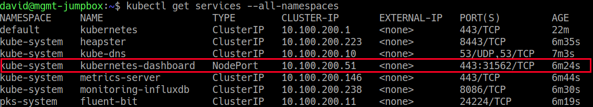
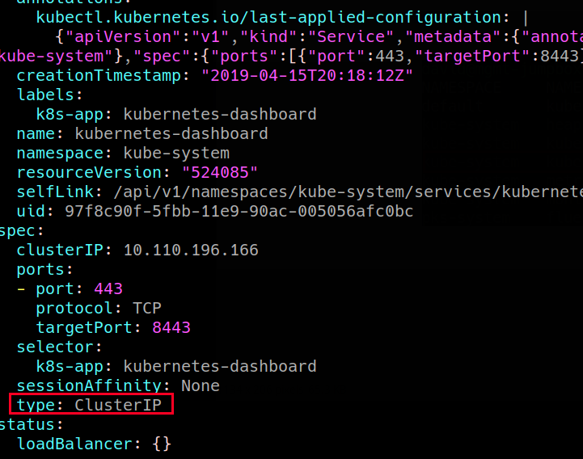
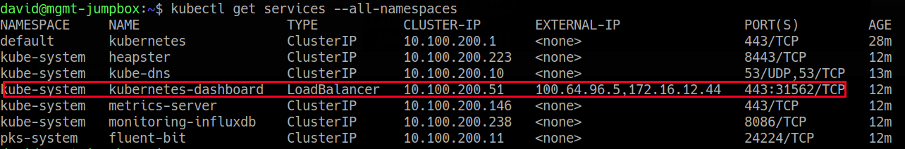
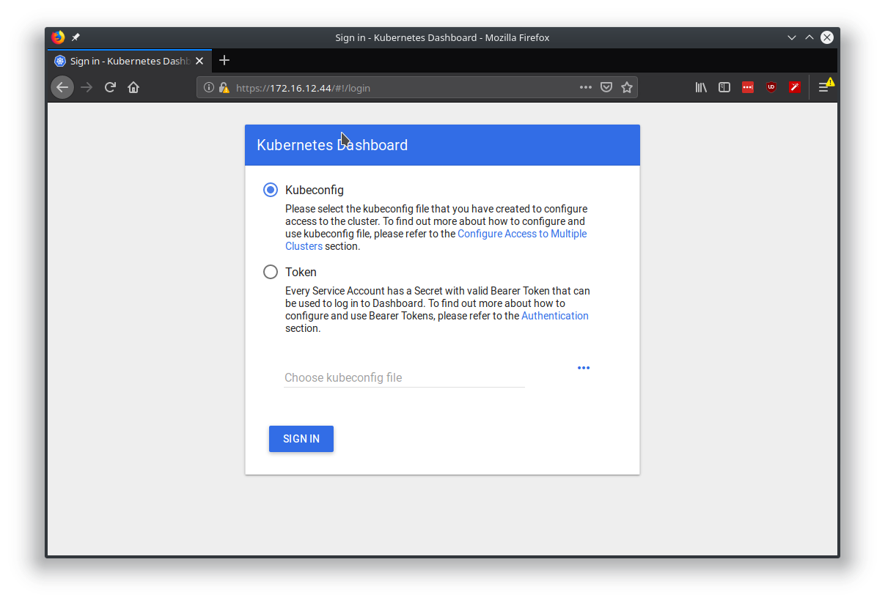

For the following to work, your k8s infrastructure needs to leverage some kind of CNI that's able to provision load balancers. For this example I'm leveraging PKS which has native integration with NSX-T.

The default way to access the Kubernetes dashboard is to leverage the kubectl proxy command. However, this is somewhat limiting for a production environment. An alternative way is to expose the dashboard through a load balancer.

 

Modify the Dashboard service by executing : **kubectl -n kube-system edit service kubernetes-dashboard** and modifying the "type" field from "ClusterIP" to "LoadBalancer"

 

Afterwards, the service will be reconfigured to be presented by a load balancer external VIP.

At which point we can access it directly:

