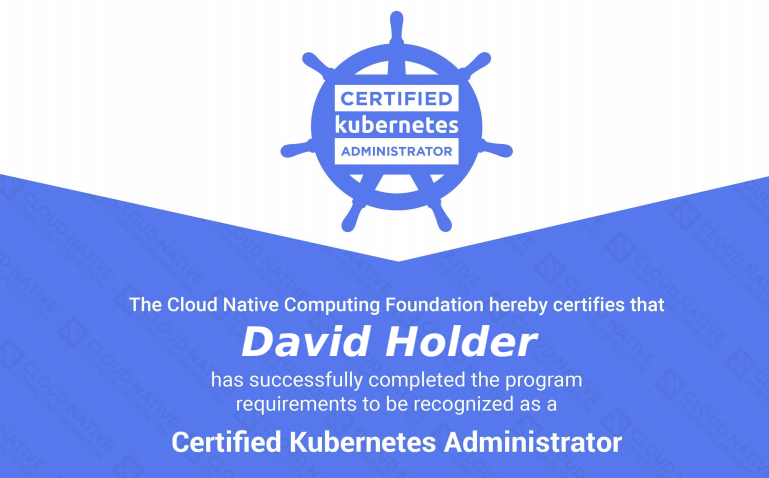
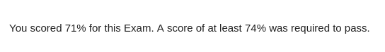

# Introduction

Over the long bank holiday weekend, I sat and passed the Certified Kubernetes Exam (CKA). This blog post goes over my experience (With respect to the NDA) together with a lab guide I've made which I've uploaded hoping it might help others.

 

 

# Format

The online exams consist of a set of performance-based items (problems) to be solved on the command line. For the CKA there are 24 questions of varying difficulty. At the time of writing, the only option to sit this exam is through remote proctoring.

[This link](https://www.cncf.io/certification/cka/) contains the most pertinent information to assimilate.

 

# Experience

I'm a huge fan of practical exams. I'm so glad the powers at be decided to go down this route. I absolutely **loathe** multiple choice exams for many reasons. The remote proctoring was a new experience for me, and I wasn't completely comfortable with it. Given the choice, I would have preferred to go to a test center. I hope The Linux Foundation adds this option in the future.

I sat the exam first time around feeling relatively confident, but knew I had some weaker areas. After a painstaking wait I received the following email:

I brushed myself off, crammed the areas I was weaker on, took the exam again and waited....

...and waited

From my experience, as a techie, I get a much more accomplished feeling when passing practical exams, such as this / VCAP's etc. Either way, to say I was happy would be a gross understatement.

 

# Takeaways

- A lot of people say this exam is "hard". I get really discouraged reading up on peoples exam experiences saying exams are "hard". I would say a more accurate adjective for this exam would be "Fair". Know the curriculum, practice your craft, and you'll get there.
- Lean on the documentation as much as you need to. You have access to kubernetes.io/docs during the exam.
- It's a practical exam, so practice, practice, and practice some more.
- You get a free retake, so don't worry if you don't pass first time.
- kubectl run somedeployment --image=nginx --replicas=5 --dry-run -o yaml. Output existing or new objects to a yaml file if you need to make finer adjustments or create objects from scratch.

 

# Lab Guide

My revision approach for this exam predominantly consisted of:

1. Reading up on the topics
2. Apply the knowledge to practical examples
3. Validate the approach

I ended up with three documents:

- Revision Notes
- Practice lab exercises
- Practice lab exercises answers (writing this helped me commit this information to memory)

 

All of which can be found at [https://github.com/David-VTUK/CKA-StudyGuide](https://github.com/David-VTUK/CKA-StudyGuide)
