PKS is a comprehensive platform for the provisioning and management of Kubernetes clusters, which can be further enhanced by leveraging its extensibility options. In this post, we will modify a plan to deploy a yaml manifest file which provisions Prometheus, Grafana, and Alertmanager backed by NSX-T load balancers.

# Why Prometheus, Grafana and Alertmanager?

The [Cloud Native Computing Foundation](https://en.wikipedia.org/wiki/Cloud_Native_Computing_Foundation "Cloud Native Computing Foundation") accepted Prometheus as its second incubated project, the first being Kubernetes. Originally developed by SoundCloud. It has quickly become a popular platform for the monitoring of Kubernetes platforms. Built upon a powerful analytics engine, extensive and highly flexible data modeling can be accomplished with relative ease.

Grafana is, amongst other things, a visualisation tool that enables users to graph, chart, and generally visually represent data from a wide range of sources, Prometheus being one of them.

AlertManager handles alerts that are sent by applications such as Prometheus and performs a number of operations such as deduplicating, grouping and routing.

What I wanted to do, as someone unfamiliar with these tools is to devise a way to deploy these components in an automated way in which I can destroy, and recreate with ease. The topology of the solution is depicted below:

 

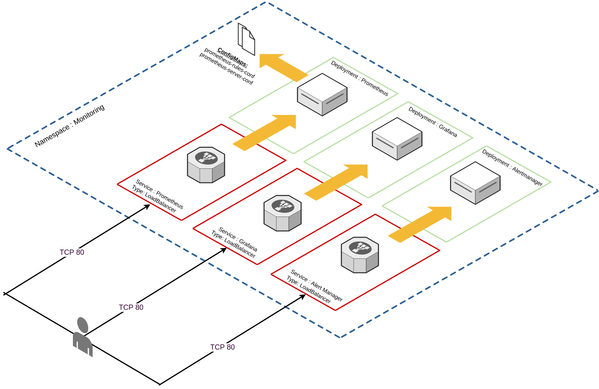

 

# Constructing the manifest file

TLDR; I've placed the entire manifest file [here](https://github.com/David-VTUK/PKS-Tools/blob/master/prometheus-grafana-alertmanager.yaml), which creates the following:

- Create the "monitoring" namespace.
- Create a service account for Prometheus.
- Create a cluster role requires for the Prometheus service account.
- Create a cluster role binding for the Prometheus service account and the Prometheus cluster role.
- Create a config map for Prometheus that:
    - Defines the Alertmonitor target.
    - Defines K8S master, K8S worker, and cAdvisor scrape targets.
    - Defines where to input alert rules from.
- Create a config map for Prometheus that:
    - Provides a template for alerting rules.
- Create a single replica deployment for Prometheus.
    - Expose this deployment via "LoadBalancer" (NSX-T).
- Create a single replica deployment for Grafana.
    - Expose this deployment via "LoadBalancer" (NSX-T).
- Create a single replica deployment for Alertmonitor.
    - Expose this deployment via "Loadbalancer" (NSX-T).

 

# Bootstrapping the manifest file in PKS

Log into Ops manager and select the PKS tile:

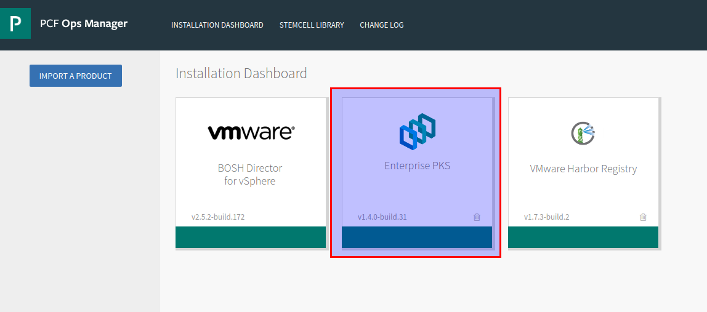

Select a plan from the left-hand side, record the plan name for later:

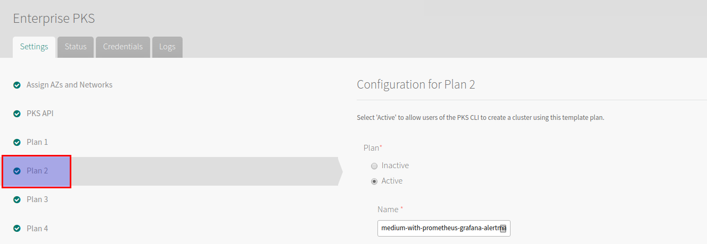

Scroll down and paste the aforementioned YAML file into the Add-ons section

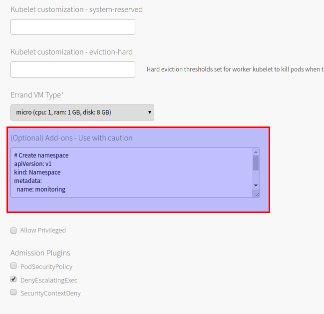

Save and then provision a cluster using the aforementioned plan:

\[code language="bash"\]

david@mgmt-jumpbox:~$ pks create-cluster k8s --external-hostname k8s.virtualthoughts.co.uk --plan medium-with-prometheus-grafana-alertmanager --num-nodes 2

\[/code\]

After which execute the following to acquire the list of loadbalancer IP addresses for the respective services:

\[code language="bash"\] david@mgmt-jumpbox:~$ kubectl get svc -n monitoring NAME TYPE CLUSTER-IP EXTERNAL-IP PORT(S) AGE alertmanager LoadBalancer 10.100.200.218 100.64.96.5,172.16.12.129 80:31747/TCP 100m grafana LoadBalancer 10.100.200.89 100.64.96.5,172.16.12.128 80:31007/TCP 100m prometheus LoadBalancer 10.100.200.75 100.64.96.5,172.16.12.127 80:31558/TCP 100m \[/code\]

# Prometheus - Quick tour

Logging into **http://prometheus-lb-vip/targets** will list the list of scrape targets for Prometheus, which have been configured via the respective configmap and include:

- API server (Master)
- Nodes (Workers)
- cAdvisor (Pods)
- Prometheus (self)

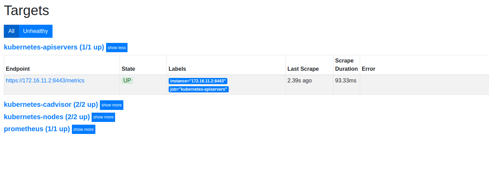

Which can be graphed / modelled / queried:

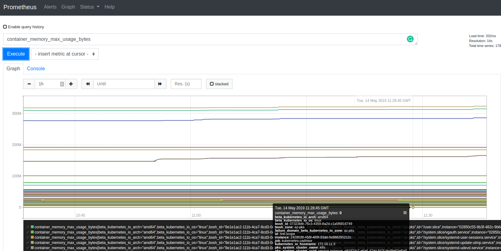

 

# Grafana - Quick Tour

Out of the box, Grafana has very limited configuration applied - I struggled a little bit with constructing a configmap that would automatically add Prometheus as a data source, so a little bit of manual configuration is required (for now). Accessing **http://grafana-lb-vip** will prompt for a logon: (admin/admin) is the default

 

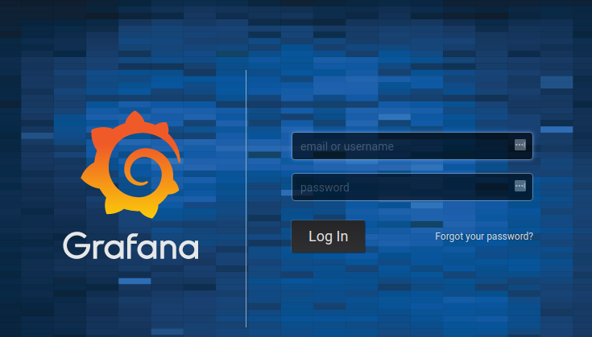

Add a data source:

Hint : use "prometheus.monitoring.svc.cluster.local" as the source URL

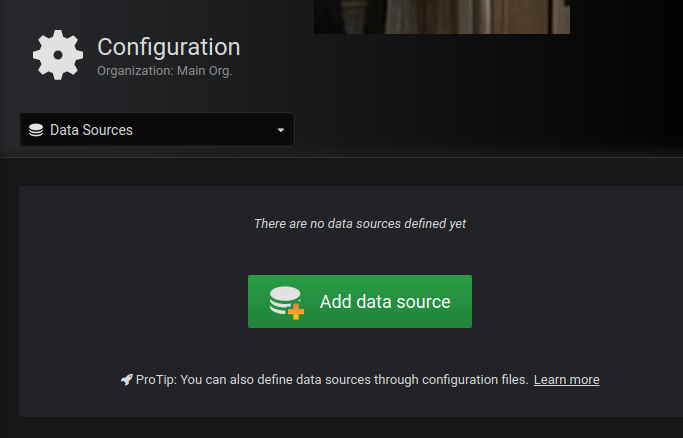

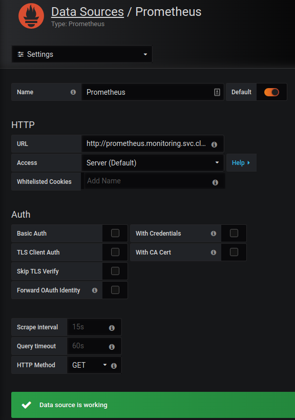

After creating a dashboard (or importing one) we can validate Grafana is extracting information from Prometheus

 

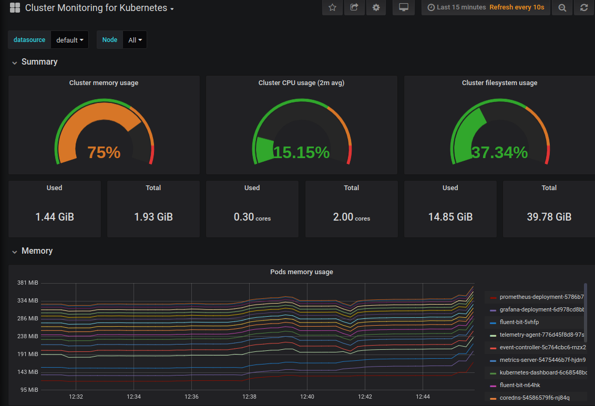

 

# Alertmanager - Quick Tour

Alertmanager can be accessed via **http://alertmanager-lb-vip.** From the YAML manifest it has a vanilla config, but Prometheus is configured to use it as a alert target via the configmap:

\[code language="bash"\] prometheus.yml: |- global: scrape\_interval: 5s evaluation\_interval: 5s alerting: alertmanagers: - static\_configs: - targets: - "alertmanager.monitoring.svc.cluster.local:80" \[/code\]

Alerts need to be configured in Prometheus in order for Alertmanager to ingest / deduplicate / forward etc.

As an example, I tested some integration with Discord:

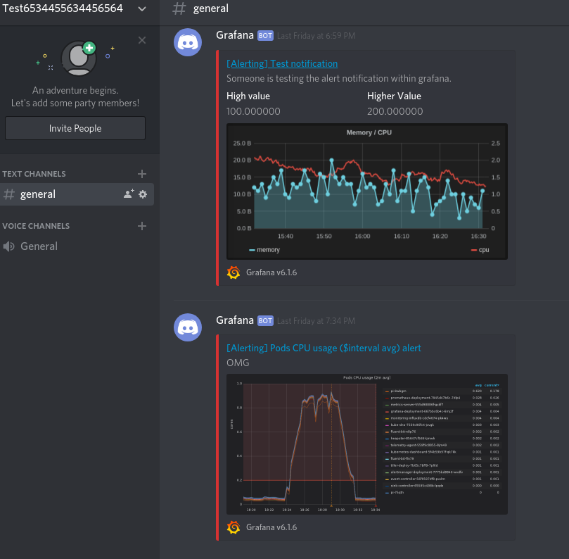

Practical to send alerts to a Discord sever? Probably not.

Fun? Yes!
