 

# What is Velero?

Velero (previously known as Heptio ARK) provides a suite of tools to backup Kubernetes resources and applications for two main purposes:

- **Disaster Recovery** - Recover Kubernetes cluster components and applications.
- **Migration** - Migrate your Kubernetes applications to another Kubernetes cluster.

Migrating Kubernetes applications is a compelling use case. One of the significant benefits of using Kubernetes is the predictability of the platform and consequently the portability of applications that reside on it. With the main exception of nuances with persistent storage, the Kubernetes API will fell almost indistinguishable whether it resides on prem, GKE, AKS, EKS and elsewhere. If you have your Kubernetes-based application on one provider and want to migrate it to another or duplicate it to run elsewhere for dev/test, this can easily be achieved. Especially with Velero.

 

# Install and Configure Velero

Velero consists primarily of the server (runs in a container) a storage location (ie S3 bucket) and the CLI.

Rather than reiterate what's already in Velero's existing and comprehensive documentation, the straight forward instructions are located [https://heptio.github.io/velero/master/.](https://heptio.github.io/velero/master/)

 

# Demo App

To understand and get to grips with Velero I decided to write my own application. It's a really simple application written in Golang and does the following:

- Every 2 seconds, output the contents of /mnt/data/data.txt with a timestamp.

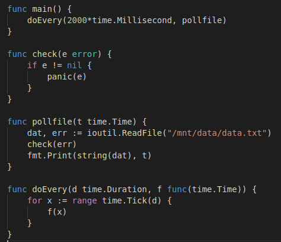

The pod will mount /mnt/data as a persistent volume based on the respective claim. The file it reads is "data.txt" which contains "some data". The PV type is hostpath, which is suitable for testing in this single worker node cluster.

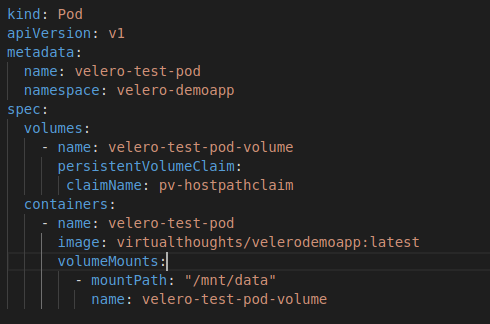

The overall solution is depicted below:

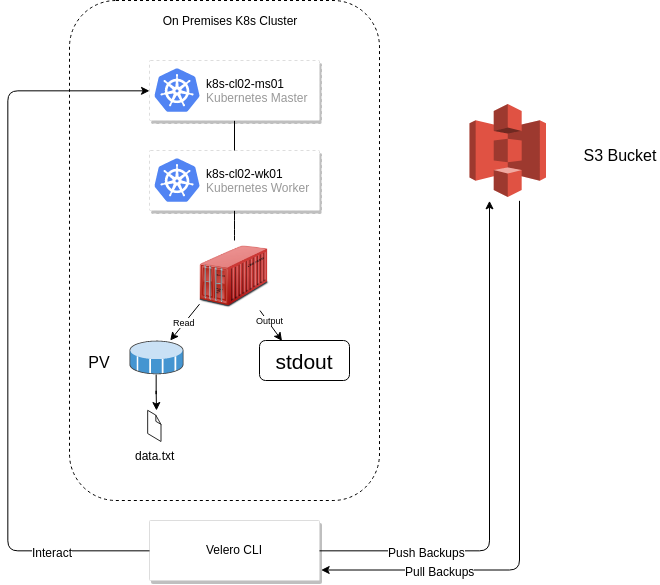

After deploying the application, we can validate it's working as expected by inspecting the stdout file descriptor with kubectl logs:

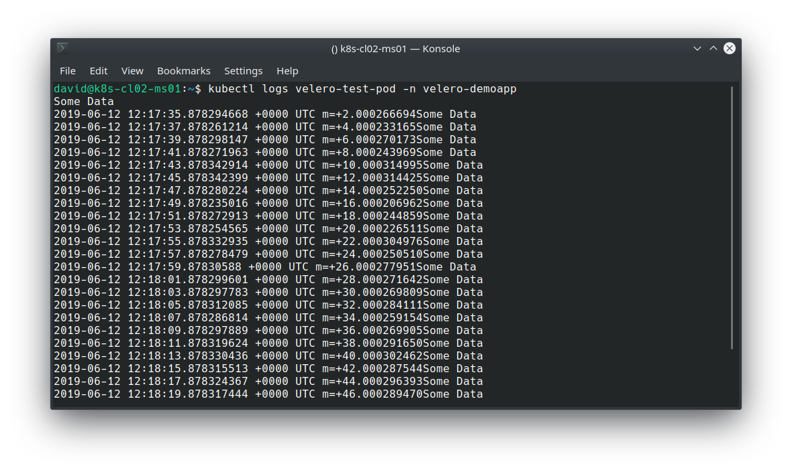

Execute a backup (Note that in production this would likely be scheduled, and this backup includes everything. Ideally, you'd probably want to back up on a per namespace or app basis).

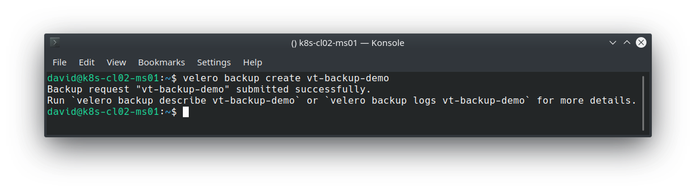

Validate the backup:

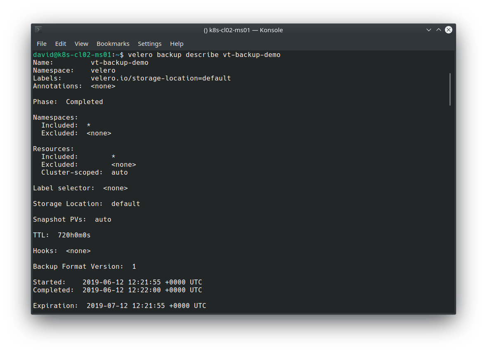

We can also see the backup residing in the previously defined S3 bucket:

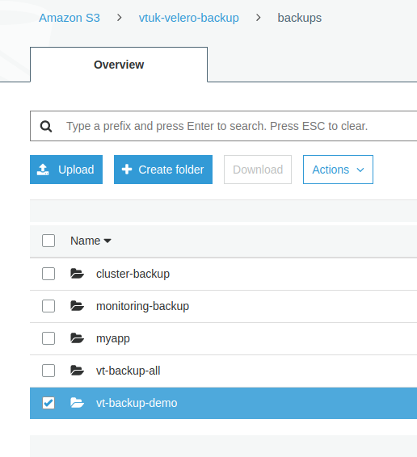

# Simulating a Disaster and Restoring

To simulate a disaster, I'll simply remove my Pod, PV and PVC:

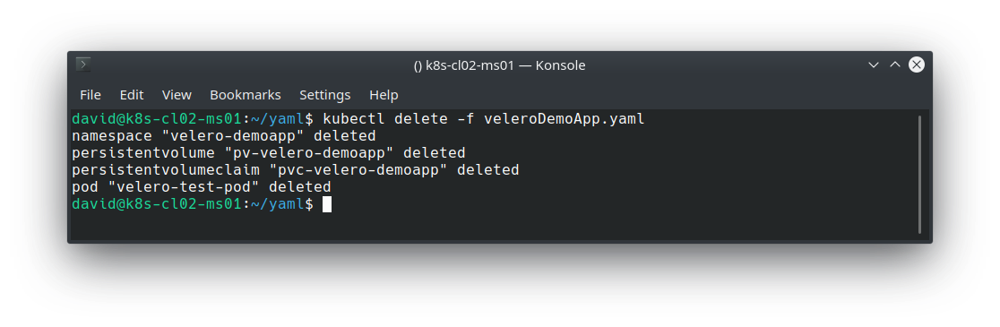

And for good measure, issue the same command previously used to extrapolate the logs:

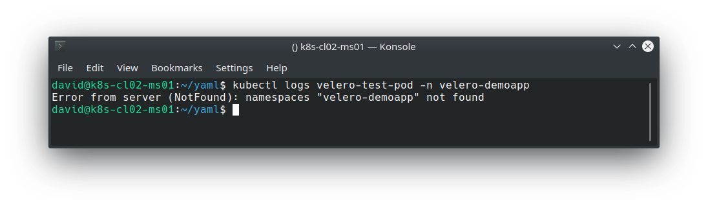

We can use the velero restore command to pull the backup from our S3 bucket and restore our application.

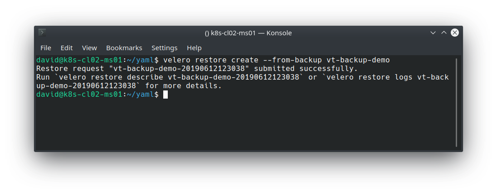

Validate the restore:

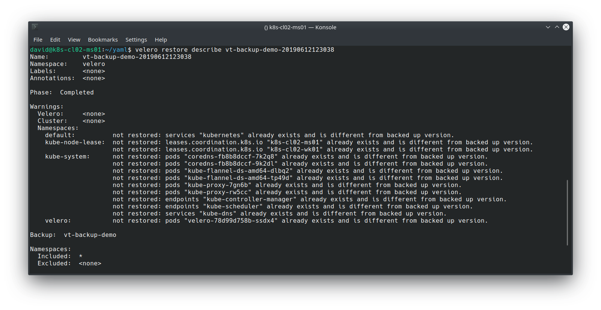

Note that because the previous backup encompassed all namespaces and all resource types, Velero employs some logic to determine which objects it should restore, based on what already exists. However, my app, its namespace, PV and PVC has been restored, which we can validate with:

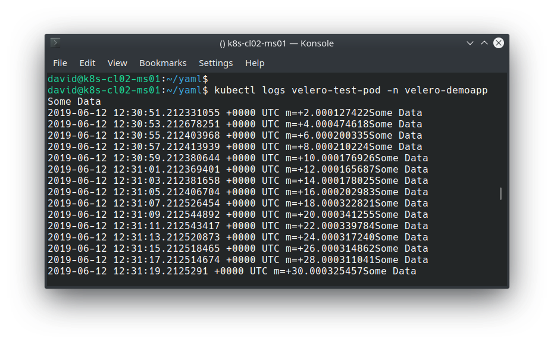

# Closing Thoughts

Being able to mobilise a Kubernetes-based application on virtually any Kubernetes-based cluster is one of many compelling reasons to leverage this technology. Equally as important as ensuring availability and reliability of applications is to adopt a solid backup and disaster recovery solution. Velero is designed to facilitate this, and its flexibility in where to store and retrieve backups from helps with preventing lock-in with a particular solution, provider or vendor. Whether it's on prem, Azure, Google Cloud, AWS, Digital Ocean or others, disasters do happen, downtime occurs. Being able to lift and shift entire cluster resources in a standardised is quickly becoming a solid requirement for modern applications.
