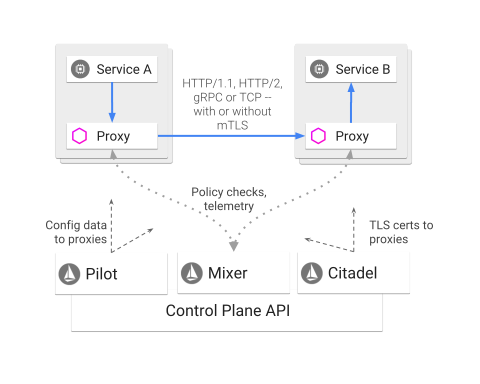
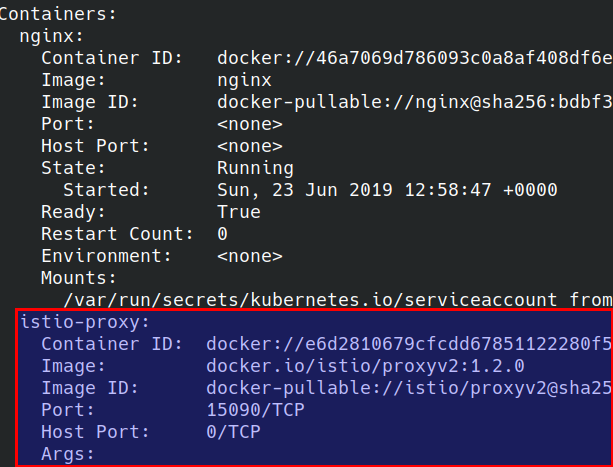
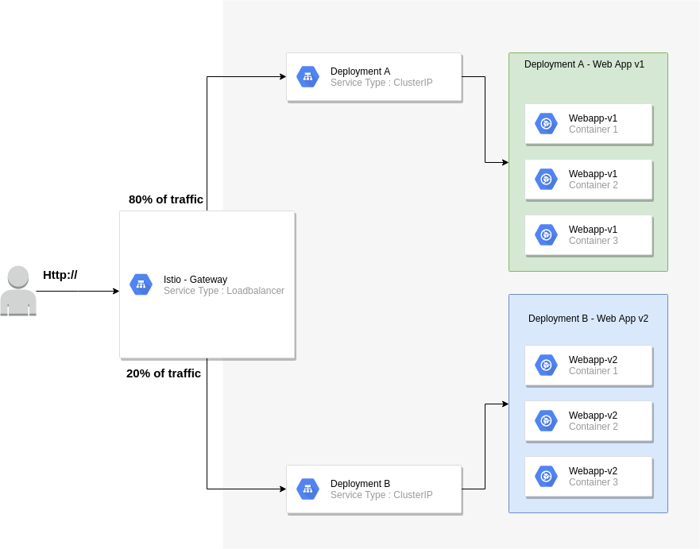
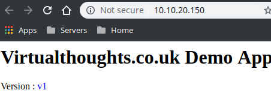
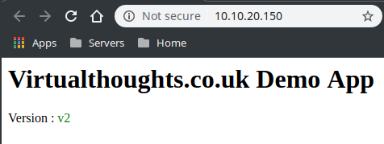
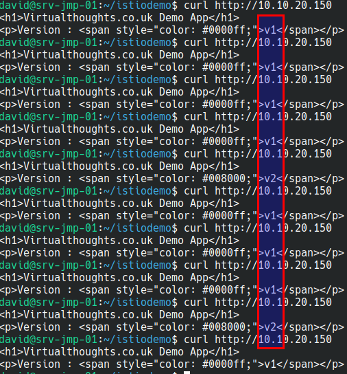

Service Mesh is a pretty hot topic in the Kubernetes ecosystem currently, and I wanted to get it up and running in my own lab environment. Istio's documentation has a pre-baked solution to demonstrate some of its capabilities (a book app, if memory serves me correctly), but I wanted to deploy my own app to get more "hands-on" experience with the tech, even if it's only very basic to start with.

# Install Istio

There are a number of prerequisite steps that need to be satisfied prior to installing Istio. These are specific to my environment,  others may differ.

**Install the Helm client**

\[code language="bash"\] sudo snap install helm --classic \[/code\]

**Grab Istio (1.2.0 in this example)**

\[code language="bash"\]curl -L https://git.io/getLatestIstio | ISTIO\_VERSION=1.2.0 sh - cd istio-1.2.0/\[/code\]

**Create the Helm service account (named "tiller")**

\[code language="bash"\]kubectl apply -f install/kubernetes/helm/helm-service-account.yaml\[/code\]

**Initialise Helm  using the service account specified in the previous step**

\[code language="bash"\]helm init --service-account tiller\[/code\]

**Create a namespace to accommodate the Istio components**

\[code language="bash"\]kubectl create ns istio-system\[/code\]

**Initialise Istio into the aforementioned namespace:**

\[code language="bash"\]helm install install/kubernetes/helm/istio-init --name istio-init --namespace istio-system\[/code\]

**Monitor the state of the pods - it will take some time for the pods to finish - these create the CRD's required for Istio**

\[code language="bash"\] kubectl get pods -n istio-system NAME READY STATUS RESTARTS AGE istio-init-crd-10-t82m6 0/1 ContainerCreating 0 95s istio-init-crd-11-42622 0/1 ContainerCreating 0 95s istio-init-crd-12-65m5v 0/1 ContainerCreating 0 95s \[/code\]

**Install Istio into the aforementioned namespace**

\[code language="bash"\]helm install install/kubernetes/helm/istio --name istio --namespace istio-system\[/code\]

# Configure a namespace for automatic sidecar injection

By this point, we have the internal foundations for Istio, but we're not leveraging it. One of the fundamental workings of Istio is the use of pod sidecars. Sidecars act as the data plane, facilitating a lot of the features we want to leverage from Istio.

Istio doesn't do this automatically, out of the box for all pods deployed into an environment, but Istio will inject sidecars into pods deployed into namespaces that have the **_istio-injection=enabled_** label set.

\[code language="bash"\] kubectl create ns app-with-injection namespace/app-with-injection created kubectl label namespace app-with-injection istio-injection=enabled namespace/app-with-injection labeled \[/code\]

We can validate this by creating a pod into this namespace:

\[code language="bash"\] kubectl run nginx -n app-with-injection --image nginx \[/code\]

And checking the Pod contents (notice how this pod has two containers)

\[code language="bash"\] kubectl get pods -n app-with-injection NAME READY STATUS RESTARTS AGE nginx-7cdbd8cdc9-96mbz 2/2 Running 0 52s \[/code\]

The proxy sidecar: 

 

# Environment Anatomy

The diagram below shows how my test environment is set up

 

 

Key considerations:

The Istio gateway will reside on the edge 80% of all traffic will be routed to v1 of my web application 20% of all traffic will be routed to v2 of my web application

The application manifest can be found at [https://raw.githubusercontent.com/David-VTUK/istioexample/master/webapp.yaml](https://raw.githubusercontent.com/David-VTUK/istioexample/master/webapp.yaml)

To accomplish this we need to implement two key objects:

# Gateway

This is our entry point into our application. By default, Istio deploys the gateway object (we must note the external IP)

\[code language="bash"\] kubectl get svc -n istio-system NAME TYPE CLUSTER-IP EXTERNAL-IP istio-citadel ClusterIP 10.100.200.47 istio-galley ClusterIP 10.100.200.149 istio-ingressgateway LoadBalancer 10.100.200.244 10.10.20.150,100.64.80.1 istio-pilot ClusterIP 10.100.200.170 istio-policy ClusterIP 10.100.200.3 istio-sidecar-injector ClusterIP 10.100.200.169 istio-telemetry ClusterIP 10.100.200.141 prometheus ClusterIP 10.100.200.238 \[/code\]

We configure the Gateway by deploying a _gateway_ manifest file:

\[code language="bash"\] apiVersion: networking.istio.io/v1alpha3 kind: Gateway metadata: name: http-gateway spec: selector: istio: ingressgateway # use Istio default gateway implementation servers: - port: number: 80 name: http protocol: HTTP hosts: - "\*" \[/code\]

- **Kind** : Type of object. Gateway is a CRD (Custom Resource Definition) that Istio implements
- **Selector**: What this applies to, in this case the default Ingress Gateway
- **Ports**: Which ports we want to listen to on the external IP address, together with a name and protocol
- **Hosts** : We can implement layer 7 load balancing on the edge, but as I'll be testing this out via IP address, "\*" will suffice. In production, this would likely be an FQDN of an external facing website

 

# VirtualService

A **gateway** object helps us define the entry point into the cluster, but we have yet to effectively tell the gateway where to route traffic to. This is where the VirtualService object type comes in. This is where we define routing intelligence.

\[code language="bash"\] apiVersion: networking.istio.io/v1alpha3 kind: VirtualService metadata: name: demoapp spec: hosts: - "\*" gateways: - http-gateway http: - route: - destination: port: number: 80 host: vt-webapp-v1.app-with-injection.svc.cluster.local weight: 80 - destination: port: number: 80 host: vt-webapp-v2.app-with-injection.svc.cluster.local weight: 20 \[/code\]

What the above effectively does is listen for all HTTP requests (hence the "\*" under "hosts") and route 80% of traffic to V1 of the webapp, by directing traffic at the respective service and 20% to v2.

# Testing

The "WebApp" is pretty simple. It simply displays one of the following (depending on the version)

 

What we should now see from accessing the external IP is traffic being split across both services via a 80/20 split:

Out of 10 curl commands 8 were routed to v1 of my app, 2 were routed to v2 of my app.

# Conclusion

Admittedly, this is an extremely simple example of a more simple use case of Istio, but as I'm learning, I think it's a decent start, and I hope others find it useful.
