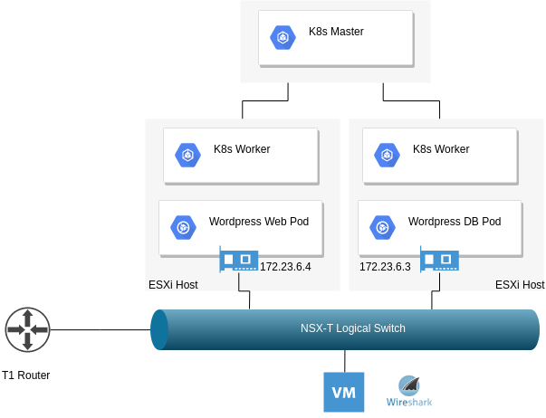
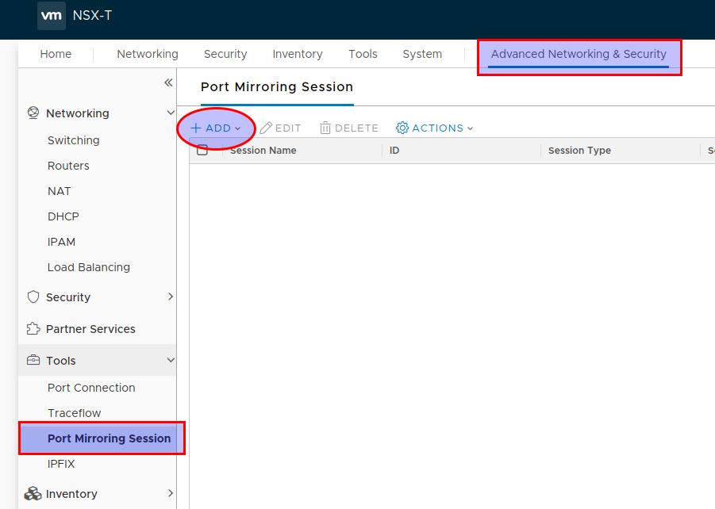
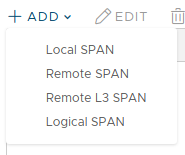
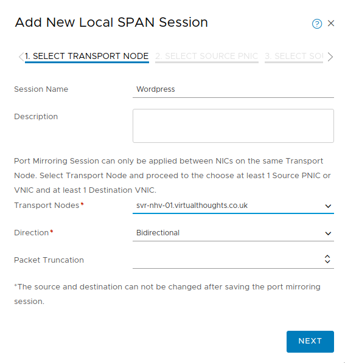
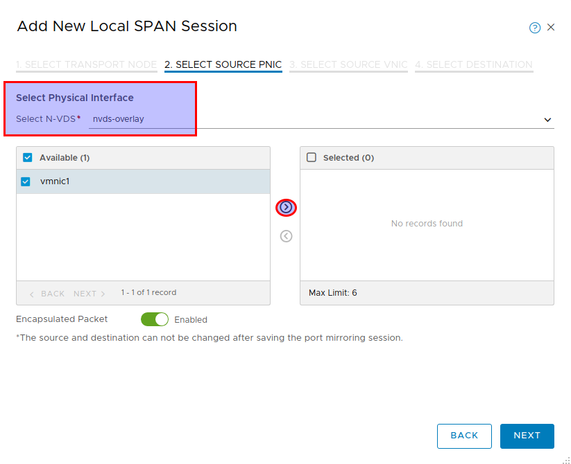
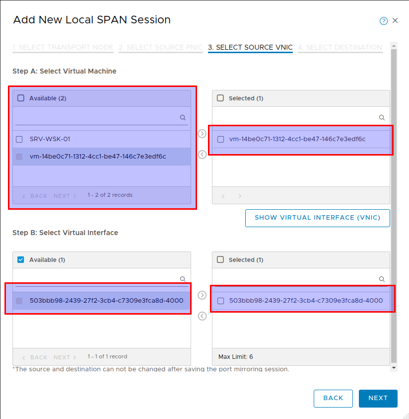
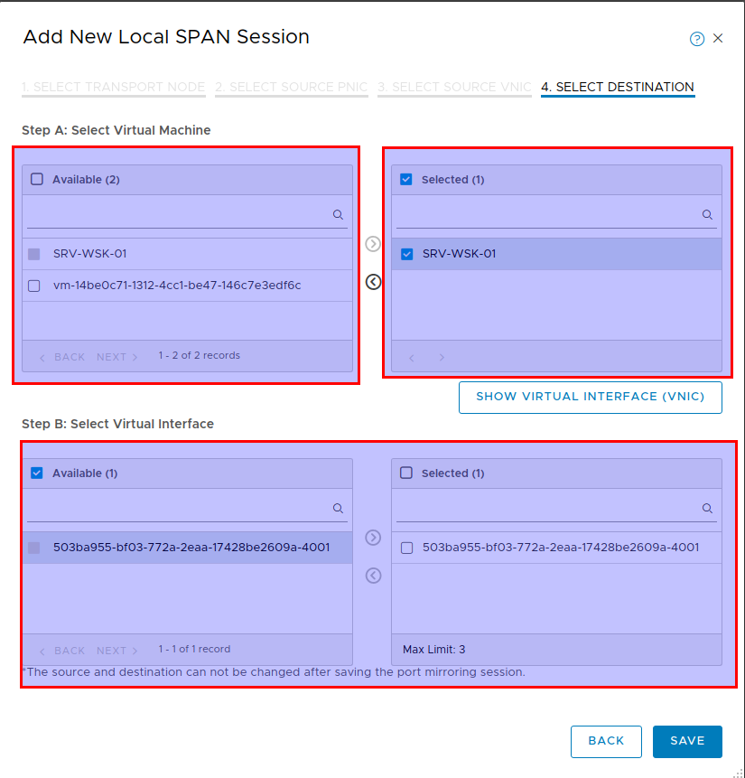
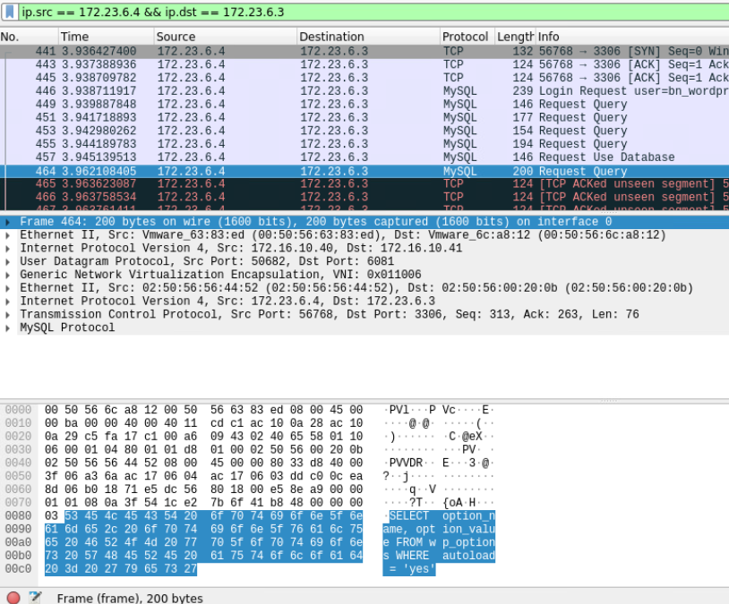

For troubleshooting (or just being a bit nosey) we have a number of tools that allow us to inspect the traffic between two endpoints. When it comes to containers however, our approach has to be adjusted slightly. When using NSX-T as a CNI, we have some of these tools available to us out of the box.

# App Overview

 

For this example, I've deployed a standard Wordpress deployment consisting of a frontend (web) pod and a backend (DB) pod. The objective is to identify and capture the traffic between these pods.

 

# Configure NSX-T Port Mirroring

Navigate to the "Port Mirroring Session" section in NSX-T via "Advanced Networking & Security" and click "Add"

Define a Local SPAN session:

Define the transport node (Source ESXI host)

Select the physical NIC(s) that participate in the n-vds configuration that we want to capture packets from.

**Important:** Enable "Encapsulated Packet" (Disabled by default) so we can inspect the underlying Geneve overlay packets. However, the NIC we want to mirror to **must** support the increased overall packet size. Therefore, adjust the MTU of the nic on the Wireshark host accordingly.

 

Select the source VNIC to capture from - This is the NIC of the Kubernetes worker node VM.

 

 

Finally, select the destination for traffic mirroring. For this example, it's a NIC on a VM I have Wireshark installed on

# Traffic Inspection

With all the hard work out of the way, we can simply provide a filter in Wireshark to show only packets originating from my Wordpress Web Pod and terminating at the Wordpress DB pod:

Notes:

- The overall frame size of 1600 further validates our requirement to have the recipient of the traffic mirroring having an interface configured accordingly.
- Because we previously defined the mirroring of encapsulated packets we can see the overlay information
- We can see the entire packet structure consisting of:
    - Outer Ethernet (NSX-T Transport Node MAC)
    - Outer IP (NSX-T VTEP IP)
    - Geneve UDP
    - Geneve Data
    - Inner Ethernet (Pod Ethernet addresses)
    - Inner IP (Pod IP addresses)
    - Inner TCP (MYSQL connection)
    - Inner Payload (MYSQL Query) - Highlighted
