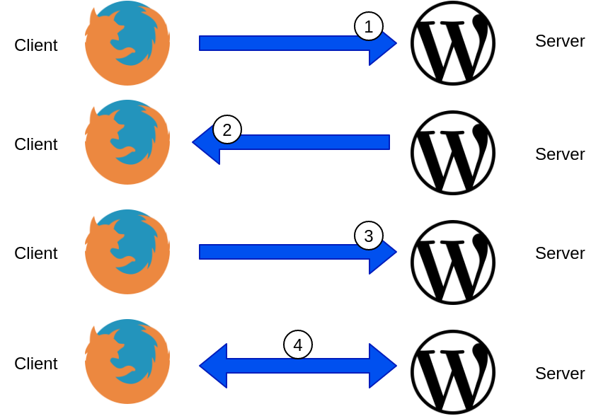
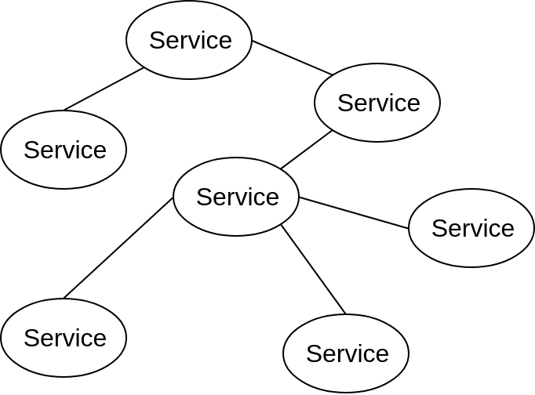
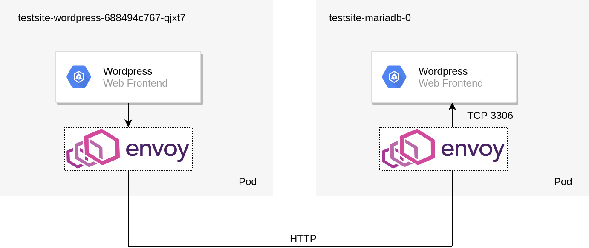
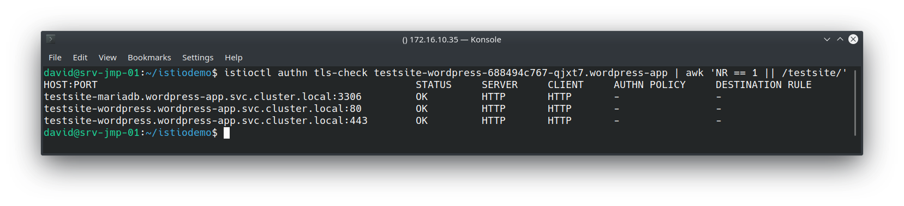
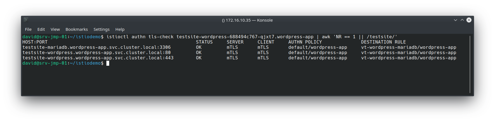
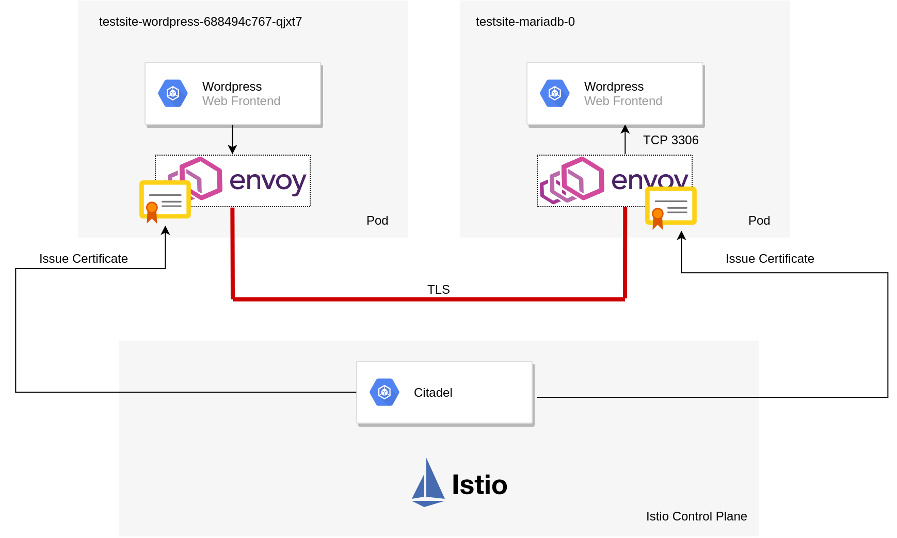

# TLS Overview

If we take an example of accessing a website such as https://www.virtualthoughts.co.uk/, these are the high-level steps of what occurs:

 

 

 

1. The client initiates a connection to the web server requesting an HTTPS connection.
2. The web server responds with its public key. The client validates the key with its list of known Certificate Authorities.
3. A session key is generated by the client and encrypted with the web server's public key and is sent back to the web server.
4. The web server decrypts the session key with its private key. End to end encryption is established.

By default, the TLS protocol only proves the identity of the server to the client using X.509 certificate and the authentication of the client to the server is left to the application layer.  For external, public-facing websites, this is an acceptable and well-established implementation of TLS. But what about communication between different microservices?

 

As opposed to monolithic applications, microservices are usually inter-connected which allow them to be scaled/modified/etc independently. But this does raise some challenges. For example:

- How do we ensure service-to-service communication is always encrypted?
- How can do we do this **without** changing the application source code?
- How can we automatically secure communication when we introduce a new service to an application?
- How can we authenticate clients **and** servers and fully establish a "zero trust" network policy?

Istio can help us address these challenges:

# Example Application

To demonstrate Istio's mTLS capabilities a WordPress Helm chart was deployed into a namespace with automatic sidecar injection. [Installing and configuring Istio can be found on a previous blog post.](https://www.virtualthoughts.co.uk/2019/06/23/step-by-step-istio-up-and-running/) By default, the policy specifies no mTLS between the respective services. As such, the topology of the solution is depicted below:

 

 

We can validate this by using Istioctl:

 

All of the "testsite" services (WordPress frontend and backend) Envoy proxies are using HTTP as their transport mechanism. Therefore mTLS has not been configured yet.

# Creating Istio Objects - Policy and Destination Rules

As you might expect, establishing mutual TLS (mTLS) is a two-part process, First, we must configure the clients to leverage mTLS, as well as the servers. This is accomplished with Policy and Destination rules.

## Policy (AKA - what I, the server, will accept)

\[code language="bash"\] apiVersion: "authentication.istio.io/v1alpha1" kind: "Policy" metadata: name: "default" namespace: "wordpress-app" spec: peers: - mtls: {} \[/code\]

This example policy strictly enforces only mTLS connections between services within the "wordpress-app" namespace

## DestinationRule (AKA - what I, the client, will send out)

\[code language="bash"\] apiVersion: "authentication.istio.io/v1alpha1" apiVersion: "networking.istio.io/v1alpha3" kind: "DestinationRule" metadata: name: "vt-wordpress-mariadb" namespace: "wordpress-app" spec: host: "\*.wordpress-app.svc.cluster.local" trafficPolicy: tls: mode: ISTIO\_MUTUAL \[/code\]

This example enforces the use of mutual TLS when communicating with any service in the wordpress-app namespace. Applying these and re-running the previous istioctl command yields the following result:

This is accomplished largely due to **Citadel** - a component in the Istio control plane that manages certificate creation and distribution:

When mTLS is configured the traffic flow (from a high level) can be described as follows:

- Citadel provides certificates to the sidecar pods and manages them.
- Wordpress pod creates a packet to query the MYSQL database.
    - Wordpress Envoy sidecar pod intercepts this and establishes a connection to the destination sidecar pod and presents its certificate for authenticity.
- MYSQL Envoy sidecar pod receives a connection request, validates the client's certificate and sends its own back.
- Wordpress Envoy sidecar pod receives MYSQL's certificate and checks it for authenticity.
- Both proxies are in agreement as to each other's identity and establish an encrypted tunnel between the two.

This is what makes it "mutual" TLS. In effect, both services are presenting, inspecting and validating each other's certificate as a prerequisite for service-to-service communication. This differs from a standard HTTPs site described earlier on where only the client was validating the server.

# Additional Comments

Some additional observations I've made from this exercise

- **If enforcing strict mTLS on a service that's exposed externally from a load balancer, your clients will obviously need to send x509 certificates that can be validated by Citadel. A more flexible alternative to this is to employ an Istio gateway that provides TLS termination at the cluster boundary. This negates the need to provision x509 certs to each and every client, whilst maintaining mTLS within the cluster.**
- ****Envoy sidecar pods can affect liveness probes and might require you to implement****\[code language="bash"\] sidecarInjectorWebhook.rewriteAppHTTPProbe=true \[/code\]
    
    **upon installing Helm**
