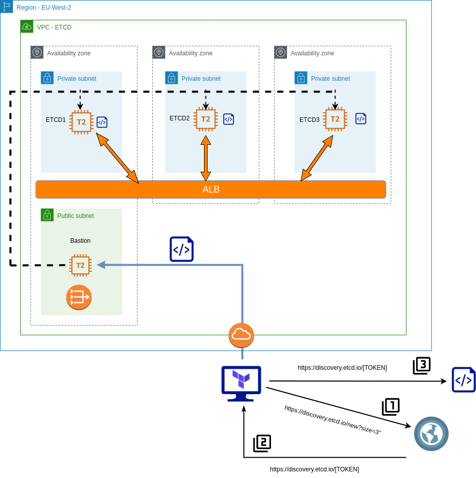
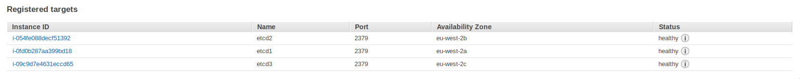

Having experimented with Terraform recently, I decided to leverage this tool by creating an etcd cluster in AWS. This blog post goes through the steps used to accomplish this. For readability, I've only quoted pertinent code snippets, but all of the code can be found at [https://github.com/David-VTUK/terraformec2](https://github.com/David-VTUK/terraformec2).

## Disclaimer

I do not profess to be an Etcd, Terraform or AWS expert, therefore he be dragons in the form of implementations unlikely to be best practice or production-ready. In particular, I would like to revisit this at some point and enhance it to include:

- Securing all Etcd communication with generated certs.
- Implement a mechanism for rotating members in/out of the cluster.
- Leverage auto-scaling groups for both bastion and Etcd members.
- Locking down the security groups.
- ....and a  lot more.

 

## Architecture

The basic principles of this implementation are as follows:

- Etcd members will reside in private subnets and accessed via an internal load-balancer.
- Etcd members will be joined to a cluster by leveraging the Etcd discovery URL.
- A bastion host will be used to proxy all access to the private subnets.
- The Terraform script creates all the components, at the VPC level and beyond.

The scripts are separated into the following files:

\[code language="bash"\] . ├── deployetcd.tpl ├── etcdBootstrapScript.tf ├── etcdEC2Instances.tf ├── etcdMain.tf ├── etcdNetworking.tf ├── etcdSecurityGroups.tf ├── etcdVPC.tf ├── terraformec2.pem ├── terraform.tfstate └── terraform.tfstate.backup \[/code\]

### deployEtcd.tpl

This is a template file for Terraform, it's used to generate a bootstrap script to run on each of our Etcd nodes.

To begin with, download Etcd, extract and do some general housekeeping with regards to access and users. It will also output two environment variables - ETCD\_HOST\_IP and ETCD\_NAME, which is needed for the Systemd unit file.

\[code language="bash"\] cd /usr/local/src sudo wget "https://github.com/coreos/etcd/releases/download/v3.3.9/etcd-v3.3.9-linux-amd64.tar.gz" sudo tar -xvf etcd-v3.3.9-linux-amd64.tar.gz sudo mv etcd-v3.3.9-linux-amd64/etcd\* /usr/local/bin/ sudo mkdir -p /etc/etcd /var/lib/etcd sudo groupadd -f -g 1501 etcd sudo useradd -c "etcd user" -d /var/lib/etcd -s /bin/false -g etcd -u 1501 etcd sudo chown -R etcd:etcd /var/lib/etcd

export ETCD\_HOST\_IP=$(ip addr show eth0 | grep "inet\\b" | awk '{print $2}' | cut -d/ -f1) export ETCD\_NAME=$(hostname -s) \[/code\]

Create the Systemd unit file

\[code language="bash"\] sudo -E bash -c 'cat << EOF > /lib/systemd/system/etcd.service \[Unit\] Description=etcd service Documentation=https://github.com/coreos/etcd

\[Service\] User=etcd Type=notify ExecStart=/usr/local/bin/etcd \\\\ --data-dir /var/lib/etcd \\\\ --discovery ${discoveryURL} \\\\ --initial-advertise-peer-urls http://$ETCD\_HOST\_IP:2380 \\\\ --name $ETCD\_NAME \\\\ --listen-peer-urls http://$ETCD\_HOST\_IP:2380 \\\\ --listen-client-urls http://$ETCD\_HOST\_IP:2379,http://127.0.0.1:2379 \\\\ --advertise-client-urls http://$ETCD\_HOST\_IP:2379 \\\\

\[Install\] WantedBy=multi-user.target EOF' \[/code\]

${discoveryURL} is a placeholder variable. The Terraform script will replace this and generate the script file with a value for this variable.

## etcdBootstrapScript.tf

This is where the discovery token is generated, parsed into the template file to which a new file will be generated - our complete bootstrap script. Simply performing an HTTP get request to the discovery URL will return a unique identifier URL in the response body. So we grab this response and store it as a data object. Note "size=3" denotes the explicit size of the Etcd cluster.

\[code language="bash"\] data "http" "etcd-join" { url = "https://discovery.etcd.io/new?size=3" } \[/code\]

Take this data and parse it into the template file, filling it the variable ${discoveryURL} with the unique URL generated.

\[code language="bash"\] data "template\_file" "service\_template" { template = "${file("./deployetcd.tpl")}"

vars = { discoveryURL = "${data.http.etcd-join.body}" } } \[/code\]

Take the generated output, and store it as "script.sh" in the local directory

\[code language="bash"\] resource "local\_file" "template" { content = "${data.template\_file.service\_template.rendered}" filename = "script.sh" } \[/code\]

The purpose of this code block is to generate one script to be executed on all three Etcd members, each joining a specific 3 node etcd cluster.

## etcdEC2Instances.tf

This script performs the following:

- Create a bastion host in the public subnet with a public IP.
- Create three etcd instanced in each AZ, and execute the generated script via the bastion host:

\[code language="bash"\] connection { host = "${aws\_instance.etc1.private\_ip}" port = "22" type = "ssh" user = "ubuntu" private\_key = "${file("./terraformec2.pem")}" timeout = "2m" agent = false

bastion\_host = "${aws\_instance.bastion.public\_ip}" bastion\_port = "22" bastion\_user = "ec2-user" bastion\_private\_key = "${file("./terraformec2.pem")}" }

provisioner "file" { source = "script.sh" destination = "/tmp/script.sh" }

provisioner "remote-exec" { inline = \[ "chmod +x /tmp/script.sh", "/tmp/script.sh", \] } \[/code\]

## etcdMain.tf

- Contains access and secret keys for AWS access

## etcdNetworking.tf

Configures the following:

- Elastic IP for NAT gateway.
- NAT gateway so private subnets can route out to pull etcd.
- Three subnets in the EU-West-2 region
    - EU-West-2a
    - EU-West-2b
    - EU-West-2c
- An ALB that spans across the aforementioned AZ's:
    - Create a target group.
    - Create a listener on Etcd port.
    - Attach EC2 instances.
    - A health check that probes :2779/version on the Etcd EC2 instances.
- An Internet Gateway and attach to VPC

## etcdSecurityGroups.tf

- Creates a default security group, allowing all (don't do this in production)

## etcdVPC.tf

- Creates the VPC with a subnet of 10.0.0.0/16

## terraformec2.pem

- Key used to SSH into the bastion host and Etcd EC2 instances.

# Validating

Log on to each ec2 instance and check the service via "journalctl -u etcd.service". In particular, we're interested in the peering and if any errors occur.

\[code language="bash"\] ubuntu@ip-10-0-1-100:~$ journalctl -u etcd.service Sep 08 15:34:22 ip-10-0-1-100 etcd\[1575\]: found peer b8321dfeb5729811 in the cluster Sep 08 15:34:22 ip-10-0-1-100 etcd\[1575\]: found peer 7e245ce888bd3e1f in the cluster Sep 08 15:34:22 ip-10-0-1-100 etcd\[1575\]: found self b4ccf12cb29f9dda in the cluster Sep 08 15:34:22 ip-10-0-1-100 etcd\[1575\]: discovery URL= https://discovery.etcd.io/32656e986a6a53a90b4bdda27559bf6e cluster 29d1ca9a6b0f3f87 Sep 08 15:34:23 ip-10-0-1-100 systemd\[1\]: Started etcd service. Sep 08 15:34:23 ip-10-0-1-100 etcd\[1575\]: ready to serve client requests Sep 08 15:34:23 ip-10-0-1-100 etcd\[1575\]: set the initial cluster version to 3.3 Sep 08 15:34:23 ip-10-0-1-100 etcd\[1575\]: enabled capabilities for version 3.3 \[/code\]

We can also check they're registered and healthy with the ALB:

Next, run a couple of commands against the ALB address:

\[code language="bash"\] \[ec2-user@ip-10-0-4-242 ~\]$ etcdctl --endpoints http://internal-terraform-example-alb-824389756.eu-west-2.alb.amazonaws.com:2379 member list 7e245ce888bd3e1f: name=ip-10-0-3-100 peerURLs=http://10.0.3.100:2380 clientURLs=http://10.0.3.100:2379 isLeader=false b4ccf12cb29f9dda: name=ip-10-0-1-100 peerURLs=http://10.0.1.100:2380 clientURLs=http://10.0.1.100:2379 isLeader=false b8321dfeb5729811: name=ip-10-0-2-100 peerURLs=http://10.0.2.100:2380 clientURLs=http://10.0.2.100:2379 isLeader=true \[/code\]

\[code language="bash"\] \[ec2-user@ip-10-0-4-242 ~\]$ etcdctl --endpoints http://internal-terraform-example-alb-824389756.eu-west-2.alb.amazonaws.com:2379 cluster-health member 7e245ce888bd3e1f is healthy: got healthy result from http://10.0.3.100:2379 member b4ccf12cb29f9dda is healthy: got healthy result from http://10.0.1.100:2379 member b8321dfeb5729811 is healthy: got healthy result from http://10.0.2.100:2379 cluster is healthy \[/code\]

Splendid. Now this cluster is ready to start serving clients.
