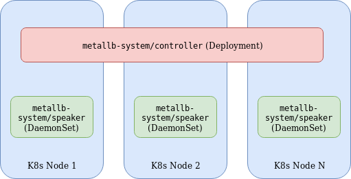
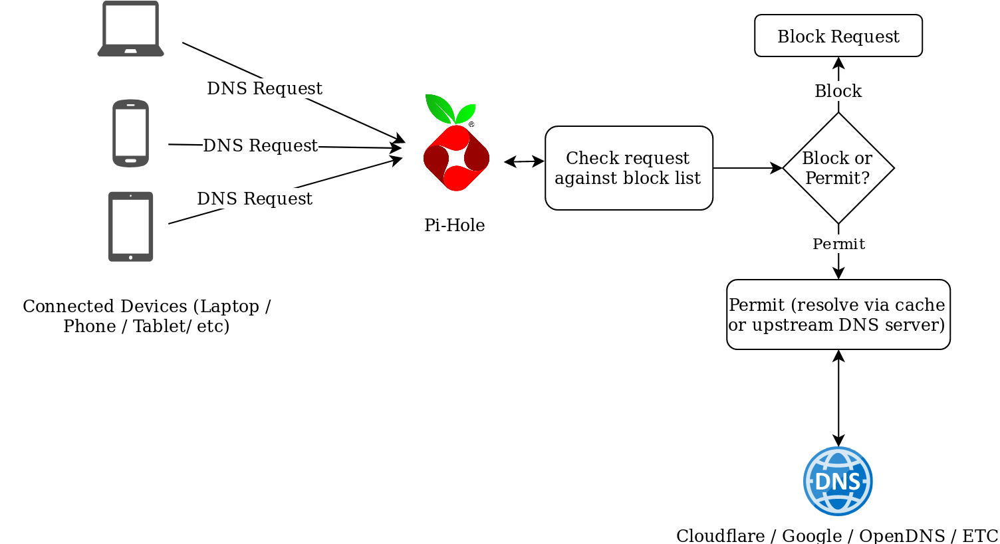
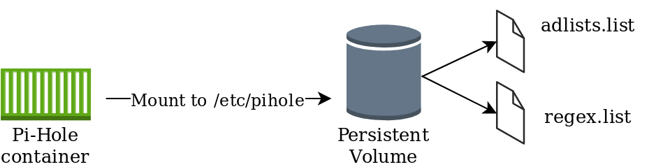
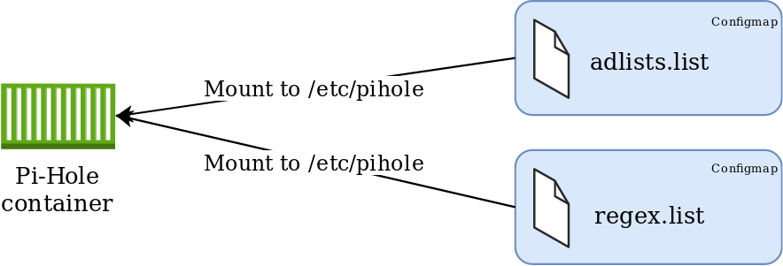
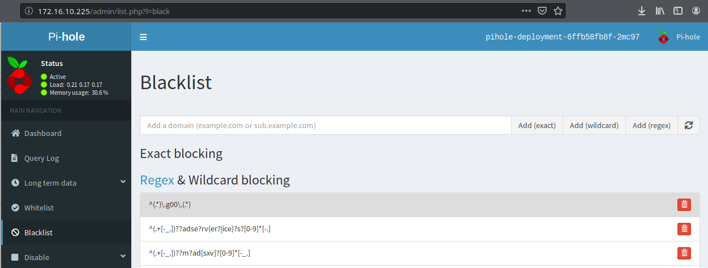
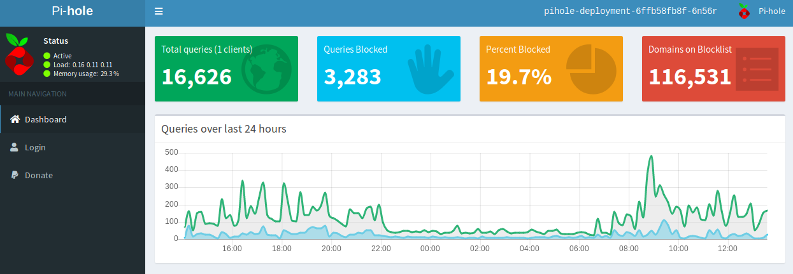

An ongoing project of mine involves the migration of home services (Unifi, Pi-hole, etc) to my Kubernetes cluster. This post explores my approach to migrating Pi-hole, with the help of MetalLB.

# MetalLB Overview

[MetalLB](https://metallb.universe.tf/) is a load balancer implementation for environments that do not natively provide this functionality. For example, with AWS, Azure, GCP and others, provisioning a "LoadBalancer" service will make API calls to the respective cloud provider to provision a load balancer. For bare-metal / on-premises and similar environments this may not work (depending on the CNI used). MetalLB bridges this functionality to these environments so services can be exposed externally.

 

 

MetalLB consists of the following components:

- **Controller Deployment** - A single replica deployment responsible for IP assignment.
- **Speaker DaemonSet** - Facilitates communication based on the specified protocols used for external services.
- **Controller and Speaker service accounts** - RBAC permissions required for respective components.
- **Configuration ConfigMap** - Specifies parameters for either L2 or BGP configuration. The former being used in this example for simplicity.

The Speaker and Controller components can be deployed by applying the MetalLB manifest:

\[code language="bash"\] kubectl apply -f https://raw.githubusercontent.com/google/metallb/v0.8.1/manifests/metallb.yaml \[/code\]

A configmap is used to complement the deployment by specifying the required parameters. Below is an example I've used.

\[code language="bash"\] apiVersion: v1 kind: ConfigMap metadata: namespace: metallb-system name: config data: config: | address-pools: - name: default protocol: layer2 addresses: - 172.16.10.221-172.16.10.230 \[/code\]

The end result is any service of type "LoadBalancer" will be provisioned from the pool of IP addresses in the above configmap.

 

# PI-Hole Overview

Pi-Hole is a network-wide adblocker. It's designed to act as a DNS resolver employing some intelligence to identify and block requests to known ad sites. An advantage of implementing it vs something like Ublock Origin, is PiHole operates at the network level, and is, therefore, device/client agnostic and requires no plugins/software on the originating device.

 

 

The makers of Pi-Hole have an [official Dockerhub repo](https://hub.docker.com/r/pihole/pihole/) for running Pi-Hole as a container, which makes it easier to run in Kubernetes, but with some caveats, as is described below.

# Storing Persistent Data with Pi-Hole

A Pi-Hole container can be fired up with relative ease and provides some effective ad-blocking functionality but if the container is deleted or restarted, any additional configuration post-creation will be lost, it would, therefore, be convenient to have a persistent location for the Pi-Hole configuration, so blocklist / regex entries / etc could be modified. [The makers of Pi-Hole have documented the location and use of various configuration files](https://discourse.pi-hole.net/t/what-files-does-pi-hole-use/1684). Of interest are the following:

`adlists.list`: a custom user-defined list of blocklist URL’s (public blocklists maintained by Pi-Hole users). Located in /etc/pihole

`regex.list` : file of regex filters that are compiled with each pihole-FTL start or restart. Located in /etc/pihole

 

## Approach #1 - Persistent Volumes

This approach leverages a persistent volume mounted to /etc/pihole with a "Retain" policy. This would ensure that if the container terminates, the information in /etc/pihole would be retained. One disadvantage of this includes the operational overhead of implementing and managing Persistent Volumes.

## Approach #2 - Config Maps

This approach leverages configmaps mounted directly to the pod, presented as files. Using this method will ensure consistency of configuration parameters without the need to maintain persistent volumes, with the added benefit of residing within the etcd database and is therefore included in etcd backups. This method also completely abstracts the configuration from the pod, which can easily facilitate updates/changes.

 

# Implementation

Given the options, I felt #2 was better suited for my environment. YAML manifests can be found in [https://github.com/David-VTUK/k8spihole](https://github.com/David-VTUK/k8spihole).

 

## 00-namespace.yaml

Create a namespace for our application. This will be referenced later

\[code language="bash"\] apiVersion: v1 kind: ConfigMap metadata: namespace: metallb-system name: config data: config: | address-pools: - name: default protocol: layer2 addresses: - 172.16.10.221-172.16.10.230 \[/code\]

## 01-configmaps.yaml

This is where our persistent configuration will be stored.

Location for adlists:

\[code language="bash"\] apiVersion: v1 kind: ConfigMap metadata: name: pihole-adlists namespace: pihole-test data: adlists.list: | https://raw.githubusercontent.com/StevenBlack/hosts/master/hosts ......etc \[/code\]

Location for regex values

\[code language="bash"\] apiVersion: v1 kind: ConfigMap metadata: name: pihole-regex namespace: pihole-test data: regex.list: | ^(.+\[-\_.\])??adse?rv(er?|ice)?s?\[0-9\]\*\[-.\] ......etc \[/code\]

Setting environment variables for the timezone and upstream DNS servers.

\[code language="bash"\] apiVersion: v1 kind: ConfigMap metadata: name: pihole-env namespace: pihole-test data: TZ: UTC DNS1: 1.1.1.1 DNS2: 1.0.0.1 \[/code\]

## 02-deployment.yaml

This manifest defines the parameters of the deployment, of significance are how the config maps are consumed. For example, the environment variables are set from the respective configmap:

\[code language="bash"\] containers: - name: pihole image: pihole/pihole env: - name: TZ valueFrom: configMapKeyRef: name: pihole-env key: TZ \[/code\]

The files are mounted from the aforementioned configmaps as volumes:

\[code language="bash"\] volumeMounts: - name: pihole-adlists mountPath: /etc/pihole/adlists.list subPath: adlists.list - name: pihole-regex mountPath: /etc/pihole/regex.list subPath: regex.list volumes: - name: pihole-adlists configMap: name: pihole-adlists - name: pihole-regex configMap: name: pihole-regex \[/code\]

## 03-service.yaml

Currently, you cannot mix UDP and TCP services on the same Kubernetes load balancer, therefore two services are created. One for the DNS queries (UDP 53) and one for the web interface (TCP 80)

\[code language="bash"\] kind: Service apiVersion: v1 metadata: name: pihole-web-service namespace : pihole-test spec: selector: app: pihole ports: - protocol: TCP port: 80 targetPort: 80 name : web type: LoadBalancer --- kind: Service apiVersion: v1 metadata: name: pihole-dns-service namespace: pihole-test spec: selector: app: pihole ports: - protocol: UDP port: 53 targetPort: 53 name : dns type: LoadBalancer \[/code\]

# Deployment

After configuring the configmaps, the manifests can be deployed:

\[code language="bash"\] david@david-desktop:~/pihole$ kubectl apply -f . namespace/pihole-test created configmap/pihole-adlists created configmap/pihole-regex created configmap/pihole-env created deployment.apps/pihole-deployment created service/pihole-web-service created service/pihole-dns-service created \[/code\]

Extract the password for Pi-Hole from the container:

\[code language="bash"\] david@david-desktop:~/pihole$ kubectl get po -n pihole-test NAME READY STATUS RESTARTS AGE pihole-deployment-6ffb58fb8f-2mc97 1/1 Running 0 2m24s david@david-desktop:~/pihole$ kubectl logs pihole-deployment-6ffb58fb8f-2mc97 -n pihole-test | grep random Assigning random password: j6ddiTdS \[/code\]

Identify the IP address of the web service:

\[code language="bash"\] david@david-desktop:~/pihole$ kubectl get svc -n pihole-test NAME TYPE CLUSTER-IP EXTERNAL-IP PORT(S) AGE pihole-dns-service LoadBalancer 10.100.40.39 172.16.10.226 53:31725/UDP 3m38s pihole-web-service LoadBalancer 10.107.251.224 172.16.10.225 80:30735/TCP 3m38s \[/code\]

Access Pi-Hole on the web service external IP using the password extracted from the pod:

All that remains is to reconfigure DHCP or static settings to point to the pihole-dns-service Loadbalancer address for its DNS queries.

I'm quite surprised how much it has blocked thus far (~48 hours of usage):

 

Happy Ad Blocking!
