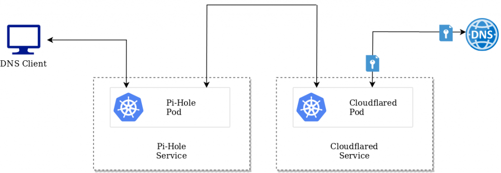
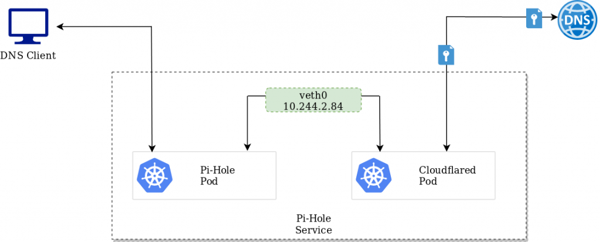
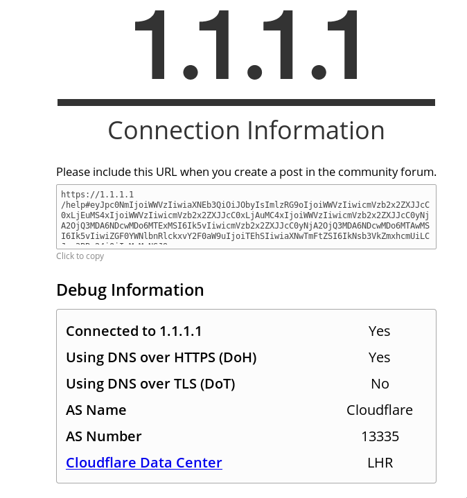

In a previous post, I went through the process of configuring Pi-Hole within a Kubernetes cluster for the purpose of facilitating a network-wide adblocking. Although helpful, I wanted to augment this with DNS over HTTPS.

[Complete manifests can be found here](https://github.com/David-VTUK/piholev2). Shout out to [visibilityspots](https://github.com/visibilityspots) for the [cloudflared image on Dockerhub](https://hub.docker.com/r/visibilityspots/cloudflared/)

## Why?

DNS, as a protocol, is insecure and can be prone to manipulation and man-in-the-middle attacks. DNS over HTTPS helps address this by encrypting the data between the DNS over HTTPS client and the DNS over HTTPS-based DNS resolver. One of which is provided by Cloudflare.

Thankfully, [Pi-Hole has some documentation on how to implement this](https://docs.pi-hole.net/guides/dns-over-https/) for the traditional Pi-Hole setups. But for Kubernetes-based deployments, this requires a different approach.

## How?

The DNS over HTTPS client is facilitated by a Cloudflare daemon. In a traditional Pi-Hole setup this is simply run alongside Pi-Hole itself, but in a containerised environment there are predominantly two ways to address this:

**As a separate microservice**

This approach leverages two different deployments, one for the Pi-Hole service, and one for cloudflared. While workable, I felt that this was a less optimal approach

<figure>



<figcaption>

Service-To-Service communication between Pi-Hole and Cloudflared

</figcaption>

</figure>

**As another container within the Pi-Hole pod**

Given the tight relationship between these containers, and the fact their respective services run on different ports, this seems like a more efficient approach.

<figure>



<figcaption>

Intra-pod communication between Pi-Hole and CloudflareD

</figcaption>

</figure>

As the containers share the same network interface, one pod can access the other over either the veth interface, or simply the localhost address. For Pi-Hole, we can facilitate this via a configmap change:

```bash
apiVersion: v1
kind: ConfigMap
metadata:
  name: pihole-env
  namespace: pihole-system
data:
  TZ: UTC
  DNS1: 127.0.0.1#5054
  DNS2: 127.0.0.1#5054
```

## Testing

Once the respective manifest files have been deployed and clients are pointing to pi-hole as a DNS resolver, it can be tested by accessing [https://1.1.1.1/help](https://1.1.1.1/help). As per the example below, DNS over HTTPS has been identified.


