One of the attractive characteristics of Kubernetes is how it can run pretty much anywhere - in the cloud, in the data center, on the edge, on your local machine and much more. Leveraging existing investments in datacenter resources can be logical when deciding where to place new Kubernetes clusters, and this post goes into automating this with Rancher and Terraform.

## Primer

For this exercise the following is leveraged:

- Rancher 2.3
- vSphere 6.7
- Ubuntu 18.04 LTS

An Ubuntu VM will be created and configured into a template to spin up Kubernetes nodes.

## Step 1 - Preparing a Ubuntu Server VM

In Rancher 2.3 Node templates for vSphere can leverage either of the following:

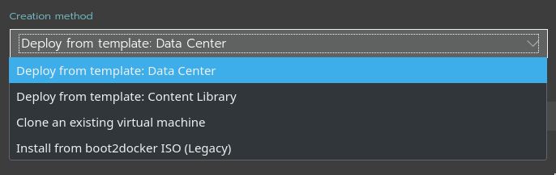

For the purposes of this demo, `"Deploy from template"` will be used, given its simplicity.

To create a new VM template, we must first create a VM. Right-click an appropriate object in vCenter and select `"New Virtual Machine"`

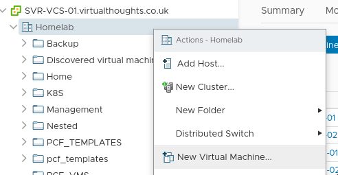

Select a source:

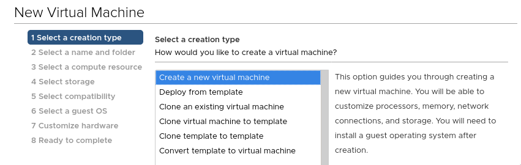

Give it a name:

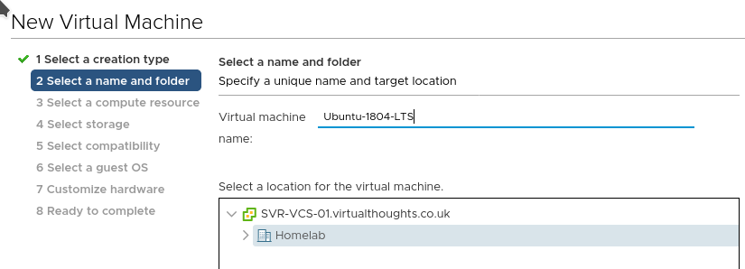

Give it a home (compute):

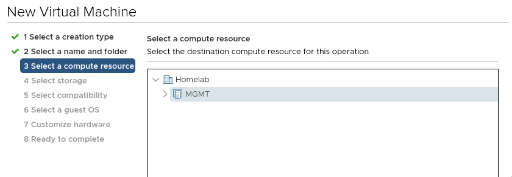

Give it a home (storage):

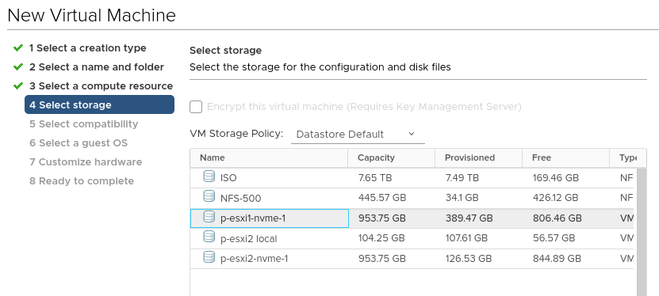

Specify the VM hardware version:

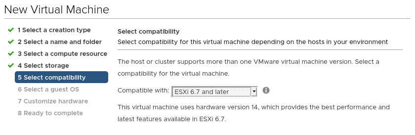

Specify the guest OS:

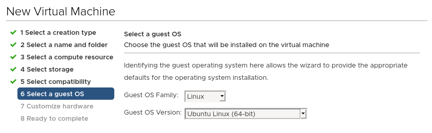

Configure the VM properties, ensure the Ubuntu install CD is mounted:

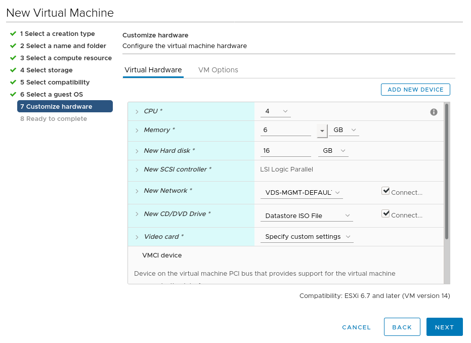

After this, power up the VM and walk through the install steps. After which it can be turned into a template:

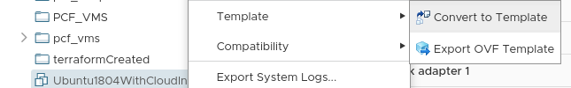

Rancher doesn't have much in the way of requirements for the VM. For this install method a VM needs to have:

- Cloud-Init (Installed by default on Ubuntu 18.04).
- SSH connectivity (Rancher will provide its own SSH certificates as per Cloud-Init bootstrap) - Ensure SSH server has been installed.

## A Note on Cloud-Init

For Vanilla Ubuntu Server installs, it uses Cloud-Init as part of the general Installation process. As such, cloud-init can not be re-invoked on startup by default. To get around this for templating purposes, the VM must be void of the existing cloud-init configuration prior to being turned into a template. To accomplish this, run the following:

```
sudo rm -rf /var/lib/cloud/instances
```

Before shutting down the VM and converting it into a template.

## Constructing the Terraform Script

Now the VM template has been created it can be leveraged by a Terraform script:

Specify the provider: (Note - `insecure = "true"` Is required for vCenter servers leveraging an untrusted certificate, such as self-signed.

```cpp
provider "rancher2" {
  api_url    = "https://rancher.virtualthoughts.co.uk"
  access_key = #ommited - reference a Terraform varaible/environment variable/secret/etc
  secret_key = #ommited - reference a Terraform varaible/environment variable/secret/etc
  insecure = "true"
}
```

Specify the Cloud Credentials:

```
# Create a new rancher2 Cloud Credential
resource "rancher2_cloud_credential" "vsphere-terraform" {
  name = "vsphere-terraform"
  description = "Terraform Credentials"
  vsphere_credential_config {
    username = "Terraform@vsphere.local"
    password = #ommited - reference a Terraform varaible/environment variable/secret/etc
    vcenter = "svr-vcs-01.virtualthoughts.co.uk"
  }
}
```

Specify the Node Template settings:

Note we can supply extra cloud-config options to further customise the VM, including adding additional SSH keys for users.

```
resource "rancher2_node_template" "vSphereTestTemplate" {
  name = "vSphereTestTemplate"
  description = "Created by Terraform"
  cloud_credential_id = rancher2_cloud_credential.vsphere-terraform.id
   vsphere_config {
   cfgparam = ["disk.enableUUID=TRUE"]
   clone_from = "/Homelab/vm/Ubuntu1804WithCloudInit"
   cloud_config = "#cloud-config\nusers:\n  - name: demo\n    ssh-authorized-keys:\n      - ssh-rsa [SomeKey]
   cpu_count = "4"
   creation_type = "template"
   disk_size = "20000"
   memory_size = "4096"
   datastore = "/Homelab/datastore/NFS-500"
   datacenter = "/Homelab"
   pool = "/Homelab/host/MGMT/Resources"
   network = ["/Homelab/network/VDS-MGMT-DEFAULT"]
   }
}
```

Specify the cluster settings:

```
resource "rancher2_cluster" "vsphere-test" {
  name = "vsphere-test"
  description = "Terraform created vSphere Cluster"
  rke_config {
    network {
      plugin = "canal"
    }
  }
}
```

Specify the Node Pool:

```
resource "rancher2_node_pool" "nodepool" {

  cluster_id =  rancher2_cluster.vsphere-test.id
  name = "all-in-one"
  hostname_prefix =  "vsphere-cluster-0"
  node_template_id = rancher2_node_template.vSphereTestTemplate.id
  quantity = 1
  control_plane = true
  etcd = true
  worker = true
}
```

After which the script can be executed.

## What's going on?

From a high level the following activities are being executed:

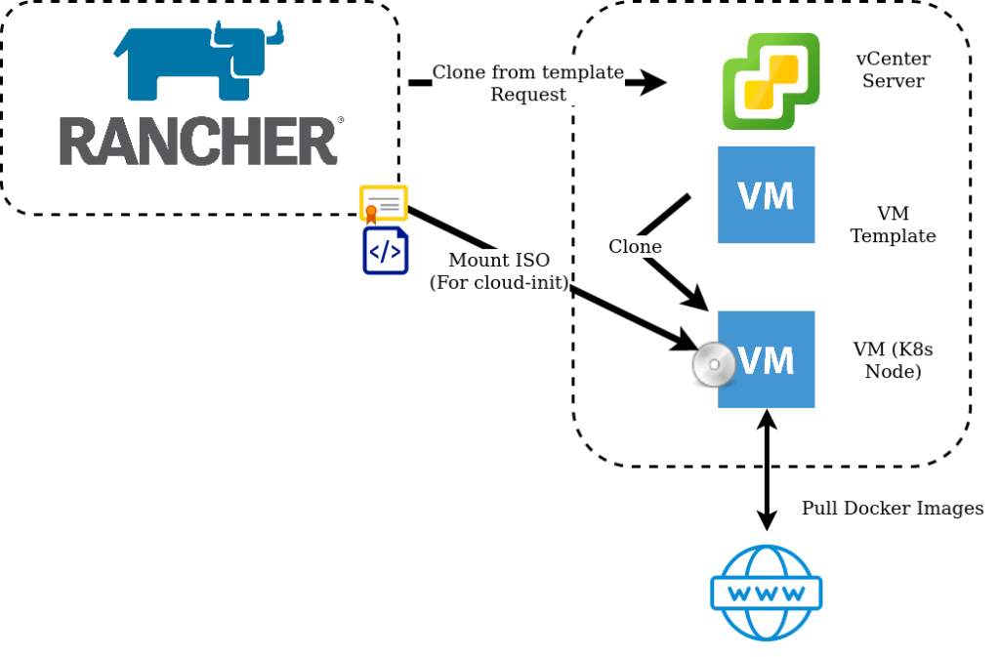

1. Rancher requests VM's from vSphere using supplied Cloud Credentials.
2. vSphere clones the VM Templateeverywhere with the specified configuration parameters.
3. An ISO image is mounted to the VM, which contains certificates and configuration generated by Rancher in the cloud-init format.
4. Cloud-Init on startup reads this ISO image and applies the configuration.
5. Rancher builds the Kubernetes cluster by Installing Docker and pulling down the images.

After which, a shiny new cluster will be created!

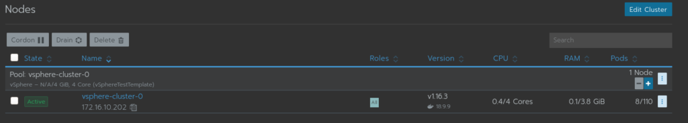
