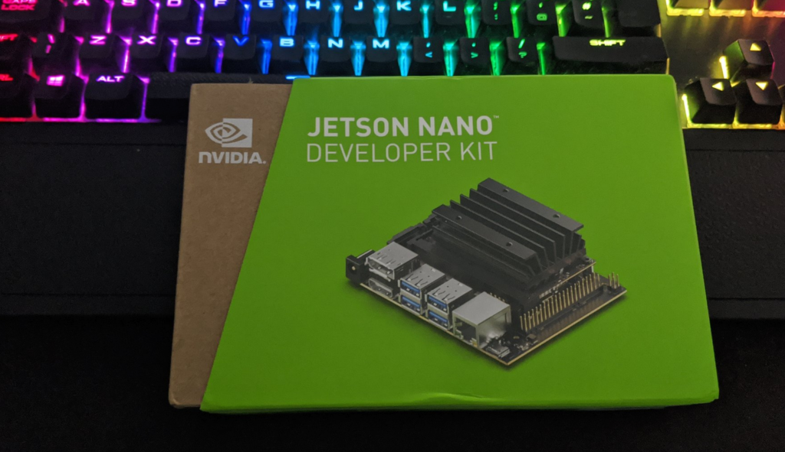

[K3S](https://k3s.io/) is a lightweight Kubernetes distribution developed by [Rancher Labs](https://rancher.com/), perfect for Edge Computing use cases where compute resources may be somewhat limited. It supports x86\_64, ARMv7, and ARM64 architectures.

## Ok, why the Nvidia Nano?

Deploying Kubernetes, be it K8s, K3s or otherwise is fairly well documented on devices such as the Raspberry Pi, however, I wanted to have an attempt doing so on a Nano for the GPU capabilities, which might be beneficial with ML/AI workloads.



## Step 1 - Prep the Nano

Nvidia already has this well documented at [https://developer.nvidia.com/embedded/learn/get-started-jetson-nano-devkit](https://developer.nvidia.com/embedded/learn/get-started-jetson-nano-devkit) but the basics are to apply the provided image to an SD card.

## Optional Step - Run OS from SSD

I decided to hook up my Nano to an SSD for better disk performance. [JetsonHacks have a superb guide on how to set this up](https://github.com/JetsonHacksNano/rootOnUSB) - but it still requires the use of an SD card as the Nano currently can't boot from USB.

## Step 2 - Update the Nano

It's crucial that as a minimum `docker` is updated, but updating everything by doing a `sudo apt update && sudo apt upgrade -y` is a good idea.

The reasoning behind upgrading Docker is as of `19.03` usage of nvidia-docker2 packages is deprecated since Nvidia GPUs are now natively supported as devices in the Docker runtime. The Jetson image comes pre-installed with Docker.

## Step 3 - Check Docker and Set the Default Runtime

Inspect the Docker configuration for the available runtimes:

```bash
david@jetson:~$ sudo docker info | grep Runtime
 Runtimes: runc nvidia
 Default Runtime: runc
```

As a test, if we run a simple container to probe the GPU with the default runtime it will fail.

```bash
david@jetson:~$ sudo docker run -it  jitteam/devicequery
./deviceQuery Starting...

 CUDA Device Query (Runtime API) version (CUDART static linking)

cudaGetDeviceCount returned 35
-> CUDA driver version is insufficient for CUDA runtime version
Result = FAIL
```

This is expected. `runc` in its current state isn't GPU-aware, or at least, not aware enough to natively integrate with Nvidia GPU's, but the Nvidia runtime is. We can test this by specifying the `--runtime` flag in the Docker command:

```bash
david@jetson:~$ sudo docker run -it --runtime nvidia jitteam/devicequery
./deviceQuery Starting...

 CUDA Device Query (Runtime API) version (CUDART static linking)

Detected 1 CUDA Capable device(s)

Device 0: "NVIDIA Tegra X1"
  CUDA Driver Version / Runtime Version          10.0 / 10.0
  CUDA Capability Major/Minor version number:    5.3
  Total amount of global memory:                 3964 MBytes (4156911616 bytes)
  ( 1) Multiprocessors, (128) CUDA Cores/MP:     128 CUDA Cores
  GPU Max Clock rate:                            922 MHz (0.92 GHz)
  Memory Clock rate:                             1600 Mhz
  Memory Bus Width:                              64-bit
  L2 Cache Size:                                 262144 bytes

```

Next, modify `/etc/docker/daemon.json` to set "nvidia" as the default runtime:

```bash
{
    "default-runtime": "nvidia",
    "runtimes": {
        "nvidia": {
            "path": "nvidia-container-runtime",
            "runtimeArgs": []
        }
    }
}
```

Restart Docker:

```
sudo systemctl restart docker
```

And validate:

```
david@jetson:~$ sudo docker info | grep Runtime
 Runtimes: nvidia runc
 Default Runtime: nvidia
```

This will negate the need to define `--runtime` for subsequent containers

## Install K3s

Installing K3s is very easy, the only difference to make in this scenario is to leverage `Docker` as the container runtime, instead of `containerd` which can be done by specifying it as an argument:

```
curl -sfL https://get.k3s.io | INSTALL_K3S_EXEC="--docker" sh -s -
```

After K3s has done its thing, we can validate by:

```bash
david@jetson:~$ kubectl get no -o wide
NAME     STATUS   ROLES    AGE    VERSION        INTERNAL-IP     EXTERNAL-IP   OS-IMAGE             KERNEL-VERSION   CONTAINER-RUNTIME
jetson   Ready    master   2d6h   v1.17.3+k3s1   192.168.1.218   <none>        Ubuntu 18.04.4 LTS   4.9.140-tegra    docker://19.3.6

```

Deploying the previous container as a workload:

```bash
david@jetson:~$ kubectl run -i -t nvidia --image=jitteam/devicequery --restart=Never       
./deviceQuery Starting...

 CUDA Device Query (Runtime API) version (CUDART static linking)

Detected 1 CUDA Capable device(s)

Device 0: "NVIDIA Tegra X1"
  CUDA Driver Version / Runtime Version          10.0 / 10.0
  CUDA Capability Major/Minor version number:    5.3
  Total amount of global memory:                 3964 MBytes (4156911616 bytes)
  ( 1) Multiprocessors, (128) CUDA Cores/MP:     128 CUDA Cores
  GPU Max Clock rate:                            922 MHz (0.92 GHz)
  Memory Clock rate:                             1600 Mhz
  Memory Bus Width:                              64-bit
  L2 Cache Size:                                 262144 bytes
  Maximum Texture Dimension Size (x,y,z)         1D=(65536), 2D=(65536, 65536), 3D=(4096, 4096, 4096)
  Maximum Layered 1D Texture Size, (num) layers  1D=(16384), 2048 layers
  Maximum Layered 2D Texture Size, (num) layers  2D=(16384, 16384), 2048 layers
```
