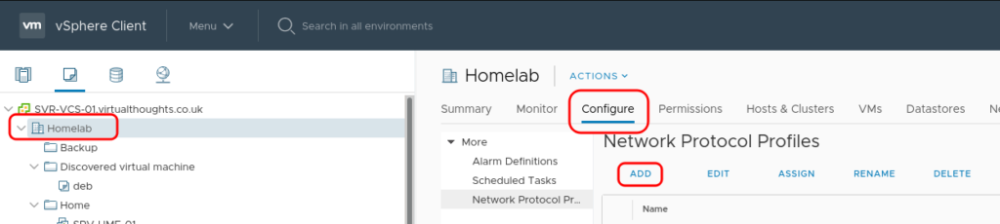
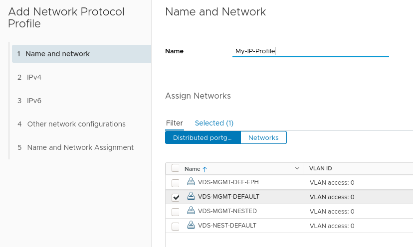
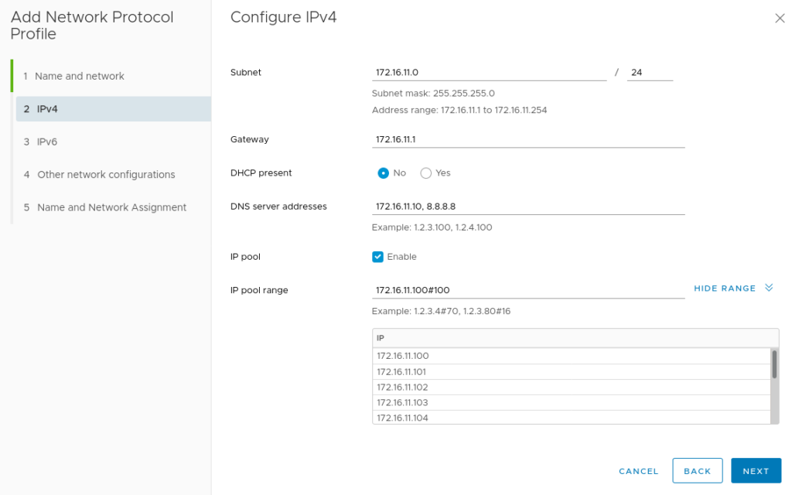
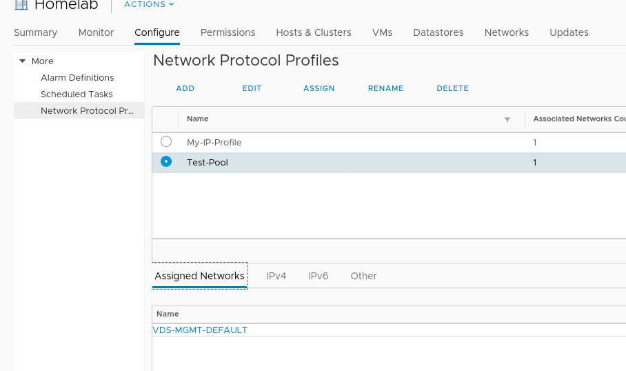
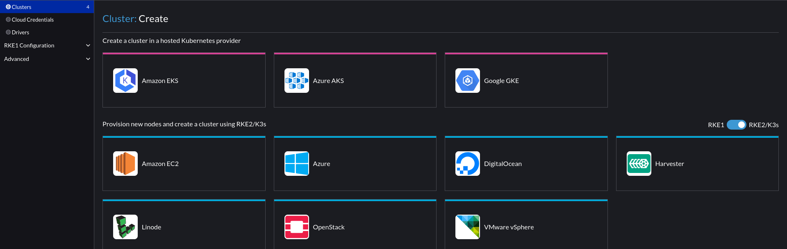
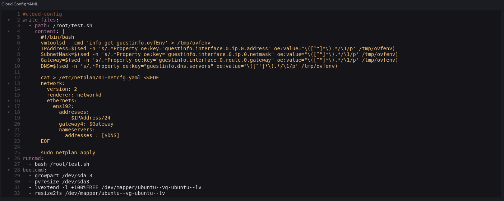
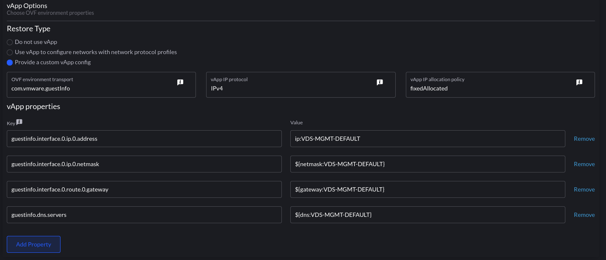
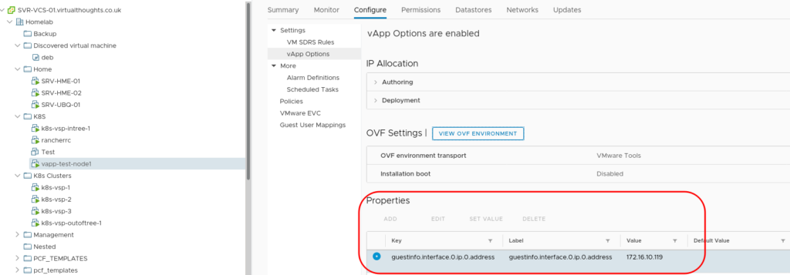

**Edit:** This post has been updated to reflect changes in newer versions of Rancher.

**Note:** As mentioned by Jonathan in the comments, disabling cloud-init's initial network configuration is recommended. To do this, create a file:

`/etc/cloud/cloud.cfg.d/99-disable-network-config.cfg`

To contain:

`network: {config: disabled}`

In your VM template.

How networking configuration is applied to k8s nodes (or VM's in general) in on-premises environments is usually achieved by one of two ways - DHCP or static. For some, DHCP is not a popular option and static addresses can be time-consuming to manage, particularly when there's no IPAM feature in Rancher. In this blog post I go through how to leverage vSphere Network Protocol Profiles in conjunction with Rancher and Cloud-Init to reliably, and predictably apply static IP addresses to deployed nodes.

## Create the vSphere Network Protocol Profile

Navigate to Datacenter > Configure > Network Protocol Profiles. and click "Add".



Provide a name for the profile and assign it to one, or a number of port groups.



Next define the network parameters for this port group. The `IP Pool` and `IP Pool Range` are of particular importance here - we will use this pool of addresses to assign to our Rancher deployed K8s nodes.



After adding any other network configuration items the profile will be created and associated with the previously specified port group.



## Create a cluster

In Rancher, navigate to Cluster Management > Create > vSphere



In the cloud-init config, we add a script to extrapolate the ovf environment that vSphere will provide via the Network Profile and configure the underlying OS. In this case, Ubuntu 22.04 using Netplan:



Code snippet:

```
#cloud-config
write_files:
  - path: /root/test.sh
    content: |
      #!/bin/bash
      vmtoolsd --cmd 'info-get guestinfo.ovfEnv' > /tmp/ovfenv
      IPAddress=$(sed -n 's/.*Property oe:key="guestinfo.interface.0.ip.0.address" oe:value="\([^"]*\).*/\1/p' /tmp/ovfenv)
      SubnetMask=$(sed -n 's/.*Property oe:key="guestinfo.interface.0.ip.0.netmask" oe:value="\([^"]*\).*/\1/p' /tmp/ovfenv)
      Gateway=$(sed -n 's/.*Property oe:key="guestinfo.interface.0.route.0.gateway" oe:value="\([^"]*\).*/\1/p' /tmp/ovfenv)
      DNS=$(sed -n 's/.*Property oe:key="guestinfo.dns.servers" oe:value="\([^"]*\).*/\1/p' /tmp/ovfenv)

      cat > /etc/netplan/01-netcfg.yaml <<EOF
      network:
        version: 2
        renderer: networkd
        ethernets:
          ens192:
            addresses:
              - $IPAddress/24
            gateway4: $Gateway
            nameservers:
              addresses : [$DNS]
      EOF

      sudo netplan apply
runcmd:
  - bash /root/test.sh
bootcmd:
  - growpart /dev/sda 3
  - pvresize /dev/sda3
  - lvextend -l +100%FREE /dev/mapper/ubuntu--vg-ubuntu--lv
  - resize2fs /dev/mapper/ubuntu--vg-ubuntu--lv
```

What took me a little while to figure out is the application of this feature is essentially a glorified transport mechanism for a bunch of key/value pairs - how they are leveraged is down to external scripting/tooling. VMTools will not do this magic for us.

Next, we configure the vApp portion of the cluster (how we consume the Network Protocol Profile:



the format is `param:portgroup`. `ip:VDS-MGMT-DEFAULT` will be an IP address from the pool we defined earlier - vSphere will take an IP out of the pool and assign it to each VM associated with this template. This can be validated from the UI:



What we essentially do with the cloud-init script is extract this and apply it as a configuration to the VM.

This could be seen as the best of both worlds - Leveraging vSphere Network Profiles for predictable IP assignment whilst avoiding DHCP and the need to implement many Node Templates in Rancher.
