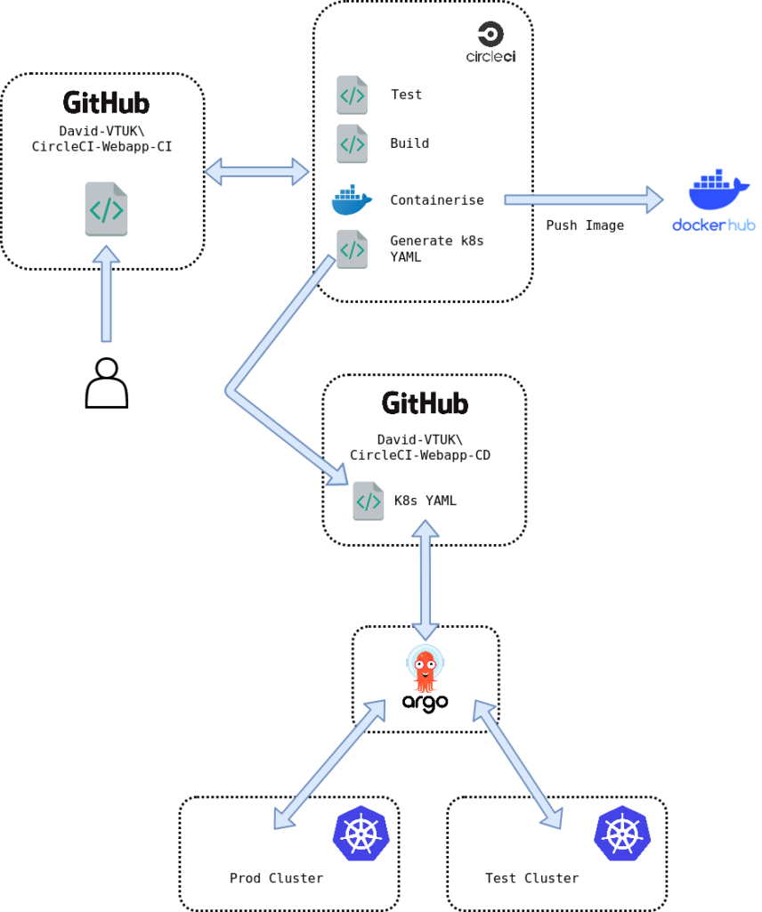

Part 1 of this 3 part series goes through the process of setting up a CI/CD pipeline leveraging CircleCI and ArgoCD. The overall architecture is depicted below:

<figure>

<figcaption>

CI/CD Delivery Pipeline

</figcaption>

</figure>

The steps that will be implemented/accommodated are:

1. Developer commits code to a GitHub repo that is monitored by CircleCI.
2. CircleCI will perform the following tasks on all commits into the `master` branch:
    1. Test the code. In this example, we're leveraging `go test`.
    2. If Testing completes successfully, build (compile) the code.
    3. If building the code completes successfully, construct a docker image to accommodate the service. Push this image to DockerHub
    4. If creating the Docker Image completes successfully, construct a basic deployment YAML file including the tag of the image that was recently uploaded.
    5. Commit the YAML file to a separate GitHub repo, monitored by ArgoCD.
3. Argo CD will deploy the YAML manifest:
    1. Automatically into the `Test` cluster
    2. With manual approval into the `Prod` cluster

[Part 2 - CircleCI Configuration](https://www.virtualthoughts.co.uk/2020/06/24/end-to-end-automation-with-circleci-and-argocd-part-2-circleci-configuration/)

[Part 3 - ArgoCD Configuration](https://www.virtualthoughts.co.uk/2020/06/24/end-to-end-automation-with-circleci-and-argocd-part-3-argocd/)
