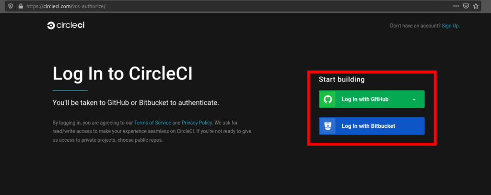
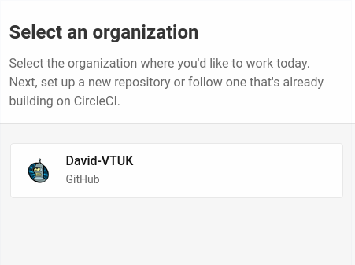
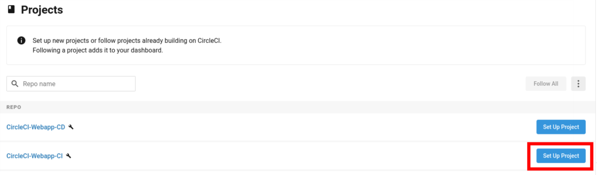
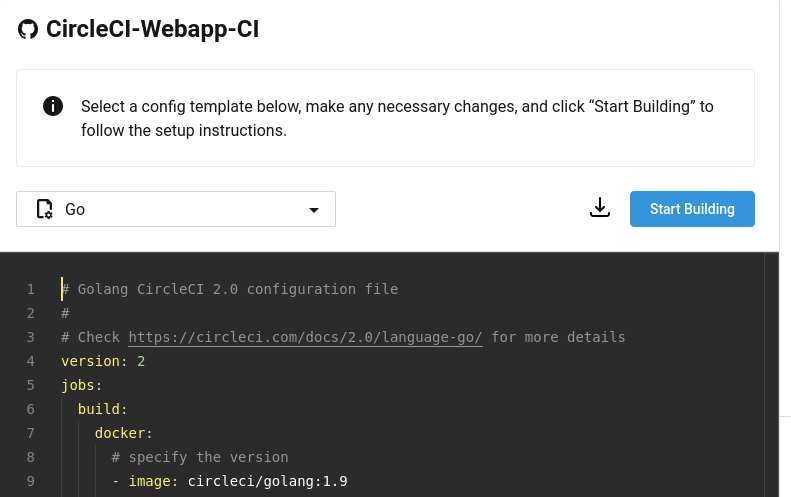
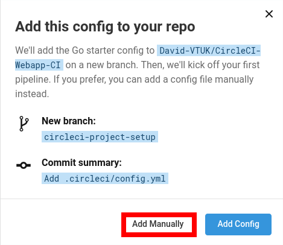
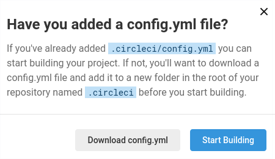
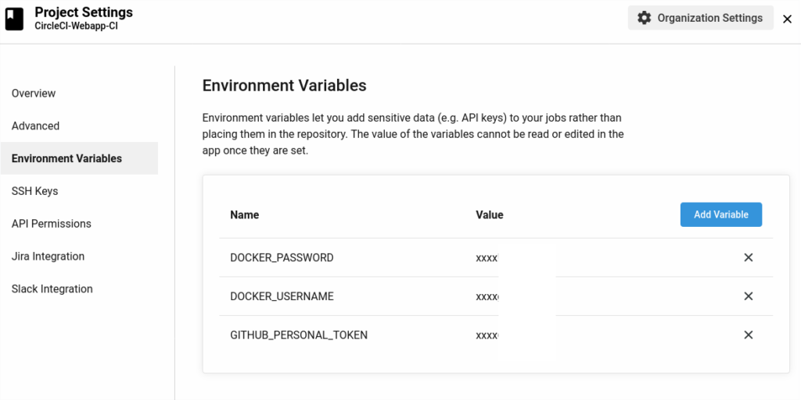
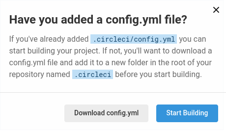
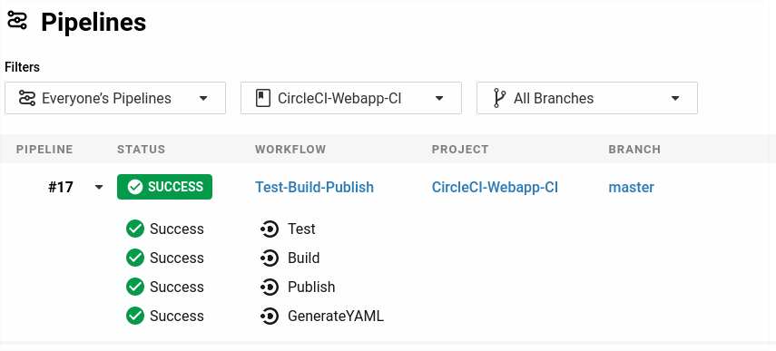
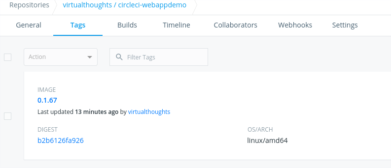

[CircleCI](https://circleci.com/) is a continuous integration technology that is capable of building extremely complex pipelines. Being cloud-hosted and offering a free tier makes it very easy to get up and running.

## Sign Up and Set-Up

Simply navigate to CircleCI's website and log in with either Github or Bitbucket.



Select your org:



Select your project. For me, it's CircleCI-Webapp-CI (Feel free to fork it or leverage your own)



The next step is to create a CircleCI config file that will dictate the steps in the pipeline. CircleCI provides a template to work with:



Clicking on "Start Building" will prompt you for two options. Either let CircleCI apply the starter config, or you can add one of your own. As I've already created one myself, I selected "Add Manually"



After which we're prompted to create `/.circleci/config.yaml` in the respective GitHub repo.



[Click here for my full config.yml](https://raw.githubusercontent.com/David-VTUK/CircleCI-Webapp-CI/master/.circleci/config.yml) file. This can be a bit daunting, so let's break it down:

```yaml
version: 2.1
jobs:
```

Here we define the version of the CircleCI configuration file and in this pipeline, we configure `Jobs`. `Jobs` are a wrapper around a collection of `Steps`. `Steps` are a series of commands. In this example, we have:

```
version: 2.1
jobs:
  Test:
    - {steps}
  Build:
    - {steps}
  Publish:
    - {steps}
  GenerateYAML:
    - {steps}
```

Therefore, we have 4 jobs in this pipeline. `Test`, `Build`, `Publish` and `GenerateYAML`.

## Test Job

```yaml
jobs:
  Test:
    docker:
      - image: cimg/go:1.13
    steps:
      - checkout
      - run: go test -v ./...
```

In this test we're defining it should run in a docker container, hence the `docker` declaration. In CircleCI, we can run jobs in either a VM or a Container.

As this application is written in Go, using the CircleCI image `cimg/go` is convenient as it will contain the dev tools we need, such as `go test`. `main_test.go` includes the test for this app.

## Build Job

```
jobs:
  Build:
    docker:
      - image: cimg/go:1.13
    steps:
      - checkout
      - run: go get -v -t -d ./...
      - run: go build -o webappdemo
      - persist_to_workspace:
          root: .
          paths:
            - ./webappdemo
            - ./deployment.yaml
```

Similarly to before, the first declaration is the docker image to use. **Note**: Each job in CircleCI runs it its own container or VM. Hence why we have to declare which image to use.

As this is using the `cimg/go` image, we have access to the dev tools to `go get` (Download application dependencies) and `go build` (Compiles). `-o` specifies the output. Here it will compile the application into an executable called `webappdemo`.

`Workspaces` are incredibly helpful in saving the output of a job to be used by others. As mentioned previously, Jobs run in their own container/VM, therefore once that job has finished, its data is gone, unless we save it as an artefact, or place it into a workspace. In this example, we're saving the compiled application and the YAML manifest for the Kubernetes deployment - which is already present in the Github repo.

## Publish Job

```yaml
jobs:
  Publish:
    docker:
      - image: cimg/go:1.13
    steps:
      - checkout
      - setup_remote_docker
      - attach_workspace:
          at: /tmp/workspace
      - run: |
          cp /tmp/workspace/webappdemo .
          TAG=0.1.$CIRCLE_BUILD_NUM
          docker build -t virtualthoughts/circleci-webappdemo:$TAG .
          echo $DOCKER_PASSWORD | docker login -u $DOCKER_USERNAME --password-stdin
          docker push virtualthoughts/circleci-webappdemo:$TAG
```

This job is responsible for generating a new docker image for our application with an appropriate tag. Dockerfile exists in the application repo and comprises of:

```php
FROM ubuntu:20.10
RUN mkdir /app
COPY webappdemo /app/
WORKDIR /app
CMD ["/app/webappdemo"]
EXPOSE 80
```

`setup_remote_docker` creates a remote environment inside the existing container, which will be automatically used to configure it. Consequently, any `docker` commands will be used in this environment. This is required to build the docker image.

This job requires the output of the previous job, which was saved into the workspace. Therefore we attach the workspace to acquire the files.

```yaml
      - attach_workspace:
          at: /tmp/workspace
```

This gives us access to the files we attached from the `Build` job.

```
- run: |
          cp /tmp/workspace/webappdemo .
          TAG=0.1.$CIRCLE_BUILD_NUM
          docker build -t virtualthoughts/circleci-webappdemo:$TAG .
          echo $DOCKER_PASSWORD | docker login -u $DOCKER_USERNAME --password-stdin
          docker push virtualthoughts/circleci-webappdemo:$TAG
```

We copy the application into the current directory and leverage one of CircleCI's environment variables to generate the build number and construct the Docker image.

This image is then pushed to Dockerhub. To prevent sensitive information being present in `config.yml`, leverage CircleCI's environment variables. (CircleCI > Project > Project Settings > Environment Variables).



## GenerateYAML Job

```
jobs:
  GenerateYAML:
    docker:
      - image: cimg/base:2020.06
    steps:
      - attach_workspace:
          at: /tmp/workspace
      - run : |
          TAG=0.1.$CIRCLE_PREVIOUS_BUILD_NUM
          git clone https://github.com/David-VTUK/CircleCI-Webapp-CD /tmp/CircleCI-Webapp-CD
          cd /tmp/CircleCI-Webapp-CD
          cp /tmp/workspace/deployment.yaml .
          sed -i 's/\(circleci-webappdemo\)\(.*\)/\1:'$TAG'/' ./deployment.yaml
          git config credential.helper 'cache --timeout=120'
          git config user.email "CircleCI@virtualthoughts.co.uk"
          git config user.name "CircleCI"
          git add .
          git commit -m "Update via CircleCI"
          # Push quietly to prevent showing the token in log
          git push -q https://$GITHUB_PERSONAL_TOKEN@github.com/David-VTUK/CircleCI-Webapp-CD.git master
```

This job:

- Clones the CD repo (This is what ArgoCD will monitor).
- Retrieves the template deployment.yaml from the Workspace.
- Replaces `$TAG` in the following string.

```yaml
    spec:
      containers:
      - name: webapp-demo
        image: virtualthoughts/circleci-webappdemo:$TAG
```

With the image tag of the `Build` process and consequently what has been tagged in Dockerhub.

- Pushes this YAML file into a separate repo using the `$GITHUB_PERSONAL_TOKEN` environment variable.

## Workflow

Workflows are a way to schedule `Jobs`. They aren't required, but it helps to manage jobs and influence order, dependency and other characteristics. Additionally, breaking up a workflow can help with troubleshooting as a failed step relates to a specific Job.

```
workflows:
  version: 2
  Test-Build-Publish:
    jobs:
      - Test
      - Build:
          requires:
            - Test
      - Publish:
          requires:
            - Build
      - GenerateYAML:
          requires:
            - Publish
```

This workflow sets the order for this pipeline. The first job is Test, followed by Build, Publish and GenerateYAML. Each of these jobs specifies a `requires:` field. So if a previous job fails, the entire workflow fails.

With this YAML file in place, "Start Building" can be selected:



Any commit into this repo will trigger the defined pipeline. Which we can view in CircleCI:



Additionally, the Docker image has been updated:



[Part 1 - Overview](https://www.virtualthoughts.co.uk/2020/06/24/end-to-end-automation-with-circleci-and-argocd-part-3-argocd/)

[Part 3 - ArgoCD Configuration](https://www.virtualthoughts.co.uk/2020/06/24/end-to-end-automation-with-circleci-and-argocd-part-3-argocd/)
