[ArgoCD](https://argoproj.github.io) is a Continuous Delivery tool designed for Kubernetes, This will be used to take the generated YAML file from the CI process and apply it to two clusters.

In this section, the following part of the overall CI/CD pipeline being implemented is depicted below.

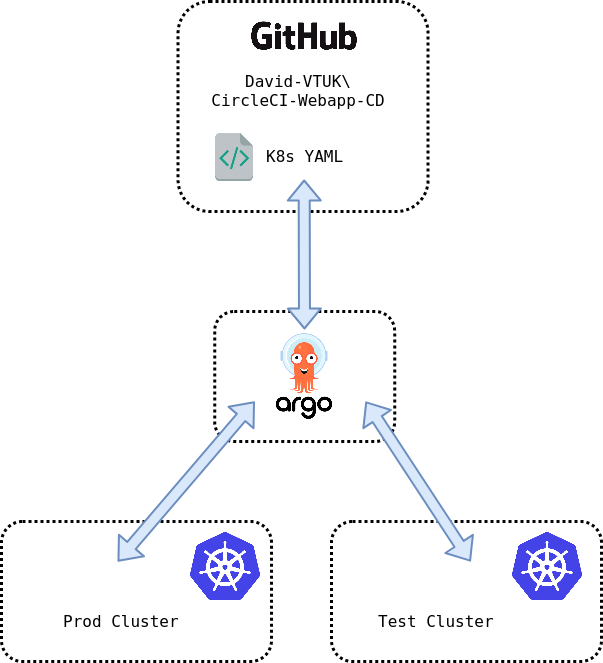

- ArgoCD will monitor for changes in the `Webapp-CD` Github Repo.
- All changes are automatically applied to the `Test` cluster.
- All changes will be staged for manual approval to `Prod` cluster

## Install ArgoCD

ArgoCD has extensive installation documentation [here](https://argoproj.github.io/argo-cd/getting_started/). For ease, a community Helm chart has also been created.

## Add Clusters to ArgoCD

I'm using Rancher deployed clusters which require a bit of tweaking on the ArgoCD side. The following Gist outlines this well: [https://gist.github.com/janeczku/b16154194f7f03f772645303af8e9f80](https://gist.github.com/janeczku/b16154194f7f03f772645303af8e9f80). However, other clusters can be added with a `argocd cluster add`, which will leverage the current kubeconfig file. For this environment, both `Prod` and `Test` clusters were added.

If done correctly, the clusters should be visible in Settings > Clusters in the ArgoCD web UI and `argocd cluster list` in the CLI:

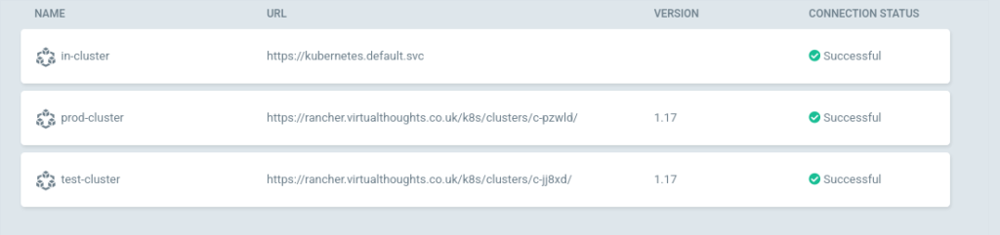

## Add Repo to ArgoCD

In ArgoCD navigate to Settings > Repositories:

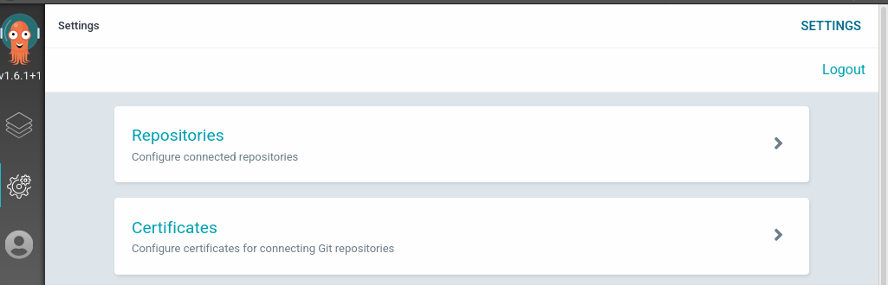

You can connect to a repo in one of two ways - SSH or HTTPS. Fill in the name URL and respective authentication parameters:

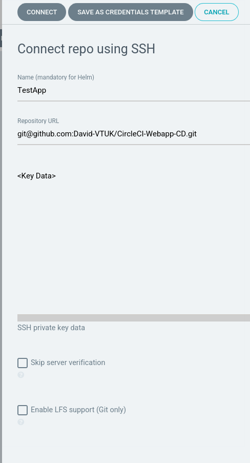

With all being well, it will be displayed:

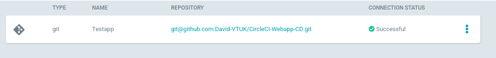

## Create ArgoCD Application

From the ArgoCD UI, select either `New App` or `Create Application`

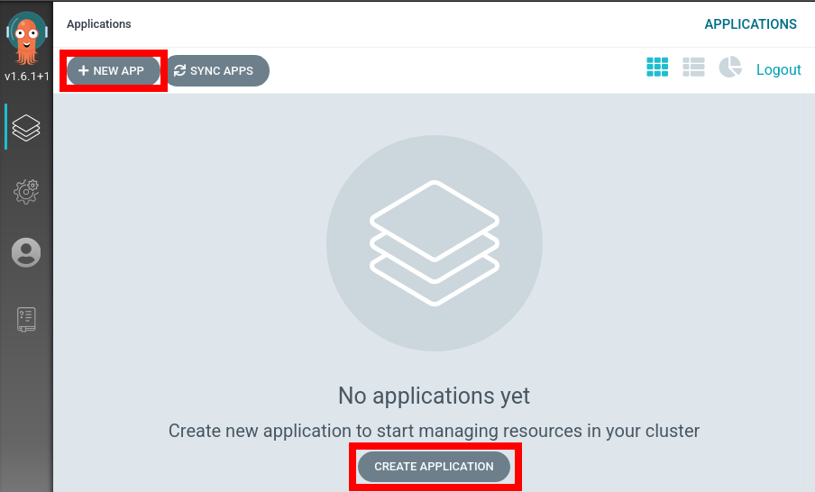

### Application Settings - General

`Application Name`: web-test  
`Project`: Default (For production environments a separate project would be created with specific resource requirements, but this will suffice to get started with.)  
`Sync Policy`: Automatic

### Application Settings - Source

`Repository URL`: Select from dropdown  
`Revision`: Head  
`Path`: .

### Application Settings - Destination

`Cluster`: Test  
`Namespace`: Default (This is used when the application does explicitly define a namespace to reside in).

After which our application has been added:

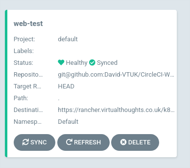

Selecting the app will display its constituent parts

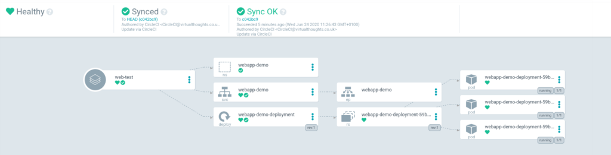

Repeat the `create application` process but substitute the following values:

`Application Name` : web-prod  
`Sync Policy`: Manual  
`Cluster`: Prod

After which, both the prod and test applications will be shown

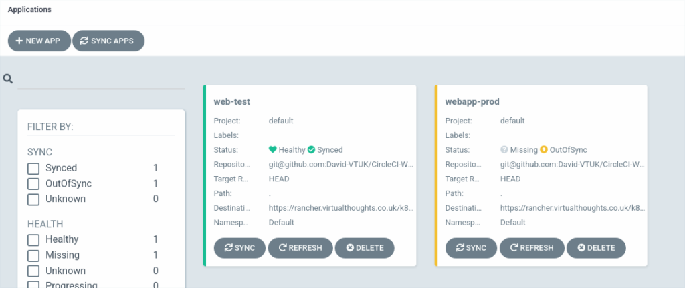

`webapp-prod` is noted as being OutOfSync - this is expected. In this environment, I don't want changes to automatically propagate to prod, but only to test. Clicking "Sync" will rectify this:

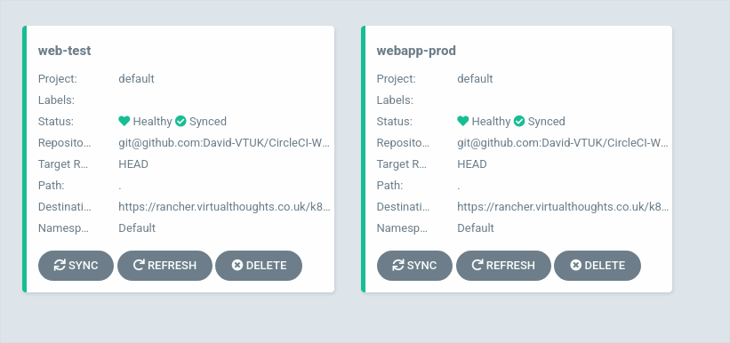

## Testing

Now everything is in place the following should occur during a new commit to the source code:

- Automatically invoke CircleCI pipeline to Test, Build and Publish the application as a container to Dockerhub
- Construct a YAML file using the aforementioned image
- ArgoCD detects a change in the manifest and:
    - Applies it to Test immediately
    - Reports Prod is now out of sync.

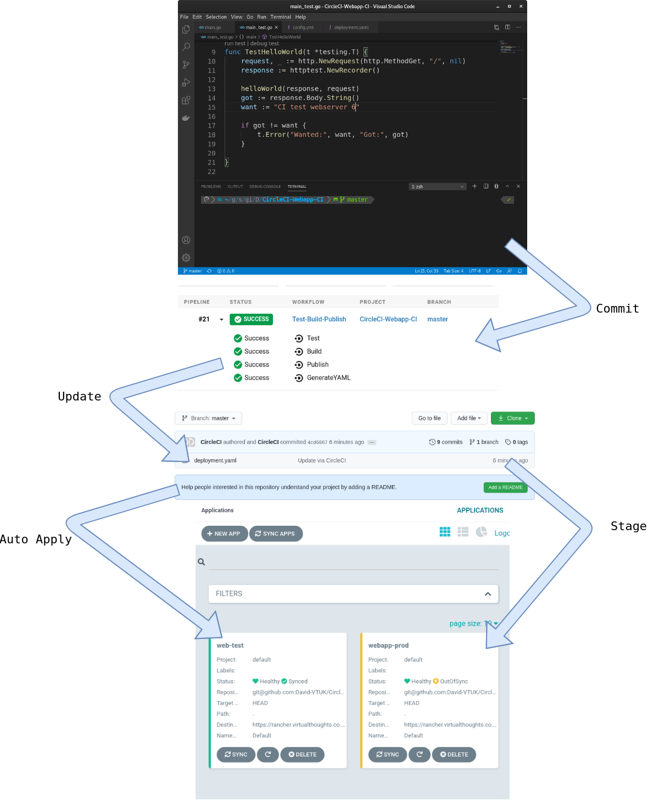

As expected, changes to the source code have propagated into the Kubernetes clusters it is residing on.

[Part 1 - Overview](https://www.virtualthoughts.co.uk/2020/06/24/end-to-end-automation-with-circleci-and-argocd-part-1-overview/)

[Part 2 - CircleCI Configuration](https://www.virtualthoughts.co.uk/2020/06/24/end-to-end-automation-with-circleci-and-argocd-part-2-circleci-configuration/)
