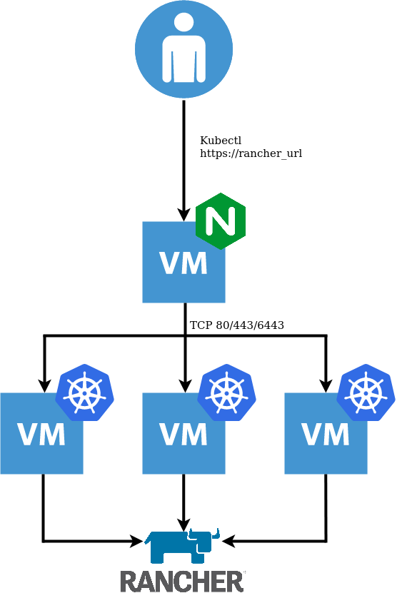

Previously, my local Rancher installs were based on [RKE](https://rancher.com/docs/rke/latest/en/). However, since [K3S](https://rancher.com/docs/k3s/latest/en/) is now a supported distribution, I decided to rebuild my environment leveraging it. Additionally, it was a good opportunity to automate the process with Terraform.

## TL;DR

[https://github.com/David-VTUK/Rancher-K3s-vSphere](https://github.com/David-VTUK/Rancher-K3s-vSphere) contains the Terraform code required to do this.

## Quick note on K3S with Embedded DB

This installation method is currently `experimental`. Do `not` leverage it in production (yet). Towards the end of August 2020, we (Rancher) plan to replace it with embedded etcd as per [the roadmap](https://github.com/rancher/k3s/blob/master/ROADMAP.md). I'm a fan of simplicity, therefore when v1.19 does come out, I plan to simply tear down and rebuild my cluster using this Terraform code. However, one could equally modify it to leverage an external DB for a more production-ready setup.

## Resources Created

The aforementioned Terraform code will create:

- A single VM with NGINX installed acting as a Loadbalancer, forwarding TCP 80/443/6443 to the K3s Nodes
- Three VM's which will form the K3s cluster with an embedded DB. The first of which is used to initialise the cluster
- Once the cluster is created, Cert-Manager and Rancher are installed which are probed for readiness.



## Prerequisites

- Terraform version 0.13
- Prior to running this script, a DNS record needs to be created to point at the Loadbalancer IP address, defined in the variable `lb_address`.
- The VM template used must have the `Cloud-Init Datasource for VMware GuestInfo` project installed, which facilitates pulling meta, user, and vendor data from VMware vSphere's GuestInfo interface. This can be achieved with:

```
curl -sSL https://raw.githubusercontent.com/vmware/cloud-init-vmware-guestinfo/master/install.sh | sh -
```

Or use the following Packer Template:

[https://github.com/David-VTUK/Rancher-Packer/tree/master/vSphere/ubuntu\_2004\_cloud\_init\_guestinfo](https://github.com/David-VTUK/Rancher-Packer/tree/master/vSphere/ubuntu_2004_cloud_init_guestinfo)

## Acquire Kubeconfig

- SSH to one of the K3s nodes
- Grab `/etc/rancher/k3s/k3s.yaml`
- Replace `server: https://127.0.0.1:6443` with the IP address defined in `lb_address`
