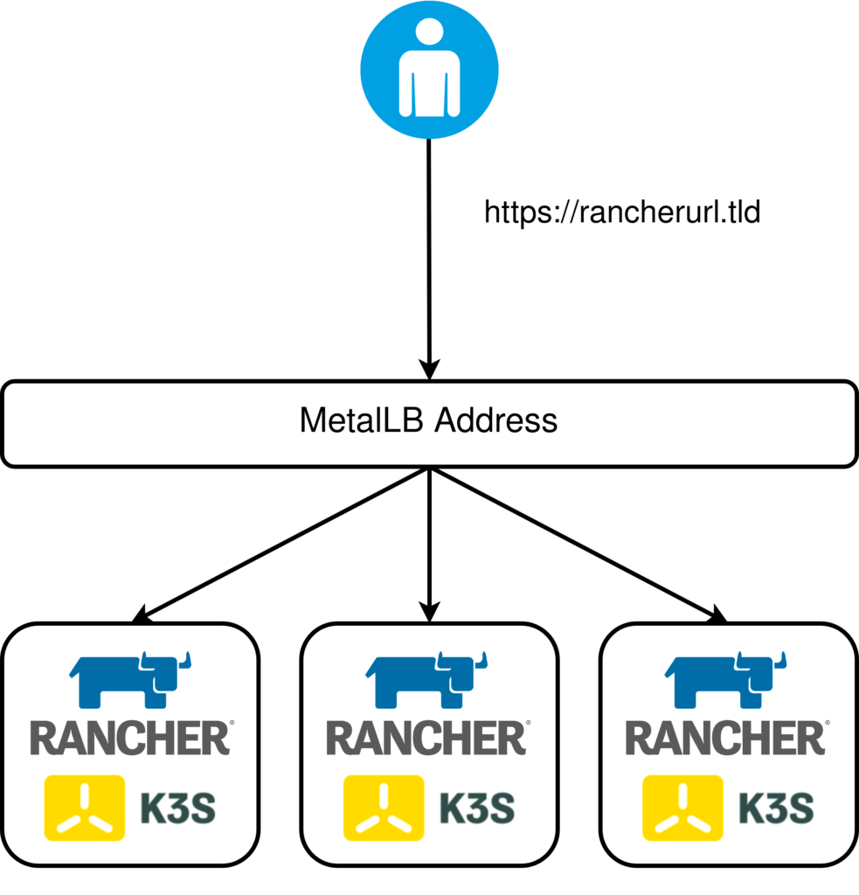

TLDR; Repo can be found [here](https://github.com/David-VTUK/vSphere-K3s-Rancher-Pulumi) (Be warned, I'm at best, a hobbyist programmer and certainly not a software engineer in my day job)

I've been recently getting acquainted with [Pulumi](https://www.pulumi.com/) as an alternative to Terraform for managing my infrastructure. I decided to create a repo that would do a number of activities to stand up Rancher in a new K3s cluster, all managed by Pulumi in my vSphere Homelab, consisting of the following activities:

- Provision three nodes from a VM Template.
- Use `cloud-init` as a bootstrapping utility:
    - Install K3s on the first node, elected to initialise the cluster.
    - Leverage K3s's [Auto-Deploying Manifests](https://rancher.com/docs/k3s/latest/en/advanced/#auto-deploying-manifests) feature to install Cert-Manager, Rancher and Metallb.
- Join two additional nodes to the cluster to form a HA, embedded etcd cluster.



The Ingress Controller is exposed via a `loadbalancer` service type, leveraging Metallb.

After completion, Pulumi will output the IP address (needed to create a DNS record) and the specified URL:

```
tputs:
    Rancher IP (Set DNS): "172.16.10.167"
    Rancher url:        : "rancher.virtualthoughts.co.uk"
```

## Why `cloud-init` ?

For this example, I wanted to have a zero-touch deployment model relative to the VM's themselves - IE no SSH'ing directly to the nodes to remotely execute commands. `cloud-init` addresses these requirements by having a way to seed an instance with configuration data. This Pulumi script leverages this in two ways:

1. To set the instance (and therefore host) name as part of `metadata.yaml` (which is subject to string replacement)
2. To execute a command on boot that initialises the K3s cluster (Or join an existing cluster for subsequent nodes) as part of `userdata.yaml`
3. To install `cert-manager`, `rancher` and `metallb`, also as part of `userdata.yaml`

## Reflecting on Using Pulumi

Some of my observations thus far:

- I really, _really_ like having "proper" condition handling and looping. I never really liked repurposing `count` in Terraform as awkward condition handling.
- Being able to leverage standard libraries from your everyday programming language makes it hugely flexible. An example of this was taking the cloud-init user and metadata and encoding it in base64 by using the `encoding/base64` package.
