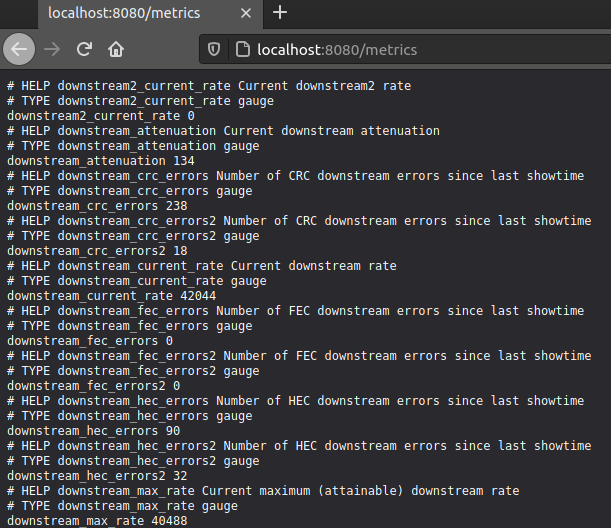
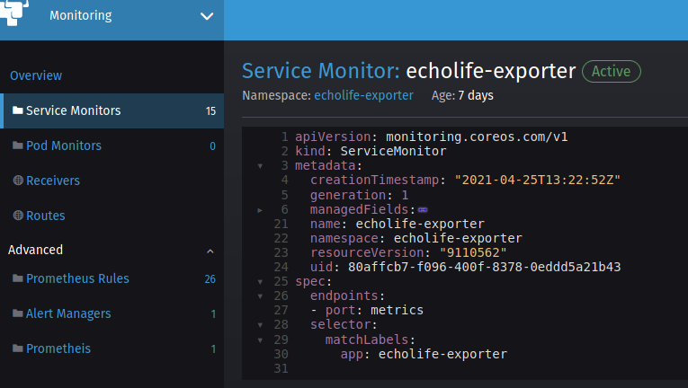
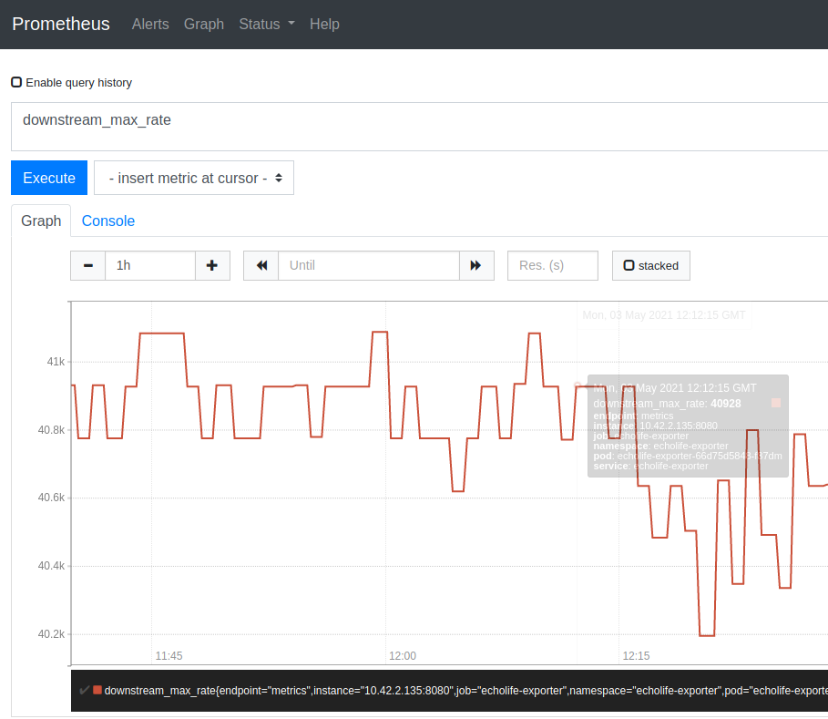
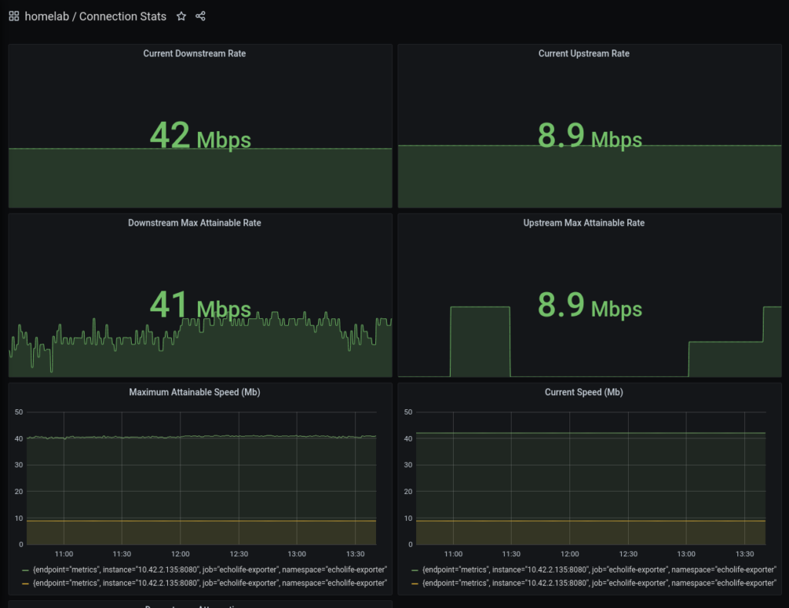

TLDR; Code repo can be found [here](https://github.com/David-VTUK/echolife-exporter). Huge thanks to Spencer for the [original blog post that helped me](https://rsmitty.github.io/Prometheus-Exporters-Revamp/), answering some questions over email, and providing [a really helpful Prometheus exporter template](https://github.com/rsmitty/prom-example) (in Go) that I used for this example.

[The monitoring framework in Rancher 2.5](https://rancher.com/docs/rancher/v2.x/en/monitoring-alerting/v2.5/) was significantly changed - including, but not limited to, giving us the ability to scrape for our own application metrics and creating custom Grafana dashboards. The Monitoring stack in Rancher is a culmination of a number of open-source technologies:

- Prometheus - For collecting and storing metrics into a time-series database.
- Grafana - Analytics and visualisation of metrics (IE Prometheus).
- AlertManager - An extension of Prometheus that enabling configuration of alerts and routing them to notification, paging, and automation systems.

## Prometheus Exporters

Prometheus-native applications expose their own metrics which can be scraped from an HTTP endpoint. If we want to capture Prometheus metrics from a system that doesn't natively export them in this format we need Exporters.

Exporters act as an interpretation layer, taking non-Prometheus formatted metrics and exposing them as such.

## Test System - VDSL Modem

My VDSL modem (a EchoLife HG612 with unlocked firmware) does expose some metrics about my connection, but not in a format understood by Prometheus. Accessing `/html/status/xdslStatus.asp` on my modem returns:

```
var DSLCfg = new Array(new stDsl("InternetGatewayDevice.WANDevice.1.WANDSLInterfaceConfig","Up","VDSL2","","8852","42044","0","0","8852","40780","0","222","62","134","62","134","Unknown Mode"),null); var DSLStats = new Array(new stStats("InternetGatewayDevice.WANDevice.1.WANDSLInterfaceConfig.Stats.Showtime","90","4294967290","238","127","0","0","32","0","18","0","0","0"),null); var DslUpTime = "0"; var time = 0;
```

This information gives me some info about my connection. After some quick Googling, I found a [reference table](https://cwmp-data-models.broadband-forum.org/tr-069-1-0-0.html#D.InternetGatewayDevice:1.InternetGatewayDevice.WANDevice.{i}.WANDSLInterfaceConfig.) that defines what each of these fields relates to.

## Writing the Exporter

As the aforementioned metrics aren't in a format Prometheus can understand, I need to write an Exporter. Prometheus expects to scrape from HTTP-based endpoints, so writing one in `go` is quite trivial. Prometheus has packages you can leverage to help write your own - which I've used as part of the HTTP handler.

```cpp
func main() {
	//Kick off collector in background
	go collector.Collect()

	//This section will start the HTTP server and expose
	//any metrics on the /metrics endpoint.
	http.Handle("/metrics", promhttp.Handler())
	log.Info("Beginning to serve on port :8080")
	log.Fatal(http.ListenAndServe(":8080", nil))
}
```

I wrote my own page for collector, which also includes Prometheus packages:

```cpp
package collector

import (
	"github.com/prometheus/client_golang/prometheus"
...
...
)

// Stats get reset after disconnect, hence the use of Gauge Type
type myMetrics struct {
	UpstreamCurrRate      prometheus.Gauge
	DownstreamCurrRate    prometheus.Gauge
	UpstreamCurrRate2     prometheus.Gauge
	DownstreamCurrRate2   prometheus.Gauge
	UpstreamMaxRate       prometheus.Gauge
...
...
```

For tidiness, I decided to encapsulate all my metrics into a single instance of a `myMetrics` struct. Alternatively, you could simply store these in individual variables but with the number of metrics this collects, this seemed to be the more appropriate way.

The Prometheus package also exposes certain `types`, Guage is heavily used as over time, these values could fluctuate or even reset to 0.

The bulk of the Collector package performs the following:

- Makes an HTTP call to the VDSL modems stats page.
- Uses Regex to extrapolate the quoted values
- Calls a helper function to convert these into `float` - which is what the `prometheus.Gauge` type expects

```cpp
//Form Regex to extract all quoted strings
			re := regexp.MustCompile("\"(.*?)\"")
			extractedValues := re.FindAll(bodyBytes, -1)

			modemMetrics.UpstreamCurrRate.Set(convertToFloat(extractedValues[4]))
			modemMetrics.DownstreamCurrRate.Set(convertToFloat(extractedValues[5]))
			modemMetrics.UpstreamCurrRate2.Set(convertToFloat(extractedValues[6]))
			modemMetrics.DownstreamCurrRate2.Set(convertToFloat(extractedValues[7]))
			modemMetrics.UpstreamMaxRate.Set(convertToFloat(extractedValues[8]))
			modemMetrics.DownstreamMaxRate.Set(convertToFloat(extractedValues[9]))
			modemMetrics.UpstreamNoiseMargin.Set(convertToFloat(extractedValues[10]))
```

Running this code and navigating to http://localhost:8080 shows the metrics:



## Packaging in a Container

In the aforementioned repo, a Github CI job kicks off on a push to package this application inside a docker container, which makes it easy to deploy to Kubernetes.

## Scraping with Rancher

To scrape additional metrics within Rancher (after installing the Monitoring chart), we can define additional `servicemonitor` objects to specify what needs to be scraped. In this example, I created a simple deployment object for my Exporter container, inside a Pod, exposed by a Service of type `clusterIP`



Which we can then inspect the metrics for in Prometheus:



And visualise in Grafana:


