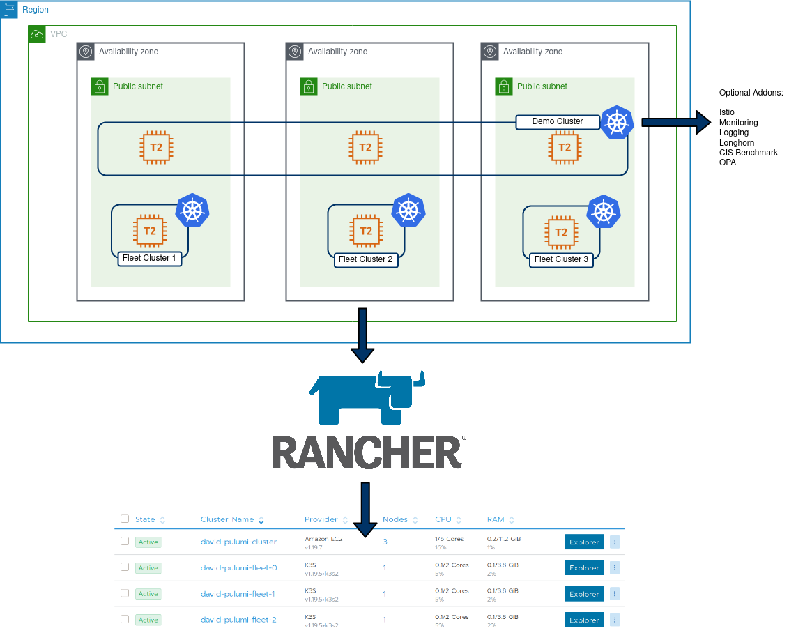

tldr; [Here](https://github.com/David-VTUK/pulumi-rancher-demos) is the code repo

## Intro

My Job at Suse (via Rancher) involves hosting a lot of demos, product walk-throughs and various other activities that necessitate spinning up tailored environments on-demand. To facilitate this, I previously leaned towards Terraform, and have since curated a list of individual scripts I have to manage on an individual basis as they address a specific use case.

This approach reached a point where it became difficult to manage. Ideally, I wanted an IaC environment that catered for:

- Easy, in-code looping (ie `for` and `range`)
- "Proper" condition handling, ie if monitoring == true, install monitoring vs the slightly awkward HCL equivalent of repurposing `count` as a sudo-replacement for condition handling.
- Influence what's installed by config options/vars.
- Complete end-to end creation of cluster objects, in my example, create:
    - AWS EC2 VPC
    - AWS Subnets
    - AWS AZ's
    - AWS IGW
    - AWS Security Group
    - 1x Rancher provisioned EC2 cluster
    - 3x single node K3S clusters used for Fleet

<figure>



<figcaption>

Architectural Overview

</figcaption>

</figure>

[Pulumi](https://www.pulumi.com/) addresses these requirements pretty comprehensively. Additionally, I can re-use existing logic from my Terraform code as the Rancher2 Pulumi provider is based on the Terraform implementation, but I can leverage `Go` tools/features to build my environment.

## Code Tour - Core

The core objects are created directly, using types from the Pulumi packages:

VPC:

```
// Create AWS VPC
vpc, err := ec2.NewVpc(ctx, "david-pulumi-vpc", &ec2.VpcArgs{
	CidrBlock:          pulumi.String("10.0.0.0/16"),
	Tags:               pulumi.StringMap{"Name": pulumi.String("david-pulumi-vpc")},
	EnableDnsHostnames: pulumi.Bool(true),
	EnableDnsSupport:   pulumi.Bool(true),
})
```

You will notice some interesting `types` in the above - such as `pulumi.Bool` and `pulumi.String`. The reason for this is, we need to treat cloud deployments as asynchronous operations. Some values we will know at runtime (expose port 80), some will only be known at runtime (the ID of a VPC, as below). These Pulumi types are a facilitator of this asynchronous paradigm.

IGW

```
// Create IGW
igw, err := ec2.NewInternetGateway(ctx, "david-pulumi-gw", &ec2.InternetGatewayArgs{
	VpcId: vpc.ID(),
})
```

Moving to something slightly more complex, such as looping around regions and assigning a subnet to each:

```
// Get the list of AZ's for the defined region
azState := "available"
zoneList, err := aws.GetAvailabilityZones(ctx, &aws.GetAvailabilityZonesArgs{
	State: &azState,
})

if err != nil {
	return err
}

//How many AZ's to spread nodes across. Default to 3.
zoneNumber := 3
zones := []string{"a", "b", "c"}

var subnets []*ec2.Subnet

// Iterate through the AZ's for the VPC and create a subnet in each
for i := 0; i < zoneNumber; i++ {
	subnet, err := ec2.NewSubnet(ctx, "david-pulumi-subnet-"+strconv.Itoa(i), &ec2.SubnetArgs{
		AvailabilityZone:    pulumi.String(zoneList.Names[i]),
		Tags:                pulumi.StringMap{"Name": pulumi.String("david-pulumi-subnet-" + strconv.Itoa(i))},
		VpcId:               vpc.ID(),
		CidrBlock:           pulumi.String("10.0." + strconv.Itoa(i) + ".0/24"),
		MapPublicIpOnLaunch: pulumi.Bool(true),
	})
```

This is repeated for each type

## Code Tour - Config

The config file allows us to store information required by providers (unless using env variables or something externally) and values that we can use to influence the resources that are created. In particular, I added the following boolean values:

```
config:
  Rancher-Demo-Env:installCIS: false
  Rancher-Demo-Env:installIstio: false
  Rancher-Demo-Env:installLogging: false
  Rancher-Demo-Env:installLonghorn: false
  Rancher-Demo-Env:installMonitoring: false
  Rancher-Demo-Env:installOPA: false
  Rancher-Demo-Env:installFleetClusters: false
```

This directly influence what will be created in my main demo cluster, as well as individual "Fleet" clusters. Within the main Pulumi code, these values are extracted:

```
conf := config.New(ctx, "")
InstallIstio := conf.GetBool("installIstio")
installOPA := conf.GetBool("installOPA")
installCIS := conf.GetBool("installCIS")
installLogging := conf.GetBool("installLogging")
installLonghorn := conf.GetBool("installLonghorn")
installMonitoring := conf.GetBool("installMonitoring")
installFleetClusters := conf.GetBool("installFleetClusters")
```

Because of this, native condition handling can be leveraged to influence what's created:

```
if installIstio {
	_, err := rancher2.NewAppV2(ctx, "istio", &rancher2.AppV2Args{
		ChartName:    pulumi.String("rancher-istio"),
		ClusterId:    cluster.ID(),
		Namespace:    pulumi.String("istio-system"),
		RepoName:     pulumi.String("rancher-charts"),
		ChartVersion: pulumi.String("1.8.300"),
	}, pulumi.DependsOn([]pulumi.Resource{clusterSync}))

	if err != nil {
		return err
	}
}
```

As there's a much more dynamic nature to this project, I have a single template which I can tailor to address a number of use-cases with a huge amount of customisation. One could argue the same could be done in Terraform with using `count`, but I find this method cleaner. In addition, my next step is to implement some testing using go's native features to further enhance this project.

## Bootstrapping K3s

One challenge I encountered was being able to create and import K3s clusters. Currently, only RKE clusters can be directly created from Rancher. To address this, I created the cluster object in Rancher, extract the join command, and passed it together with the K3s install script so after K3s has stood up, it will run the join command:

```
if installFleetClusters {
	// create some EC2 instances to install K3s on:
	for i := 0; i < 3; i++ {
		cluster, _ := rancher2.NewCluster(ctx, "david-pulumi-fleet-"+strconv.Itoa(i), &rancher2.ClusterArgs{
			Name: pulumi.String("david-pulumi-fleet-" + strconv.Itoa(i)),
		})

		joincommand := cluster.ClusterRegistrationToken.Command().ApplyString(func(command *string) string {
			getPublicIP := "IP=$(curl -H \"X-aws-ec2-metadata-token: $TOKEN\" -v http://169.254.169.254/latest/meta-data/public-ipv4)"
			installK3s := "curl -sfL https://get.k3s.io | INSTALL_K3S_VERSION=v1.19.5+k3s2 INSTALL_K3S_EXEC=\"--node-external-ip $IP\" sh -"
			nodecommand := fmt.Sprintf("#!/bin/bash\n%s\n%s\n%s", getPublicIP, installK3s, *command)
			return nodecommand
		})

		_, err = ec2.NewInstance(ctx, "david-pulumi-fleet-node-"+strconv.Itoa(i), &ec2.InstanceArgs{
			Ami:                 pulumi.String("ami-0ff4c8fb495a5a50d"),
			InstanceType:        pulumi.String("t2.medium"),
			KeyName:             pulumi.String("davidh-keypair"),
			VpcSecurityGroupIds: pulumi.StringArray{sg.ID()},
			UserData:            joincommand,
			SubnetId:            subnets[i].ID(),
		})

		if err != nil {
			return err
		}
	}

}
```

End result:

```
     Type                               Name                                  Status       
 +   pulumi:pulumi:Stack                Rancher-Demo-Env-dev                  creating...  
 +   pulumi:pulumi:Stack                Rancher-Demo-Env-dev                  creating..   
 +   pulumi:pulumi:Stack                Rancher-Demo-Env-dev                  creating..   
 +   ├─ rancher2:index:Cluster          david-pulumi-fleet-1                  created      
 +   ├─ rancher2:index:Cluster          david-pulumi-fleet-2                  created      
 +   ├─ rancher2:index:CloudCredential  david-pulumi-cloudcredential          created      
 +   ├─ aws:ec2:Subnet                  david-pulumi-subnet-1                 created      
 +   ├─ aws:ec2:Subnet                  david-pulumi-subnet-0                 created      
 +   ├─ aws:ec2:InternetGateway         david-pulumi-gw                       created     
 +   ├─ aws:ec2:Subnet                  david-pulumi-subnet-2                 created     
 +   ├─ aws:ec2:SecurityGroup           david-pulumi-sg                       created     
 +   ├─ aws:ec2:DefaultRouteTable       david-pulumi-routetable               created     
 +   ├─ rancher2:index:NodeTemplate     david-pulumi-nodetemplate-eu-west-2b  created     
 +   ├─ rancher2:index:NodeTemplate     david-pulumi-nodetemplate-eu-west-2a  created     
 +   ├─ rancher2:index:NodeTemplate     david-pulumi-nodetemplate-eu-west-2c  created     
 +   ├─ aws:ec2:Instance                david-pulumi-fleet-node-0             created     
 +   ├─ aws:ec2:Instance                david-pulumi-fleet-node-2             created     
 +   ├─ aws:ec2:Instance                david-pulumi-fleet-node-1             created     
 +   ├─ rancher2:index:Cluster          david-pulumi-cluster                  created     
 +   ├─ rancher2:index:NodePool         david-pulumi-nodepool-2               created     
 +   ├─ rancher2:index:NodePool         david-pulumi-nodepool-1               created     
 +   ├─ rancher2:index:NodePool         david-pulumi-nodepool-0               created     
 +   ├─ rancher2:index:ClusterSync      david-clustersync                     created     
 +   ├─ rancher2:index:AppV2            opa                                   created     
 +   ├─ rancher2:index:AppV2            monitoring                            created     
 +   ├─ rancher2:index:AppV2            istio                                 created     
 +   ├─ rancher2:index:AppV2            cis                                   created     
 +   ├─ rancher2:index:AppV2            logging                               created     
 +   └─ rancher2:index:AppV2            longhorn                              created     
 
Resources:
    + 29 created

Duration: 19m18s
```

20mins for a to create all of these resources fully automated is pretty handy. This example also includes all the addons - opa, monitoring, istio, cis, logging and longhorn.
