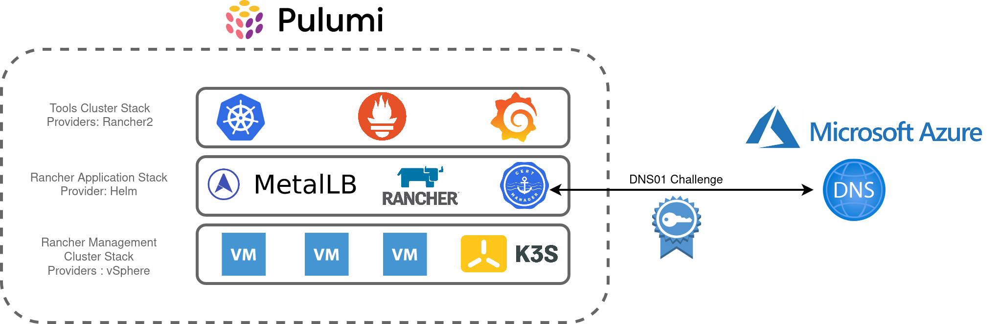

## Architecture

After reviewing the key components of my lab environment, I translated these into the Pulumi stacks as illustrated in the diagram below. [Pulumi has a blog post about the benefits of adopting multiple stacks](https://www.pulumi.com/docs/guides/organizing-projects-stacks/) and I found organising my homelab this way enables greater flexibility and organisation. I can also use stacks as a "template" to further build out my lab environment, for example, repeating the "Tools-Cluster" stack to add additional clusters.



The main objectives are:

- Create a 3 node, K3s cluster utilising vSphere VM's
- Install Metallb, Rancher and Cert-Manager into this cluster
- Using Rancher, create an RKE2 cluster to accommodate shared tooling services, ie:
    - Rancher Monitoring Stack (Prometheus, Grafana, Alertmanager, etc)
    - Hashicorp Vault
    - etc

## Building

Each stack contains the main Pulumi code, a YAML file to hold various variables to influence parameters such as VM names, Networking config, etc.

```bash
├── rancher-application
│   ├── Assets
│   │   └── metallb
│   │       └── metallb-values.yaml
│   ├── go.mod
│   ├── go.sum
│   ├── main.go
│   ├── Pulumi.dev.yaml
│   └── Pulumi.yaml
├── rancher-management-cluster
│   ├── Assets
│   │   ├── metadata.yaml
│   │   └── userdata.yaml
│   ├── go.mod
│   ├── go.sum
│   ├── main.go
│   ├── Pulumi.dev.yaml
│   └── Pulumi.yaml
└── rancher-tools-cluster
    ├── Assets
    │   └── userdata.yaml
    ├── go.mod
    ├── go.sum
    ├── main.go
    ├── Pulumi.dev.yaml
    └── Pulumi.yaml

```

Each stack has a corresponding `assets` directory which contains supporting content for a number of components:

- **Rancher Application** - Values.yaml to influence the metallb L2 VIP addresses
- **Rancher** **Management Cluster** - Userdata and Metadata to send to the created VM's, including bootstrapping K3s
- **Rancher Tools Cluster** - Userdata to configure the local registry mirror

## Rancher Management Cluster Stack

This is the first stack that needs to be created and is relatively simple in terms of its purpose. The `metadata.yaml` contains a template for defining cloud-init metadata for the nodes:

```yaml
network:
  version: 2
  ethernets:
    ens192:
      dhcp4: false
      addresses:
        - $node_ip
      gateway4: $node_gateway
      nameservers:
        addresses:
          - $node_dns
local-hostname: $node_hostname
instance-id: $node_instance
```

`userdata.yaml` contains k3s-specific configuration pertaining to my local registry mirror as well a placeholder for the K3S bootstrapping process, `$runcmd.`

```yaml
#cloud-config
write_files:
  - path: /etc/rancher/k3s/registries.yaml
    content: |
      mirrors:
        docker.io:
          endpoint:
            - "http://172.16.10.208:5050"
runcmd:
  - $runcmd
```

Creating the VM's leverages the existing vSphere Pulumi provider, seeding the nodes with cloud-init user/metadata which also instantiates K3s.

```cpp
userDataEncoded := base64.StdEncoding.EncodeToString([]byte(strings.Replace(string(userData), "$runcmd", k3sRunCmdBootstrapNode, -1)))

				vm, err := vsphere.NewVirtualMachine(ctx, vmPrefixName+strconv.Itoa(i+1), &vsphere.VirtualMachineArgs{
					Memory:         pulumi.Int(6144),
					NumCpus:        pulumi.Int(4),
					DatastoreId:    pulumi.String(datastore.Id),
					Name:           pulumi.String(vmPrefixName + strconv.Itoa(i+1)),
					ResourcePoolId: pulumi.String(resourcePool.Id),
					GuestId:        pulumi.String(template.GuestId),
					Clone: vsphere.VirtualMachineCloneArgs{
						TemplateUuid: pulumi.String(template.Id),
					},
					Disks: vsphere.VirtualMachineDiskArray{vsphere.VirtualMachineDiskArgs{
						Label: pulumi.String("Disk0"),
						Size:  pulumi.Int(50),
					}},
					NetworkInterfaces: vsphere.VirtualMachineNetworkInterfaceArray{vsphere.VirtualMachineNetworkInterfaceArgs{
						NetworkId: pulumi.String(network.Id),
					},
					},
					ExtraConfig: pulumi.StringMap{
						"guestinfo.metadata.encoding": pulumi.String("base64"),
						"guestinfo.metadata":          pulumi.String(metaDataEncoded),
						"guestinfo.userdata.encoding": pulumi.String("base64"),
						"guestinfo.userdata":          pulumi.String(userDataEncoded),
					},
				},
				)
				if err != nil {
					return err
				}
```

The first node initiates the K3s cluster creation process. Subsequent nodes have their `$rucmd` manipulated by identifying the first node's IP address and using that to join the cluster:

```cpp
userDataEncoded := vms[0].DefaultIpAddress.ApplyT(func(ipaddress string) string {

					runcmd := fmt.Sprintf(k3sRunCmdSubsequentNodes, ipaddress)
					return base64.StdEncoding.EncodeToString([]byte(strings.Replace(string(userData), "$runcmd", runcmd, -1)))
				}).(pulumi.StringOutput)

				vm, err := vsphere.NewVirtualMachine(ctx, vmPrefixName+strconv.Itoa(i+1), &vsphere.VirtualMachineArgs{
					Memory:         pulumi.Int(6144),
```

## Rancher Application Stack

This stack makes extensive use of the (currently experimental) [Helm Release Resource](https://www.pulumi.com/blog/full-access-to-helm-features-through-new-helm-release-resource-for-kubernetes/) as well as the [cert-manager package from the Pulumi Registry](https://www.pulumi.com/registry/packages/kubernetes-cert-manager/)

For example, creating the Metallb config map based on the aforementioned asset file:

```cpp
		metallbConfigmap, err := corev1.NewConfigMap(ctx, "metallb-config", &corev1.ConfigMapArgs{
			Metadata: &metav1.ObjectMetaArgs{
				Namespace: metallbNamespace.Metadata.Name(),
			},
			Data: pulumi.StringMap{
				"config": pulumi.String(metallbConfig),
			},
		})
```

And the Helm release:

```cpp
		_, err = helm.NewRelease(ctx, "metallb", &helm.ReleaseArgs{
			Chart:     pulumi.String("metallb"),
			Name:      pulumi.String("metallb"),
			Namespace: metallbNamespace.Metadata.Name(),
			RepositoryOpts: helm.RepositoryOptsArgs{
				Repo: pulumi.String("https://charts.bitnami.com/bitnami"),
			},
			Values: pulumi.Map{"existingConfigMap": metallbConfigmap.Metadata.Name()},
		})
```

And for Rancher:

```cpp
		_, err = helm.NewRelease(ctx, "rancher", &helm.ReleaseArgs{
			Chart:     pulumi.String("rancher"),
			Name:      pulumi.String("rancher"),
			Namespace: rancherNamespace.Metadata.Name(),
			RepositoryOpts: helm.RepositoryOptsArgs{
				Repo: pulumi.String("https://releases.rancher.com/server-charts/latest"),
			},
			Values: pulumi.Map{
				"hostname":           pulumi.String(rancherUrl),
				"ingress.tls.source": pulumi.String("secret"),
			},
			Version: pulumi.String(rancherVersion),
		}, pulumi.DependsOn([]pulumi.Resource{certmanagerChart, rancherCertificate}))
```

As I used an existing secret for my TLS certificate I had to create a cert-manager `cert` object, for which there are a number of options that I experimented with:

### 1\. Read a file

Similarly to the metallb config, A file could be read that contained the YAML to create the Custom Resource type, although this was a feasible approach, I wanted something that was less error-prone.

### 2\. Use the API extension type

The Pulumi Kubernetes provider enables the provisioning of the type `NewCustomResource`. For my requirements, this is an improvement over simply reading a YAML file, however, anything beyond the resources `metadata` isn't strongly typed

```cpp
rancherCertificate, err := apiextensions.NewCustomResource(ctx, "rancher-cert", &apiextensions.CustomResourceArgs{
			ApiVersion: pulumi.String("cert-manager.io/v1"),
			Kind:       pulumi.String("Certificate"),
			Metadata: &metav1.ObjectMetaArgs{
				Name:      pulumi.String("tls-rancher-ingress"),
				Namespace: pulumi.String(rancherNamespaceName),
			},
			OtherFields: kubernetes.UntypedArgs{
				"spec": map[string]interface{}{
					"secretName": "tls-rancher-ingress",
					"commonName": "rancher.virtualthoughts.co.uk",
					"dnsNames":   []string{"rancher.virtualthoughts.co.uk"},
					"issuerRef": map[string]string{
						"name": "letsencrypt-staging",
						"kind": "ClusterIssuer",
					},
				},
			},
		}, pulumi.DependsOn([]pulumi.Resource{certmanagerChart, certmanagerIssuers}))

```

### 3\. Use crd2pulumi

`[crd2pulumi](https://github.com/pulumi/crd2pulumi)` is used to generate typed CustomResources based on Kubernetes CustomResourceDefinitions, I took the cert-manager CRD's and ran it through this tool, uploaded to a repo and repeated the above process:

```cpp
import (
	certmanagerresource "github.com/david-vtuk/cert-manager-crd-types/types/certmanager/certmanager/v1"
        ...
        ...
)
```

```cpp
	rancherCertificate, err := certmanagerresource.NewCertificate(ctx, "tls-rancher-ingress", &certmanagerresource.CertificateArgs{
			ApiVersion: pulumi.String("cert-manager.io/v1"),
			Kind:       pulumi.String("Certificate"),
			Metadata: &metav1.ObjectMetaArgs{
				Name:      pulumi.String("tls-rancher-ingress"),
				Namespace: pulumi.String(rancherNamespaceName),
			},
			Spec: &certmanagerresource.CertificateSpecArgs{
				CommonName: pulumi.String(rancherUrl),
				DnsNames:   pulumi.StringArray{pulumi.String(rancherUrl)},
				IssuerRef: certmanagerresource.CertificateSpecIssuerRefArgs{
					Kind: leProductionIssuer.Kind,
					Name: leProductionIssuer.Metadata.Name().Elem(),
				},
				SecretName: pulumi.String("tls-rancher-ingress"),
			},
		})
```

Much better!

## Tools Cluster Stack

Comparatively, this is the simplest of all the Stacks. Using the [Rancher2 Pulumi Package](https://www.pulumi.com/registry/packages/rancher2/) makes it pretty trivial to build out new clusters and install apps:

```
_, err = rancher2.NewClusterV2(ctx, "tools-cluster", &rancher2.ClusterV2Args{
			CloudCredentialSecretName: cloudcredential.ID(),
			KubernetesVersion:         pulumi.String("v1.21.6+rke2r1"),
			Name:                      pulumi.String("tools-cluster"),
			//DefaultClusterRoleForProjectMembers: pulumi.String("user"),
			RkeConfig: &rancher2.ClusterV2RkeConfigArgs{

.........
}

				monitoring, err := rancher2.NewAppV2(ctx, "monitoring", &rancher2.AppV2Args{
					ChartName: pulumi.String("rancher-monitoring"),
					ClusterId: cluster.ClusterV1Id,
					Namespace: pulumi.String("cattle-monitoring-system"),
					RepoName:  pulumi.String("rancher-charts"),
				}, pulumi.DependsOn([]pulumi.Resource{clusterSync}))
```
